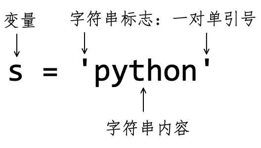
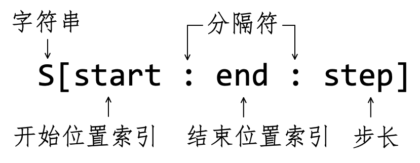
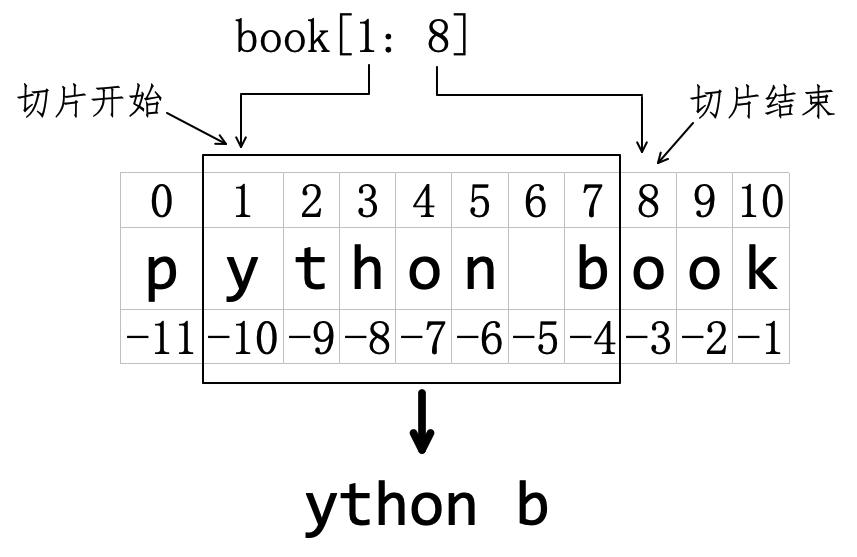
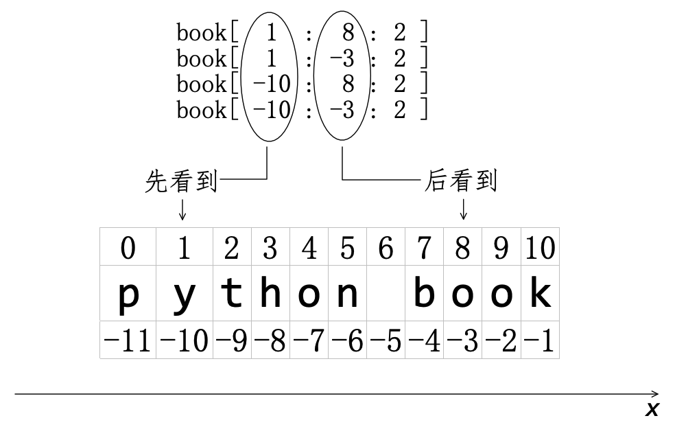
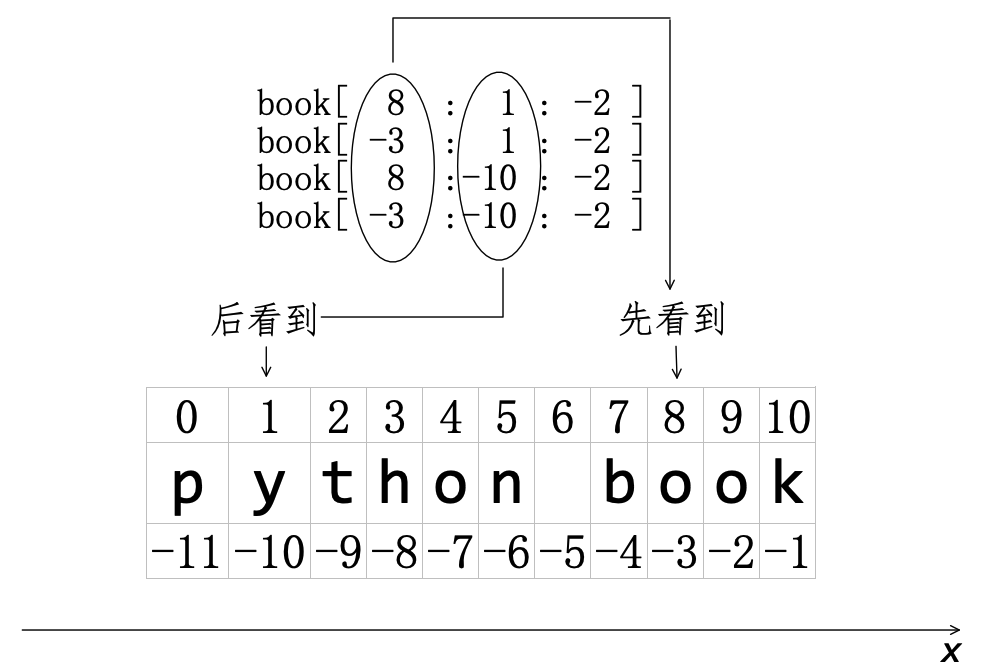
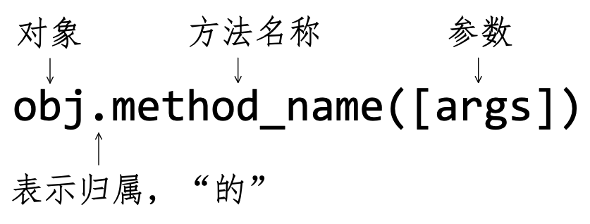

# 第4章 序列

> 拟把疏狂图一醉，对酒当歌，强乐还无味。衣带渐宽终不悔，为伊消得人憔悴。
>
> ——柳永

第2章敲出了第一行代码 `print('Hello World')` ，其中的 `Hello World` 是书面自然语言（英文）中的两个单词，且这些单词中各个字母是按照指定次序排列——次序不能乱，“Heoll” 与 “Hello” 显然不是同一个单词。除了自然语言之外，生活中讲究“次序”的也比比皆是，如“长幼有序、论资排辈”等皆为“次序现象”。编程语言一定要能够解决现实问题，所以，必然回应“次序现象”。Python 语言中为此设置了一些内置对象类型，通常将这些内置对象类型统称为**序列**（sequence）——序列是一些 Python 对象的统称。本章将介绍三类典型的序列：字符串和列表、元组——此三者均为 Python 内置对象。

## 4.1 字符编码

使用本书自学的最佳方法是一边阅读、一边调试书中的代码（参阅第3章3.7节的【自学建议】）。为此必然离不开键盘，通过键盘所输入给计算机的，就是本节将要讨论的**字符**（ Character ）——包括但不限于字母和数字。此外，对于汉字而言，一个汉字也构成了一个字符。可以说，字符是书面自然语言的基本单位。然而，人类发明的电子计算机不能直接认识字符，它直接认识的是二进制数字。为了解决这个问题，需要对字符进行编码。

所谓**编码**（ Encoding ），是信息从一种形式或格式转换为另一种形式或格式的过程。例如“山雪河冰野萧瑟，青是烽烟白人骨”中的“烽烟”，就是古代将敌人入侵的信息，转换为“烽烟”得以快速传递——古老的长途通讯方式之一。看到“烽烟”的将士们正确理解其含义——没有理解为烧柴做饭，即编码的逆过程，称为**解码**（ Decoding ）。

在互联网广泛使用之前，电报曾是一种重要的长途通讯方式，它能将字符转化为电信号，例如著名的摩尔斯电码（ Morse code ）中用点（`·`）和划（`-`）对字符编码，表4-1-1是对英文字母的编码。点和划可以通过电键敲击对应为不同的电信号，从而将字符组成的文本内容通过有线或无线的电磁波发送到远端。远端接收到此信号之后，通过解码还原出文本内容。

表4-1-1 英文字母和摩尔斯电码

| 字符 | 代码   | 字符 | 代码   | 字符 | 代码   | 字符 | 代码   | 字符 | 代码   | 字符 | 代码   | 字符 | 代码  |
| ---- | ------ | ---- | ------ | ---- | ------ | ---- | ------ | ---- | ------ | ---- | ------ | ---- | ----- |
| A    | `·-`   | B    | `-···` | C    | `-·-·` | D    | `-··`  | E    | `·`    | F    | `··-·` | G    | `--·` |
| H    | `····` | I    | `··`   | J    | `·---` | K    | `-·-`  | L    | `·-··` | M    | `--`   | N    | `-·`  |
| O    | `---`  | P    | `·--·` | Q    | `--·-` | R    | `·-·`  | S    | `···`  | T    | `-`    | U    | `··-` |
| V    | `···-` | W    | `·--`  | X    | `-··-` | Y    | `-·--` | Z    | `--··` |      |        |      |       |

（表4-1-1源自《维基百科》的“摩尔斯电码”词条，https://zh.wikipedia.org/wiki/摩尔斯电码）

据不太可靠的消息，泰坦尼克号首航遇险时，曾通过电报发出了如今我们熟知的求救信号“SOS”，其摩尔斯电码是“`···---···`”，听起来就是“滴滴滴”（三短音）、“答答答”（三长音）、“滴滴滴”（三短音），辨识度非常高，而且容易记忆和操作，甚至于普通民众利用一些器物敲击也可以传达此信息，故被定为国际通用的求救信号（1991年9月22日，国际海事机关决定从1992年二月开始废除SOS信号，改用新的国际海事卫星电子通信设备，只要一按电钮，所有关于事故发生及位置数据将自动地通报救援机关。这比采用莫尔斯电信设备要快速、准确、方便得多）。很可惜，当时在泰坦尼克号附近的一艘名为“加州人号”邮轮的电报员关了电报机睡觉去了，该求救信号第二天早上才被收到。

可以说，电报是一种早期的数字化通信方式。尽管摩尔斯电码的方案不能直接搬用到计算机上，但让计算机“认识”字符的原理与之近似，区别在于要将字符转换为“二进制的数字”形式，从而建立起字符与二进制的位（ Bit ，最小的信息单位，或译为“位元”、“比特”。词汇“ Bit ”是由“ Binary digit ”而来）之间的对应关系，此即为**字符编码**（ Character Encoding ）。

1960年代，美国发布了“美国信息交换标准代码”（American Standard Code for Information Interchange，简写ASCII）。在 ASCII 中，主要规定了英语字符在计算机中的编码，1986年发布的最新版一共规定了128个字符的编码。

利用 Python 中的内置函数 `ord()` 可以得到 ASCII 中某个字符编码的十进制表示（在 Python 交互模式中调试）。

```python
>>> ord("A")
65
```

这个十进制数字对应的二进制数字可以用 `bin()` 函数得到（参阅第3章3.4.1节）。

```python
>>> bin(65)
'0b1000001'
```

十进制整数 `65` 对应的二进制数是 `1000001` 。只不过在ASCII中，每个字符的编码只占用了一个字节的后面 $7$ 位（字节：Byte ，$8$ 个位（ bit ）表示一个字节），最前面的一位统一规定为 `0`，即为 `01000001`。

ASCII 对于英语而言已经足够了，但仅此而已，英语以外的语言怎么办？于是有了针对其他语言的编码，例如 ISO 8859（全称 ISO/IEC 8859 ，是国际标准化组织（ ISO ）及国际电工委员会（ IEC ）联合制定的一系列8位字符集的标准）针对希腊语提出了 ISO 8859-7 编码字符集。但是，尚有很多语言没有与 ISO 8859 兼容或它没有涵盖其他语言的字符，于是在显示上经常出现所谓的“乱码”，例如用 KOI-8 对俄文单词“ кракозбббры ”进行编码，然后使用 ISO 8859-1 解码，将看到“ ËÒÁËÏÚÒÙ ”。

随着互联网的发展，不同语言之间的交流更加密切，迫切需要涵盖所有语言字符的编码方案。于是，20世纪80年代末出现了两个相互独立的方案：一个是 ISO 10646 ，另一个是 Unicode 。这两个项目有共同的目标：用一个涵盖所有正在广泛使用的语言的通用编码替换数百个相互冲突的字符编码。并且这两个项目在1991年合并，统一为 Unicode 字符集。这就是现在被广泛采用的字符集。

Unicode（译为：统一码）是目前计算机科学领域的编码标准，它涵盖了世界上绝大部分的文字系统，至今仍在不断更新，编写此内容时最新版是2020年3月公布的 13.0.0 ，已经收录了超过13万个字符。Unicode 包括视觉上的字形、编码方法、标准的字符编码、字符特性（大小写字母）。

Unicode 使用16位的编码空间，每个字符占用 $2$​ 个字节，这样理论上一共最多可以表示 $2^{16}$​（即 $65536$​ ）个字符——每个汉字是一个字符，常用汉字在 3000~4000 个，用汉字来衡量，Unicode 基本满足需要。也不用担心这种编码方式无法涵盖其他语言或者符号，因为 Unicode 还保留了大量空间以作为将来扩展，并且未来的版本会涵盖 UCS-4（通用字符集的一个版本）的所有字符，届时理论上能表示 $2^{31}$​ 个字符，完全可以涵盖所有语言中的符号了。

当一个字符的 Unicode 编码确定之后，在实际传输过程中，由于不同系统的设计差异，并且要节省空间，于是对 Unicode 编码的实现方式有所不同。Unicode 的实现方式称为 **Unicode 转换格式**（  Unicode Transformation Format ，简称为 UTF ）。例如字符 `A` ，按照 ASCII 只要编码为 `1000001` （7位）即可，若使用 Unicode 编码需要用两个字节，第一个字节全是 `0` 。这显然造成了比较大的浪费，所以需要“变长编码”，即 ASCII 字符用一个字节（仍用7位编码，首位补 `0`），其他字符用两个、三个，乃至四个字节。 这种 Unicode 的实现方式就是当前普遍采用的 UTF-8（ 8-bit Unicode Transformation Format ），类似地还有 UTF-16 和 UTF-32 。截止到2019年11月， 在所有网页中，UTF-8 编码应用率高达94.3%（其中一些仅是 ASCII 编码，因为它是 UTF-8 的子集），而在排名最高的1000个网页中占96％（参考【维基百科】的“UTF-8”词条）——请读者再次阅读第2章2.2节，进一步理解该节的内容。

在交互模式中，执行如下操作：

 ```python
>>> import sys
>>> sys.getdefaultencoding()
'utf-8'
 ```

这说明我所配置的 Python 开发环境默认的编码方式是 `UTF-8` ——注意在 Python 中常常用小写字母 `utf-8` 。 

在第1章1.7节，已经约定了本书使用的是 Python 3.9.4 ，对于此版本的 Python ，已经全面支持 Unicode —— 之所以强调这一点，是因为 Python 2.x 并没有支持 Unicode ，例如：

```python
# 以下是在 Python 2.7 下执行，读者不必操作
>>> s = '学'
>>> s          # (1)
'\xe5\xad\xa6'
>>> print(s)
学
```

这里的 `s` 变量引用了一个对象——汉字，但是注释（1）不能显示这个汉字，只有执行了 `print(s)` 之后，即对其依据 UTF-8 编码，才看到它。 

而在 Python 3.9 中，因为它支持 Unicode ，一个汉字就是一个字符。所以学习和使用 Python 3.x 的读者和开发者，再不用为困扰人的“编码”“解码”而忧愁了——有的时候还要为此而愁，那是因为原始资料没有使用 UTF-8，与本地的字符编码格式不同。

```python
Python 3.9.4 (v3.9.4:1f2e3088f3, Apr  4 2021, 12:32:44)
[Clang 6.0 (clang-600.0.57)] on darwin
Type "help", "copyright", "credits" or "license" for more information.
>>> s = '学'
>>> s
'学'
>>> ord(s)    # (2)
23398
```

前面提到了 `ord()`函数，如果查看它的帮助文档信息，会看到：

```python
ord(c, /)
    Return the Unicode code point for a one-character string.
```

即返回的实际上是 Unicode 编码（如上述代码中的注释（2）所示），只不过因为前面所述的“变长编码”原因，对于 `ord(A)` 得到了 ASCII 编码。

此外，还有一个实现 `ord()` 反向操作的 `chr()` 函数：

```python
>>> chr(ord("A"))
'A'
>>> chr(ord(s))
'学'
```

> **自学建议**
>
> 本节简要介绍了“字符编码”的历史发展，但是并非“字符编码”就这么简单。如果读者有意对此进行深入研究，建议阅读相关的专门资料。
>
> 在本书中，经常建议“阅读相关的专门资料”，专门资料哪里来？对大多数读者而言，可能是在网络上搜索，找到几篇有关文章阅读（再多找，也都是差不多，因为网上的文章多数是彼此转载）。不可否认这是一种比较快速地“阅读相关专门资料”的方法——甚至于囫囵吞枣。
>
> 我在此重点推荐的是阅读相关的书籍，因为书籍的内容承载量往往要多于网上的文章，以本节的”字符编码“为例，这不是本书的重点，所以未加详解。如果某本书是以此为重点，则会将编码阐述得洞鉴古今、鞭辟入里，如电子工业出版社的《编码：隐匿在计算机软硬件背后的语言》——“旧书不厌百回读，熟读深思子自知”（苏轼）。

## 4.2 字符串

顾名思义，“字符串”就是由一个或多个字符“串”起来—— Python 3.x 中的才是真正字符串，Python 2.x 中的严格称呼应为“字节串”。不过，现在读者暂不用关注历史。

### 4.2.1 创建字符串

其实，前面已经出现了的 `'Hello,World'`，就是一个字符串（英语：String ）。在 Python 中创建字符串的方法非常简单。

```python
>>> s = 'python'             # (3)
>>> book = "learn python"    # (4)
>>> poem = """我住长江头，
... 君住长江尾。"""            # (5)
>>> type(s)
<class 'str'>
>>> type(book)
<class 'str'>
>>> type(poem)
<class 'str'>
```

注释（3）（4）（5）分别演示了三种用于定义字符串的引号：

- 注释（3）使用一对单引号（英文状态）包裹若干字符，定义了字符串对象。如图4-2-1所示，以此为例显示了定义字符串的形式。



<center>图4-2-1 定义字符串的形式</center>

- 注释（4）使用一对双引号（英文状态）定义字符串。
- 注释（5）使用一对“三引号”——此处使用的是三个“双引号”，若用三个“单引号”亦然——定义字符串，俗称“多行字符串”，其内部允许使用换行（敲“回车键”），如图4-2-2所示。


<center>图4-2-2 输入多行字符串</center>

注意，作为字符串的标志，包裹字符串的“单引号”、“双引号”和“三引号”，在键盘输入的时候必须是英文状态，并且要成对出现，否则无法定义字符串对象。

```python
>>> "I am learning Python'
  File "<stdin>", line 1
    "I am learning Python'
                          ^
SyntaxError: EOL while scanning string literal
```

在注释（5）之后使用内置函数 `type()` 查看三个对象的类型，返回值 `str` 即表示 Python 中字符串类型，与之前所学对象类型同理，也存在同名的内置函数 `str()` ，通过它也能创建字符串——但有局限。

```python
>>> sint = str(250)
>>> type(sint)
<class 'str'>
>>> sint
'250'
```

以整数为 `str()` 的参数，返回值是一个字符串 `'250'`——也可以理解为将整数 `250` 用函数 `str()` 转化为了字符串 `'250'` 。

像 `'250'` 这样的完全由数字组成的字符串，可以用 `int()` 函数将其转化为整数。

```python
>>> result = int('250')
>>> result
250
>>> type(result)
<class 'int'>
```

类似地，`float()` 则可以将浮点数构成的字符串转化为浮点数。

```python
>>> float('3.14')
3.14
>>> float('250')
250.0
>>> float('1e2')
100.0
>>> int('1e2')
Traceback (most recent call last):
  File "<stdin>", line 1, in <module>
ValueError: invalid literal for int() with base 10: '1e2'
```

注意上面的报错信息，对于 `int()` 函数而言，其参数必须是整数构成的字符串。

```python
>>> int('a45')
Traceback (most recent call last):
  File "<stdin>", line 1, in <module>
ValueError: invalid literal for int() with base 10: 'a45'
>>> int('hello')
Traceback (most recent call last):
  File "<stdin>", line 1, in <module>
ValueError: invalid literal for int() with base 10: 'hello'
```

下面还要提醒读者注意两个貌似“差不多”的字符串：

```python
>>> empty_str = str()    # (6)
>>> empty_str
''
>>> spacing = " "        # (7)
>>> spacing
' '
>>> bool(empty_str)      
False
>>> bool(spacing)        
True
```

注释（6）定义了一个“空字符串”，其结果与直接输入 `''` （注意输入方法，连续输入两个单引号，在两个单引号之间，没有任何符号）效果一致；注释（7）则是在两个引号之间，输入了一个空格。虽然 `empty_str` 和 `spacing` 有点类似，但它们是完全不同的对象。空字符串的布尔值是 `False` ，而“空格”是通过键盘输入的一个字符——所有通过键盘输入的都是字符，包括不可见的和可见，所以 `spacing` 的布尔值是 `True` 。

### 4.2.2 转义符

如果在交互模式中这样输入：

```python
>>> print('what's your name?')
  File "<stdin>", line 1
    print('what's your name?')
                ^
SyntaxError: invalid syntax
```

出现了 `SyntaxError`（语法错误）引导的提示，此处的 `SyntaxError` 是一种错误类型（参阅第10章10.1节），其后的内容是对此错误的解释：“invalid syntax”（无效的语法）。

产生错误的原因是 `'what's your name?'` 中出现了三个“单引号”。如果学过英语者理解此字符串，第二个“引号”（“`what's`”）是英语中“ what is ”的缩写，不是构成字符串的引号的组成部分。但是，Python 解释器无法分辨。解决此错误的方法之一是使用双引号和单引号的嵌套。

```python
>>> print("what's your name?")
what's your name?
```

用双引号来包裹，双引号里面允许出现单引号。其实，反过来，单引号里面也可以包裹双引号。

```python
>>> print('you are learning "Python Book"')
you are learning "Python Book"
```

此外，还有一种解决方法：使用**转义符**（ escape character ）。

```python
>>> print('what\'s your name?')                # (8)
what's your name?
>>> print("you are learning \"Pthon Book\"")   # (9)
you are learning "Pthon Book"
```

注释（8）中第二个“引号”前面增加了反斜杠（ `\` ），就能得到了想要的输出结果。此处所用的反斜杠（ `\` ）就是转义符，它的作用是使后面的“引号”（`'`）不再具有其单独出现的语义。注释（9）中则用转义符分别使两个双引号（`"`） 不再具有其单独出现的语义。

以上是转义符的一个作用，它的另外一个作用是表示无法从键盘录入的字符，比如换行符——除非用4.2.1节中的注释（5）所定义的“多行字符串”。

```python
>>> poem
'我住长江头，\n君住长江尾。'
>>> print(poem)
我住长江头，
君住长江尾。
```

在返回的字符串中出现了一个 `\n` ，它就是换行符。如果不用“多行字符串”，可以这么做：

```python
>>> poem2 = "日日思君不见君，\n共饮长江水。"
>>> print(poem2)
日日思君不见君，
共饮长江水。
```

此处在定义字符串 `poem2` 时并未使用“三引号”，只是在其中增加了回车符（ `\n`），`print(poem2)` 的输出结果中就在 `\n` 的位置换行。表4-2-1中列出了 Python 中常用的转义字符及其说明，供应用时查阅。

表4-2-1 转义字符

| 转义字符 | 描述                                       |
| -------- | ------------------------------------------ |
| `\`      | （在行尾时）续行符，即一行未完，转下一行   |
| `\`      | 反斜杠符号                                 |
| `\'`     | 单引号                                     |
| `\"`     | 双引号                                     |
| `\a`     | 响铃                                       |
| `\b`     | 退格（Backspace）                          |
| `\e`     | 转义                                       |
| `\000`   | 空                                         |
| `\n`     | 换行                                       |
| `\v`     | 纵向制表符                                 |
| `\t`     | 横向制表符                                 |
| `\r`     | 回车                                       |
| `\f`     | 换页                                       |
| `\oyy`   | 八进制数，yy代表的字符，例如：12代表换行   |
| `\xyy`   | 十六进制数，yy代表的字符，例如：0a代表换行 |
| `\other` | 其他的字符以普通格式输出                   |

建议读者在交互模式中测试上述转移符的显示效果。

对于使用 Windows 系统的读者特别要注意，在此操作系统中，文件和目录的路径写法与类 Unix 系统不同。

```shell
# 以下是 MacOS 系统的路径，Linux与此一致

/Users/qiwsir/Documents

# 以下是 Windows 系统的路径

C:\new_books\python
```

如果在 Python 中建立 Windows 路径的字符串：

```python
>>> pth = 'c:\new_books\python'    # (10)
>>> print(pth)
c:
ew_books\python
```

`print(pth)` 的结果则是被分割为两行，且路径名称有误，这是因为注释（10）的字符串中，Python 解释器将其中的 `\n` 作为“换行”转义符了。为此，修改为：

```python
>>> pth = 'c:\\new_books\python'    # (11)
>>> print(pth)
c:\new_books\python
```

比较注释（11）和（10）的差异，在（11）中用转义符 `\` 将其后的 `\n` 符号“转义”，令其不再具有表4-2-1中的含义。

此外，还有一种方法：

```python
>>> pth = r'c:\new_books\python'    # (12)
>>> print(pth)
c:\new_books\python
>>> pth
'c:\\new_books\\python'
>>> type(pth)
<class 'str'>
```

注释（12）中以字母 `r` 作为字符串的前缀，这样所定义的对象称为**原始字符串**（ raw string ）——依然是字符串类型。对字符串的引号所包裹着的内容，有一个专门术语：**字面量**（ literal ）。如果字面量是字符串里面的，就称为**字符串字面量**（ string literal ）。前缀 `r` 的作用效果就是自动在字面量中的 `\` 符号前面再添加 `\` 符号，从而令字面量中的 `\` 符号转义之目的。

但是，原始字符串并非总能实现上面的效果，例如：

```python
>>> pth = r'c:\new_books\python\'    # (13)
  File "<stdin>", line 1
    pth = r'c:\new_books\python\'
                                 ^
SyntaxError: EOL while scanning string literal
```

在报错信息中出现的 `EOL`  ，完整表述为“ End of Line ”，即行结尾处出现了错误。后面还有一个状语 `while scanning string literal` ，即告诉我们 Python 解释器在“扫描”字符串字面量时，结尾处有错误。有点疑惑！？

从注释（13）的创建来看，其字符串字面量是“ c:\new_books\python\ ”，结尾处的 `\` 符号是这个 Windows 路径的组成部分。但是，当写成（13）那样的时候，Python 解释器会把 `\'` 组合起来视为表4-2-1中所示的单引号，且是字面量的组成部分。这样，作为字符串的标志的单引号就少了一半，于是出现了 `SyntaxError` 异常。类似于：

```python
>>> p = 'python
  File "<stdin>", line 1
    p = 'python
               ^
SyntaxError: EOL while scanning string literal
```

因此，官方网站的文档中特别提示：Specifically, *a raw literal cannot end in a single backslash* (since the backslash would escape the following quote character).

如何修改？

```python
>>> pth = 'c:\\new_books\\python\\'        # (14)
>>> print(pth)
c:\new_books\python\
>>> pth = r'c:\new_books\python' + '\\'    # (15)
>>> pth
'c:\\new_books\\python\\'
>>> print(pth)
c:\new_books\python\
```

注释（14）没有使用原始字符串，毫无疑问可以打印得到字符串字面量；注释（15）中则是原始字符串和字符串“相加”，也得到了同样效果——虽然解决了前面的报错，但是又出现了“字符串相加”这样一个令人迷茫的操作，正可谓“才下眉头，却上心头”。

### 4.2.3 基本操作

并非“此情无计可消除”，作为序列一员的 Python 内置对象字符串，被定义为支持如下基本操作：

**1. 连接**

注释（15）将两个字符串连接起来，最终得到了一个新的字符串。符号 `+` 的作用是实现这个操作——不同于两个数字相加。

```python
>>> a = 'machine learning'
>>> b = 'mathematics'
>>> book = b + " for " + a
>>> book
'mathematics for machine learning'
>>> id(a), id(b), id(book)         # (16)
(140230753895728, 140230753892848, 140230751832656)
```

从注释（16）的返回值中可知，以上代码中的 `a`、`b` 和 `book` 三个字符串是三个不同的对象（注意注释（16）的写法，返回值是4.4节要介绍的另外一个 Python 内置对象，它的三个成员分别对应三个对象的内存地址）。 

虽然数字之间支持 `+` 符号、字符串之间也支持 `+` 符号，但是不能将 `+` 符号用于数字和字符串之间。

```python
>>> book + 2
Traceback (most recent call last):
  File "<stdin>", line 1, in <module>
TypeError: can only concatenate str (not "int") to str
```

符号 `+` 所连接的对象必须是同种类型的，否则要报错。如果要修改上面的错误，可以将 `2` 转化为字符串类型。

```python
>>> book + str(2)
'mathematics for machine learning2'
```

**2. 重复成员**

在第3章3.2节自学算术运算符时，用符号 `*` 表示两个数字相乘——注意乘法的意义：$5\times 3 = 5+5+5$​ 。对于字符串，也能用“乘法”实现类似的含义：“ 'A' × 3='A'+'A'+'A' ”，结合前面字符串的 `+` 符号的作用，即得：“ 'A' × 3 = 'AAA' ”。当然，这种写法无非是为了以类比的方式理解符号 `*` 对于字符串的作用，用 Python 中的严格说法，符号 `*` 表示字符串中的字符进行相应次数的重复。

```python
>>> "A" * 3
'AAA'
```

经 `*` 表达式返回的字符串相对于原来的字符串而言，是一个新的对象。

```python
>>> book = 'self learning'
>>> mul_book = book * 2
>>> mul_book
'self learningself learning'

# 注意比较两个字符串的内存地址
>>> id(book)
140230753893552
>>> id(mul_book)
140230753895728
```

是否想过让上面演示中的字符串中的元素重复“2.5”次？想得到并非整数次数的重复，比如“ `self learningself` ”，是否可以将 `*` 后面的整数改为浮点数？

 ```python
>>> book * 2.5
Traceback (most recent call last):
  File "<stdin>", line 1, in <module>
TypeError: can't multiply sequence by non-int of type 'float'
 ```

Python 不允许这么做。从报错信息中可知，序列必须用整数“乘”。

> **自学建议**
>
> 编程语言是一种人工语言，对于初学者而言，可能会觉得有时“不能直接地随心所欲实现某些功能”，这是因为我们还没有完全掌握它。完全掌握它后，还觉得有很多需要改进的地方，那才是发现了创新之处。
>
> 在学习过程中，应该有一些比较“大胆、诡异、刁难”的想法，要勇敢地试一试——尝试的成本很低，仅仅是向上面那样报错，收获却很大。之所以强调“勇敢”，是因为曾遇到过学习者或怯于、或羞于、或懒于动手尝试。

**3. 长度**

毋庸置疑，字符串中的字符数量是非负整数，此数值也称为字符串的长度。 Python 中提供了一个内置函数 `len()` ，用于测量字符串的长度。

```python
>>> book
'self learning'
>>> len(book)
13
>>> empty_str = ''
>>> len(empty_str)
0
```

请读者认真数一数，`book` 中包含多少个英文字母？与函数 `len()` 的返回值是否一致？

表4-2-2 字符数量

| 个数   | 1    | 2    | 3    | 4    | 5    | 6    | 7    | 8    | 9    | 10   | 11   | 12   | 13   |
| ------ | ---- | ---- | ---- | ---- | ---- | ---- | ---- | ---- | ---- | ---- | ---- | ---- | ---- |
| 字符串 | s    | e    | l    | f    |      | l    | e    | a    | r    | n    | i    | n    | g    |

表4-2-2表示了字符串 `book` 的所有字符，不仅仅包括英文字母，还有一个空格——4.2.1节特别对此进行了说明，“空格”非“空”，它是一个字符。所以 `book` 共计由 $13$ 个字符组成，即其长度是整数 `13` 。

上面的演示中还特别将 `empty_str` 作为 `len()` 的参数，返回值是整数 `0` ——“空”才是空。读者不妨阅读 `len()` 的帮助文档，进一步理解上述操作结果。

```python
len(obj, /)
    Return the number of items in a container.
```

有没有注意到文档中的一个单词“ container ”，中文译为“容器”。这说明 `len()` 函数不仅仅可以用字符串作为其参数，还能用“容器”作为其参数——“容器”是什么，请参见第5章。

**4. 成员检测**

字符串的成员（ membership ）是指该字符串的子集——也是一个字符串，Python 提供了检测字符串中是否含有某成员的关键词 `in` 和 `not in` 。

```python
>>> 'p' in 'python'    # (17)
True
```

注释（17）表示字符串 `'p'` 是字符串 `'python'` 中的一员，返回 `True` 则说明此表达式成立。如果是：

```python
>>> 'j' in 'python'    # (18)
False
```

返回了 `False` 则说明注释（18）所标记的表达式不成立。若用 `not in` ——注意写法，不是 `in not`。

```python
>>> 'j' not in 'python'
True
```

前面特备强调字符串的“成员”也是一个字符串，就不局限于一个字符构成的字符串，如：

```python
>>> 'py' in 'python'
True
>>> 'Py' in 'python'       # (19)
False
>>> 'thon' in 'python'
True
>>> 'python' in 'python'
True
>>> 'po' in 'python'       # (20)
False
```

注释（19）的返回值是 `False` ，是因为 Python 语言区分大小写，`py` 和 `Py` 是两个不同的字符串。

注释（20）所标记的表达式也不成立，是因为 `'python'` 中虽然有 `'p'` 和 `'o'` ，但没有 `'po'` 这个字符串。

此外，Python 中将空字符串作为任何字符串的子集，所以：

```python
>>> '' in 'python'
True
>>> '' in 'laoqi'
True
```

成员检测是检测“有没有”，但不回答“在哪里”——`'p'` 在 `'python'` 的开头、结尾还是中间？这个问题要留待4.2.4节解决。

### 4.2.4 索引

如果读者从来没有学习过编程、数据库等方面的知识，对“索引”这个词的理解可能更原汁原味。“索引”原本是指将书刊中的主要内容，比如章节名称、重要名词等罗列出来，并给出它们相应的页码，以便查阅方便——本书的目录就是索引。在编程语言和数据库中，也少不了“查阅”行为，于是引入了“索引”概念。

字符串一般由多个字符组成，给这些字符创建**索引**（ index ），目的就在于可以更便捷地操作字符串中的字符。

在 Python 中，依据字符串中各个字符的位置创建其索引，如图4-2-3所示，其创建方法有如下两种：

- 方法1：从左边开始依据字符位置创建索引，依次为 `0` 、`1` 、`2` 、…，直到最右边的字符结束。特别注意，此时第一个字符编号为 `0` ，而不是 `1` ，这是 Python 语言的规定（很多其他编程语言也这样规定，但是，也有的编程语言规定从 `1` 开始计数）。
- 方法2：从右边开始依据字符位置创建索引，依次是 `-1` 、`-2` 、`-3` 、…，直到最左边的字符结束。


<center>图4-2-3 字符串中的索引</center>

如图4-2-3所示，对字符串中的所有字符建立了索引。因为以上两种创建索引的方法，于是字符串中每个字符可以有两个索引数字，例如索引 `5` 和索引 `-6` 都指向了字符 `n`。

字符的索引建立好了，自然就可以通过索引“查阅”相应字符了——就如同通过书的页码找到相应的页面。在 Python 中实现这种操作的方式是使用 `[ ]` 符号。在交互模式中完成如下操作：

```python
>>> book = 'python book'
>>> book[0]      
'p'
>>> book[-11]
'p' 
```

变量 `book` 引用了图4-2-3所示的字符串对象，`book[0]` 的方括号 `[ ]`里面的整数 `0` 就是一个字符的索引——显然此索引是按照方法1创建的，返回值为索引 `0` 所对应的字符 `'p'` 。在 `book[-11]` 中所使用的索引是 `-11`——按照方法2创建的，对照图4-2-3，返回值也是字符 `'p'` 。读者不妨再做几个练习，熟悉以索引得到对应字符的操作方法。

```python
>>> book[7]
'b'
>>> book[11]
Traceback (most recent call last):
  File "<stdin>", line 1, in <module>
IndexError: string index out of range
```

执行 `book[11]` 后出现 `IndexError` 异常，从提示信息中可知，是索引 `11` 超出了字符串的索引范围。根据图4-2-3，此字符串的最大索引是 `10` ——但是字符串共计 $11$​ 个字符，请读者注意区分图4-2-3和表4-2-2的差异：字符串的长度不等于最大索引值。为了避免此错误，可以用下面方法得到最大索引：

```python
>>> max_idx = len(book) - 1
>>> max_idx
10
>>> book[max_idx]
'k'
```

上面实现了“从索引到字符”的操作，反过来，根据字符“找到”索引，是否可以？

Python 字符串有一个方法能够实现（关于“方法”，参见4.2.6节）。

```python
>>> book.index('k')
10
>>> book.index('o')
4
```

 `index()` 就是字符串对象 `book` 的一个方法，其参数 `'k'` 是字符串中的一个字符，返回值为该字符对应的索引——按照方法1创建的索引。

在 `book.index('o')` ，返回的是 `book` 字符串（ `'python book'` ）中按照从左向右顺序第一个字符 `'o'` 的索引。

如果备查的字符不在字符串中：

```python
>>> book.index('m')
Traceback (most recent call last):
  File "<stdin>", line 1, in <module>
ValueError: substring not found
```

会抛出异常。

以上是字符串的 `index()` 简单应用，如果看过它的帮助文档（参阅第3章3.3节【自学建议】），不仅仅会有新发现，而且对前面所述的操作也有高屋建瓴的理解。

在交互模式中按照下面的方法操作，查看 `book.index()` 的帮助文档：

 ```python
>>> help(book.index)
 ```

显示如下内容：

```python
index(...) method of builtins.str instance
    S.index(sub[, start[, end]]) -> int

    Return the lowest index in S where substring sub is found,
    such that sub is contained within S[start:end].  Optional
    arguments start and end are interpreted as in slice notation.

    Raises ValueError when the substring is not found.
```

`S.index(sub[, start[, end]])` 是此方法的调用方式，其中参数解释如下：

- `sub` ：全称是“ substring ”，即字符串的子集，在4.2.3节曾介绍过，字符串的字符、部分字符组成的字符串和空字符串都是字符串的子集，也就是说这些都可以用于 `index()` 的参数。例如：

  ```python
  >>> book.index("python")
  0
  >>> book.index("")
  0
  >>> book.index("oo")
  8
  ```

- `[, start[, end]]`：此处的 `[ ]` 含义不是对象的索引操作符号，其含义详见第3章3.3.1节有关内容。`start` 和 `end` 是检索 `sub` 的索引范围（但不包含 `end` 所对应字符），比如：

  ```python
  >>> book.index('o')
  4
  >>> book.index('o', 7, 9)
  8
  >>> book.index('o', 5, 8)
  Traceback (most recent call last):
    File "<stdin>", line 1, in <module>
  ValueError: substring not found
  ```

  为了直观地理解上述操作结果，用图4-2-4指明每个表达式中检索的索引范围。

  

  <center>图4-2-4 索引范围示意</center>

### 4.2.5 切片

通过字符串某个字符的索引，可以得到相应字符，此外，还可以通过指定索引范围，得到多个字符，此操作称为**切片**（ slicing ）。

Python 语言中关于字符串切片的一般操作形式如图4-2-5所示——这种形式适用于所有的序列类对象。



<center>图4-2-5 切片的形式</center>

图4-2-5中的各个符号含义如下：

- `S` ：字符串或者引用字符串的变量；
- `start` ：切片开始位置索引。如果是从第一个字符开始，可以省略；
- `end` ：切片结束位置索引（切片中不含此索引对应的字符）。如果是到最后一个字符结束（含最后一个），可以省略；
- `step` ：切片的步长，如果省略则为默认值 `step=1`。可为正整数，也可以为负整数。

下面就按照此操作形式，了解字符串的切片。

首先，考虑 `step=1` 的情形，即省略步长值。

```python
>>> book
'python book'
>>> book[1: 8]      # (21)
'ython b'
>>> book[1: 8: 1]   # (22)
'ython b'
```

注释（21）没有声明 `step` 的值，其效果与（22）中声明 `step=1` 一样。

以注释（21）的切片为例，得到了字符串 `'python book'` 的部分字符组成的字符串——就如同从原来字符串上“切”下来“片段”一样，故曰“切片”。如图4-2-6所示，从索引是 `1` （含）的位置开始，依次将索引是 `1、2、3、4、5、6、7` 的字符“切”出来，到索引是 `8` （不含）的位置之前结束。



<center>图4-2-6 字符串切片示意</center> 

从结果中可以看出，结束索引 `8` 所对应的字符没有在“被切”之列，这是 Python 中的普遍规则，为了便于记忆，可以概括为“前包括，后不包括”。

再观察图4-2-6，根据4.2.4节所学可知，字符串中每个字符对应着两个索引，例如字符 `'y'` 的索引是 `1` 和 `-10` 。按照图4-2-5所示的操作形式，`start` 对应的是切片开始位置的索引，并未要求是“从左向右”还是“从右向左”创建的索引，因此，可以尝试 `book[-10: 8]` 等操作是否可行，结果如何？勇敢地尝试：

```python
>>> book[-10: 8]
'ython b'
>>> book[1: -3]
'ython b'
>>> book[-10: -3]
'ython b'
```

以上三项以及注释（21），实现的最终效果都一样，请读者通过这些操作理解图4-2-5中 `start` 和 `end` 的含义。

当原字符串被“切”出了一部分，是否因此而“破坏”原字符串了？

```python
>>> book
'python book'
```

这说明所谓的“切片”，就是比照着索引在原字符串中所对应的字符，重新创建了一个字符串对象。从最终结果看，貌似是从原字符串上“切下来的一部分”。

如果切片开始的索引是 `0` ，可以不写该索引：

```python
>>> book[: 8]
'python b'
>>> book[0: 8]
'python b'
```

如果切片结束的索引字符串的最后一个，例如图4-2-6所示的字符串，最后一个字符的索引是 `10` 或 `-1` ，也可以省略：

```python
>>> book[7:]       # (23)
'book'
>>> book[7: 11]    # (24)
'book'
>>> book[7: 10]    # (25)
'boo'
```

仔细对比上述三种操作及其结果，并理解：

- 注释（23）中省略了表示切片结束的索引，意思是要到该字符串右边的最后一个字符结束——含最后一个字符。
- 注释（24）中切片结束的索引已经超过了字符串的最大索引值，但是 Python 语言允许此处这种操作，并按照注释（23）的方式处理——`book[11]` 是不允许的，详见4.2.4节。
- 注释（25）中切片结束的索引是 `10` ，根据前述“前包括，后不包括”的原则，索引 `10` 所对应的字符不再“切片”之内。

如果 `book[ : ]` 又会如何？

```python
>>> book[:]
'python book'
```

读者是否能解释上述结果？

省略了切片开始的索引，则意味着从第一个字符开始“切”；省略了切片结束的索引，则意味着“切”到最后一个字符。故得到了“整个”字符串。

再进一步，现在得到的“整个”字符串与原来的字符串相比，是否是同一个对象——请参见第3章3.6.2节中对“相等”和“同一”的讨论。

```python
>>> book2 = book[:]
>>> book2 == book
True
>>> book2 is book
True
```

变量 `book2` 和 `book` 引用了同一个对象，所以，`book2 = book[:]` 并不是将原字符串复制了一份，没有生成新的字符串，这点请读者注意。

以上各项操作，均没有声明 `step` 的值，即默认步长是 `1` ，下面尝试修改步长的值。

```python
>>> book[::2]
'pto ok'
>>> book[1: 10: 3]
'yob'
```

对照图4-2-6，不难理解上述操作，此处不再赘述。不过，在前面解释 `step` 时，曾指出它的值还可以是负整数——“迈出 `-1` 步，难道是向后走吗？”，说对了。



<center>图4-2-7 步长是正整数</center>

如果把字符串看做“一维”的，如图4-2-7那样以箭头所指方向为正方向——这种规定非常符合习惯，沿着正方向“切”的步长就是“正整数”——图示中步长是 `2` 。图4-2-7所示的切片操作即可理解为：沿着正方向“从左向右”，“先看到”字符 `'y'`，其索引是 `1` 或 `-10`——作为 `start` 的值，“后看到”字符 `'o'` ，其索引是 `8` 或 `-3`——作为 `end` 的值。

```python
>>> book[1: 8: 2]
'yhnb'
>>> book[1: -3: 2]
'yhnb'
>>> book[-10: 8: 2]
'yhnb'
>>> book[-10: -3: 2]
'yhnb'
```

有向量知识的读者肯定知道（关于向量的知识请参阅拙作《机器学习数学基础》），在一维空间中，正数常常表示与规定正方向同向的向量，负数常常表示与规定正方向反向的向量。在图4-2-7中，已经规定了正方向，如果步长是正整数，则意味着“切”的方向与正方向同向；如果步长是负整数，显然意味着“切”的方向与正方向反向，即“从右开始，向左切”，此时“先看到”的是字符 `'o'` ，其索引是 `8` 或 `-3`——作为 `start` 的值；“后看到”的是字符 `'y'`，其索引是 `1` 或 `-10`——作为 `end` 的值，如图4-2-8所示，并按照从先到后的顺序将字符从字符串中“切”出来。



<center>图4-2-8 步长是负整数</center>

 ```python
>>> book[8: 1: -2]
'o ot'
>>> book[-3: 1: -2]
'o ot'
>>> book[8: -10: -2]
'o ot'
>>> book[-3: -10: -2]
'o ot'
 ```

至此，请读者稍作停留，对照图4-2-7和图4-2-8以及相关操作，再次理解图4-2-5中的 `start、end、step` 的含义，并做适当总结。

为了进一步检验自己对切片操作的理解，可以在交互模式中执行如下表达式：

```python
>>> book[: : -1]
'koob nohtyp'
>>> book
'python book'
```

将切片 `book[: : -1]` 返回的结果与原字符串对比，会发现此结果是对原字符串的反序——一般来讲，反序之后的字符串会与原字符串不同，除非是“回文”。

> 苏轼的诗《记梦》：“空花落尽酒倾漾，日上山融雪涨江。红焙浅瓯新火活，龙团小辗斗晴窗。”就是一首回文诗，如果倒读，亦成诗。

```python
>>> first = '空花落尽酒倾漾'
>>> second = '日上山融雪涨江'
>>> third = '红焙浅瓯新火活'
>>> forth = '龙团小辗斗晴窗'
>>> poem = first + "，" + second + "。\n" + third + "，" + forth + "。"
>>> print(poem)
空花落尽酒倾漾，日上山融雪涨江。
红焙浅瓯新火活，龙团小辗斗晴窗。
>>> poem2 = forth[::-1] + "，" + third[::-1] + "。\n" + second[::-1] + "，" + first[::-1] + "。"
>>> print(poem2)
窗晴斗辗小团龙，活火新瓯浅焙红。
江涨雪融山上日，漾倾酒尽落花空。
```

英语中也存在回文，比如单词 noon、eye 等，读者可以在网上搜到很多示例。

### 4.2.6 常用方法

第2章2.4节中曾提到对象的“方法”，并且在第3章3.1.2节中使用了浮点数的一个方法。现在学习的字符串是对象类型，也是对象，那么它具有哪些方法？

```python
>>> dir(str)
['__add__', '__class__', '__contains__', '__delattr__', '__dir__', '__doc__', '__eq__', '__format__', '__ge__', '__getattribute__', '__getitem__', '__getnewargs__', '__gt__', '__hash__', '__init__', '__init_subclass__', '__iter__', '__le__', '__len__', '__lt__', '__mod__', '__mul__', '__ne__', '__new__', '__reduce__', '__reduce_ex__', '__repr__', '__rmod__', '__rmul__', '__setattr__', '__sizeof__', '__str__', '__subclasshook__', 'capitalize', 'casefold', 'center', 'count', 'encode', 'endswith', 'expandtabs', 'find', 'format', 'format_map', 'index', 'isalnum', 'isalpha', 'isascii', 'isdecimal', 'isdigit', 'isidentifier', 'islower', 'isnumeric', 'isprintable', 'isspace', 'istitle', 'isupper', 'join', 'ljust', 'lower', 'lstrip', 'maketrans', 'partition', 'removeprefix', 'removesuffix', 'replace', 'rfind', 'rindex', 'rjust', 'rpartition', 'rsplit', 'rstrip', 'split', 'splitlines', 'startswith', 'strip', 'swapcase', 'title', 'translate', 'upper', 'zfill'] 
```

通过 `dir(str)` 看到了字符串对象的所有属性和方法，根据命名的形式，可以粗略地划分为两类，一类是名称以双下滑线开始和结尾的，称它们为“特殊方法”和“特殊属性”，例如 `__add__`；另一类就是用普通的词汇名称，比如 `capitalize` ，称为“方法”和“属性”（也可以称为“普通方法”、“普通属性”）。

`str` 是字符串对象类型，符合此类型的字符串，比如 `'python'` 是具体的一个字符串，在面向对象编程中通常称之为“实例”（参阅第8章8.2.2节）。`dir(str)` 所呈现的各种方法和属性，不仅仅是 `str` 所具有的，也是它的实例所具有的。

```python
>>> book = 'python book'
>>> dir(book)
['__add__', '__class__', '__contains__', '__delattr__', '__dir__', '__doc__', '__eq__', '__format__', '__ge__', '__getattribute__', '__getitem__', '__getnewargs__', '__gt__', '__hash__', '__init__', '__init_subclass__', '__iter__', '__le__', '__len__', '__lt__', '__mod__', '__mul__', '__ne__', '__new__', '__reduce__', '__reduce_ex__', '__repr__', '__rmod__', '__rmul__', '__setattr__', '__sizeof__', '__str__', '__subclasshook__', 'capitalize', 'casefold', 'center', 'count', 'encode', 'endswith', 'expandtabs', 'find', 'format', 'format_map', 'index', 'isalnum', 'isalpha', 'isascii', 'isdecimal', 'isdigit', 'isidentifier', 'islower', 'isnumeric', 'isprintable', 'isspace', 'istitle', 'isupper', 'join', 'ljust', 'lower', 'lstrip', 'maketrans', 'partition', 'removeprefix', 'removesuffix', 'replace', 'rfind', 'rindex', 'rjust', 'rpartition', 'rsplit', 'rstrip', 'split', 'splitlines', 'startswith', 'strip', 'swapcase', 'title', 'translate', 'upper', 'zfill']
```

在 Python 中，调用任何对象的方法都使用图4-2-9所示的形式。



<center>图4-2-9 对象的方法</center>

例如：

```python
>>> book.upper()
'PYTHON BOOK'
```

直观地，是不是很像函数？的确方法与函数有很多类似之处，在第8章8.4.1节会专门对二者进行比较。

从 `dir(str)` 的结果可知，字符串的方法有不少，这里不会一一介绍，仅选几个，希望通过这几个让读者理解字符串方法的基本调用形式，并学会阅读帮助文档，拥有“打渔的能力”——授人以鱼不如授人以渔。

**1. 判断**

字符串的方法中，有若干个以单词“is”命名的方法：`'isalnum', 'isalpha', 'isascii', 'isdecimal', 'isdigit', 'isidentifier', 'islower', 'isnumeric', 'isprintable', 'isspace', 'istitle', 'isupper' ` 。查看它们的帮助文档，例如在交互模式中执行 `help(book.isalnum)` 后，显示文档内容：

```python
Help on built-in function isalnum:

isalnum() method of builtins.str instance
    Return True if the string is an alpha-numeric string, False otherwise.

    A string is alpha-numeric if all characters in the string are alpha-numeric and there is at least one character in the string.
```

通过帮助文档可知，此方法用于判断字符串是否是由字母和数字组成的，如果是返回 `True` ，否则返回 `False`。

```python
>>> "abc".isalnum()
True
>>> ''.isalnum()
False
>>> "123".isalnum()
True
>>> "1+2".isalnum()
False
>>> "a\nb".isalnum()
False
```

其他同样命名方式的方法的调用方式均与此类似，读者通过方法名称和查阅帮助文档即能了解其功能。由此可见，“取一个好名字”是多么重要，比如相声大师“马三立”为“立德、立功、立言”之意，不是如同老先生自我调侃：“我的名字不好，这马剩三条腿，还凑合立着。”

```python
>>> '123'.isnumeric()    # 字符串是否由数字组成
True
>>> 'a123'.isnumeric()
False
>>> 'abc'.islower()      # 是否小写字母
True
>>> 'ABC'.islower()     
False
>>> 'ABC'.isupper()      # 是否大写字母
True
```

**2. 大小写转换**

对于含字母的字符串，对字母进行大小写转换是一种常见的操作，在字符串的方法中，有以下几个方法会与此相关：`'capitalize', 'lower', 'swapcase', 'title', 'upper'`，例如：

```python
>>> 'python BOOK'.capitalize()
'Python book'
```

如果字符串的第一个字符是字母，则返回的字符串的第一个字符为大写字母，其他均为小写字母。

其他方法，顾名思义也能猜个八九不离十，留待读者自己练习了。

**3. 搜索和替换**

在对文本进行操作时，“搜索”和“替换”是少不了的，字符串的中也有实现此功能的方法—— Python 把最常用的都写好了让我们使用，这就是它广受青睐的原因之一。与搜索和替换相关的方法：`'count', 'endswith', 'find', 'index', 'replace', 'rfind', 'rindex', 'startswith'` 。例如：

```python
>>> "python book".count('o')         # 搜索整个字符串
3
>>> "python book".count('o', 5)      # 搜索索引 5 以后
2
>>> "python book".count('o', 1, 6)   # 搜索索引 1 到 6（不含）
1
```

`s.count()` 方法返回了在规定范围内参数所引用对象的个数。

4.2.4节曾使用过方法 `index()` ，如果查看 `find()` 的帮助文档，会发现它们两个几乎一样，都会返回搜索对象在字符串中的最小索引。

```
find(...)
    S.find(sub[, start[, end]]) -> int

    Return the lowest index in S where substring sub is found,
    such that sub is contained within S[start:end].  Optional
    arguments start and end are interpreted as in slice notation.

    Return -1 on failure.
```

```python
>>> 'python book'.index('oo')
8
>>> 'python book'.find('oo')
8
```

但是，要注意细节。

```python
>>> 'python book'.index('m')
Traceback (most recent call last):
  File "<stdin>", line 1, in <module>
ValueError: substring not found
>>> 'python book'.find('m')
-1
```

如果没有搜到结果，`find()` 方法会返回 `-1`，而不是像 `index()` 那样报错，这样对程序是非常友好的——报错意味着程序中断执行。

**4. 格式**

在文本编辑中，格式是很重要的，所以，字符串的方法应该对此给予支持。在 `dir(str)` 的返回值中，`'center', 'expandtabs', 'ljust', 'lstrip', 'rjust', 'rstrip', 'strip', 'zfill'` 都是与字符串格式有关的方法。例如：

```python
>>> 'python'.center(20, '*')
'*******python*******'
```

输出结果显示，将原字符串 `'python'` 放到在了长度为 `20` 的字符串中且居中，其他空位用 `'*'` 填充——在视觉上进行了美化。

除了居中之外，也可以左对齐和右对齐，分别对应方法 `ljust()` 和 `rjust()` 。

```python
>>> 'python'.ljust(20, '*')
'python**************'
>>> 'python'.rjust(20, '*')
'**************python'
```

在自然语言处理的业务中，常常会清除字符串中的某些字符——这是“数据清洗”的一个环节，Python  字符串为这类业务提供了内置方法，用于解决一些简单问题。比如从字符串 `www.python.org` 中提取 `python` ，可以使用 `strip()` 方法实现：

```python
>>> 'www.python.org'.strip('w.org')
'python'
```

 其实，`strip()` 的真正作用不是“提取”，而是删除，删除字符串中指定的字符（以上操作就是删除参数中指定字符，剩下的就是要“提取”内容），默认是删除字符串两侧的空格。

```python
>>> '  book  '.strip()
'book'
```

另外两个名称类似的方法 `lstrip()` 和 `rstrip()` 则分别删除字符串左侧和右侧的字符。

**5. 分隔和组合**

下面一段内容：

> You raise me up, so I can stand on mountains
> You raise me up, to walk on stormy seas
> I am strong, when I am on your shoulders
> You raise me up to more than I can be

问：组成这段内容的单词都有哪些？

我们可以将这段内容看做一个字符串，要想知道其中包括哪些单词——不是字符，必须要将单词一个一个“分”出来——分词，是自然语言处理（ Natural Language Processing，NLP，是人工智能领域的一个分支）中的一项技术。特别是对于结构简单的字符串，比如“you raise me up"，这个字符串中用空格作为单词之间的分隔符，这样的字符串结构就比较简单。Python 针对结构简单的字符串提供了实现“分割”的内置方法——不仅仅是为了分词。

```python
>>> s = 'you raise me up'
>>> s.split()
['you', 'raise', 'me', 'up']
```

字符串的 `split()` 方法能够根据指定分隔符对字符串进行分割，默认分隔符是空格，再如：

```python
>>> email = 'laoqi@python.org'
>>> email.split('@')
['laoqi', 'python.org']
>>> email.split('.')
['laoqi@python', 'org']
```

返回值是4.3节将要介绍的列表对象——又一个 Python 内置对象。

如此就实现了最简单的分词。与 `split()` 方法类似的还有 `partition, 'rpartition', rsplit, splitlines` ，建议读者自行尝试。

与 `split()` 功能相反的是字符串的 `join()` 方法，其帮助文档内容如下：

```python
join(self, iterable, /)
    Concatenate any number of strings.

    The string whose method is called is inserted in between each given string.
    The result is returned as a new string.

    Example: '.'.join(['ab', 'pq', 'rs']) -> 'ab.pq.rs'
```

在方法的参数中出现了 `iterable` ，其含义为“可迭代的”，这是某些对象所具有的特征，包括字符串在内，具有此特征的对象称为可迭代对象（参阅第9章9.6节）。字符串的 `split()` 方法返回的列表对象，就是具有“可迭代的”特点的对象。

```python
>>> s = 'You raise me up to more than I can be'
>>> r = s.split()
>>> r
['You', 'raise', 'me', 'up', 'to', 'more', 'than', 'I', 'can', 'be']
>>> "*".join(r)          # (26)
'You*raise*me*up*to*more*than*I*can*be'
```

注释（26）使用了字符串 `"*"` 的方法 `join()` ，参数是前面得到的列表 `r` ，意图是要用 `'*'` 符号把列表 `r` 中的成员连接起来，并且返回一个大字符串。

```python
>>> "--".join("python")
'p--y--t--h--o--n'
```

除了列表，字符串也是“可迭代的”，所以 `join()` 方法的参数也可以用字符串。只不过字符串的成员是字符，所以，用 `"--"` 的 `join()` 方法得到如上述操作所示的结果。

字符串的方法众多，此处选几个做为示例，在后续内容中也会不断用到其它方法。

### 4.2.6 格式化输出

输出的字符串是给人看的，于是就需要有各种样式，弄得好看一些——子曰：“已矣乎！吾未见好德如好色者也。”——面子工作还得做。

**1. 字符串的 `format()` 方法**

根据一贯提倡的自学方法，应该先看看帮助文档，执行 `help(str.format)` 会看到如下内容：

```
format(...)
    S.format(*args, **kwargs) -> str

    Return a formatted version of S, using substitutions from args and kwargs.
    The substitutions are identified by braces ('{' and '}').
```

读者在这里看到了 `format()` 参数中有此前未曾出现的符号 `*args, **kwargs` ，其中 `*args` 负责收集“位置参数”，`**kwargs` 负责收集“关键词参数”——不需要对这句话进行深究，第7章7.2.1节会详解。例如：

```python
>>> "I like {0} and {1}".format("python", "physics")
'I like python and physics'
```

在交互模式中，输入了字符串 `"I like {0} and {1}"` ，其中用 `{0}` 和 `{1}` 占据了两个位置，称之为**占位符**——这种说法有点古老了，比较新潮的可以说成“替代域”（replacement field）。不论叫什么，对应的位置要被 `format()` 的参数引用的对象替代。

对于 `format("python", "physics")` 的参数所引用的两个字符串，按照4.2.4节的索引思想，也给它们“编号”。第一个字符串应该编号为 `0`——这是 Python 的惯例，从“0”开始计数——这个位置的字符串 ` "python"` 对应于占位符 `{0}` ；同理，第二个字符串 `"physics"` 对应于占位符 `{1}` 。像这样，根据位置给方法“传入”的参数称为**位置参数**（ positional argument ）。占位符中的数字 `0、1` 分别对应于位置参数的顺序“编号”（如图4-2-10所示）。


<center>图4-2-10 format() 的位置参数</center>  

显然，如果更换 `format()` 中的参数，所得到的输出结果会有不同，但基本结构一样，都符合 `"I like {0} and {1}"` 所规定的样式，因此这个字符串被称为**模板**（template）——可以直观地理解为：用模板建立了输出格式。

下面的操作，是用另外一种方式给 `format()` “传入”参数（如图4-2-11所示），即为每个将要“传入”的字符串命名一个“变量”——称为**关键词参数**（keyword argument）：

```python
>>> "I like {subject} and {lang}".format(lang="python", subject="physics")
'I like physics and python'
```


<center>图4-2-11 format() 的关键词参数</center>

下面以位置参数为例，对格式化输出做更深入探讨。

首先，在模板中，可以根据位置参数的顺序编号，将该参数放置在任何位置，即占位符中的数字并非一定从左向右排序，例如：

```python
>>> "I like {1} and {0}. {0} is a programming language".format("python", "physics")
'I like physics and python. python is a programming language' 
```

“格式化输出”的格式不仅仅是“位置”，还包含“样式”。使用 `format()` 方法可以实现多种输出“样式”。

```python
>>> "I like {0:10} and {1:>15}".format("python", "physics")
'I like python     and         physics'
>>> "I like {0:^10} and {1:^15}".format("python", "physics")
'I like   python   and     physics    '
```

上述代码中的格式含义如下：

- `{0:10}` 表示该位置的宽度是10个字符，并且放在这个位置的字符串是左对齐；
- `{1:>15}` 表示该位置的宽度是15个字符，并且放在这个位置的字符串是右对齐；
- `{0:^10}` 和 `{1:^15}` 表示字符串在该位置的对齐方式是居中。

除了规定字符串的对齐方式之外，还可以限制显示的字符个数。

```python
>>> "I like {0:.2} and {1:^15.3}".format("python", "physics")
'I like py and       phy      '
```

- `{0:.2}` 中的 `.2` 表示对于传入的字符串，截取前两个字符。需要注意的是，在冒号 `:` 后面和句点 `.` 前面，没有任何数字，意思是该位置的宽度自动适应即将放到该位置的字符串。

- `{1:^15.3}` 中的 `15.3` 表示该位置的宽度是15个字符，但即将放入该位置的字符串应该仅仅有3个字符，也就是要从传入的字符串 `"physics"` 中截取前3个字符，即为 `"phy"` 。

`format()` 的参数，不仅是字符串，还可以是数字（包括整数和浮点数），而且也能有各种花样。

```python
>>> "She is {0:d} years old and {1:f}m in height.".format(28, 1.68)
'She is 28 years old and 1.680000m in height.' 
```

- `{0:d}` 表示在该位置放第一个参数，且为整数；
- `{1:f}` 表示该位置放第二个参数，且为浮点数，此处浮点数的小数位数是默认的。

```python
>>> "She is {0:4d} years old and {1:.1f}m in height.".format(28, 1.68)
'She is   28 years old and 1.7m in height.'
```

-  `{0:4d}` 表示此位置的宽度是4个字符，并且在其中应该放置整数。默认状态下，整数是右对齐；
- `{1:.1f}` 表示该位置的浮点数的小数位数为1位，并且自动采用四舍五入方式对参数中小数进行位数截取操作，默认也是右对齐。

```python
>>> "She is {0:04d} years old and {1:06.1f}m in height.".format(28, 1.68)
'She is 0028 years old and 0001.7m in height.' 
```

`{0:04d}` 和 `{1:06.1f}` 则表示在该位置的空位，用 `0` 填充。

如果使用关键词参数，输出格式控制方法同上，例如：

```python
>>> "{name:^10} is {age:04d} years old and is a {job:>20}.".format(name='Dynami', job='painter', age=28)
'  Dynami   is 0028 years old and is a              painter.'
```

对此的更多联系，请读者自行仿照前述内容实施。

是否可以在 `format()` 的参数中混合使用关键词参数和位置参数呢？可以，但必须将位置参数放在前面。

```python
>>> a = 'python'
>>> b = 'book'
>>> c = 'laoqi'
>>> '{}--{}--{name}'.format(a, b, name=c)
'python--book--laoqi'

# 这样写就报错了
>>> '{}--{}--{name}'.format(name=c, a, b)
  File "<stdin>", line 1
    '{}--{}--{name}'.format(name=c, a, b)
                                        ^
SyntaxError: positional argument follows keyword argument
```

以上以几个简单的示例说明了利用字符串的 `format()` 方法实现格式化输出的基本方式，从中读者也体会到，对输出格式的制定是比较复杂多样的，对于替代域（如 `{age:04d}` ）中冒号右侧的写法，其通用的形式是：

```
:[[<fill>]<align>][<sign>][#][0][<width>][<group>][.<prec>][<type>]
```

表4-2-3中对各个组成部分给予详细说明，请读者参考，并作为备查资料。

表4-2-4 格式组成说明

| 组成      | 说明                                                         |
| --------- | ------------------------------------------------------------ |
| `:`       | 与前面的索引或关键词分割                                     |
| `<fill>`  | 在 `<width>` 不空时生效，并与 `<align>` 配合使用。指定未被对象占据的位置填充字符。 |
| `<align>` | 在 `<width>` 不空时生效。控制对象的显示位置： `<` 左对齐；`>` 右对齐；`^` 居中。 |
| `<sign>`  | 当输出数字时，用于控制数字前是否符号。若用 `+`，不论输出正数还是负数，均在输出结果中有符号；若用 `-`，仅在输出负数时有符号，正数则无（如下面代码中演示1）。 |
| `#`       | 用于强制显示某些字符（如下面代码中演示2）。                  |
| `0`       | 输出对象宽度小于位置宽度，空位填充 `0` 。                    |
| `<width>` | 指定该位置的最小宽度（以字符为单位）。如果参数长度大于此值，则此约束失效。 |
| `<group>` | 数字分隔符，可以使用 `,` 和 `_` （如下面代码中演示3）。      |
| `.<prec>` | 声明浮点数的小数位数或者字符串的最大长度（注意英文的句号不要丢掉）。 |
| `<type>`  | 指定格式化输出的对象类型。常用类型如表4-2-4所示（如下面代码中演示4）。 |

表4-2-4 输出类型

| 类型符号   | 说明               |
| ---------- | ------------------ |
| `b`        | 二进制整数         |
| `c`        | 单个字符           |
| `d`        | 十进制整数         |
| `e` 或 `E` | 科学计数法         |
| `f` 或 `F` | 浮点数             |
| `g` 或 `G` | 浮点数或科学计数法 |
| `o`        | 八进制整数         |
| `s`        | 字符串             |
| `x` 或 `X` | 十六进制整数       |
| `%`        | 百分数             |

```python
# 演示 1
>>> '{0:+6d}'.format(314)
'  +314'
>>> '{0:+6d}'.format(-314)
'  -314'
>>> '{0:-6d}'.format(-314)
'  -314'
>>> '{0:-6d}'.format(314)
'   314'

# 演示 2
>>> '{0:.0f}'.format(3.14)   # 输出的浮点数没有小数
'3'
>>> '{0:#.0f}'.format(3.14)  # 输出的浮点数没有小数，强制输出小数点
'3.'

# 演示 3
>>> '{0:,}'.format(31415926)
'31,415,926'
>>> '{0:_}'.format(31415926)
'31_415_926'

# 演示 4
>>> '{0:b}'.format(255)
'11111111'
>>> '{0:o}'.format(255)
'377'
>>> '{0:x}'.format(255)
'ff'
>>> '{0:f}'.format(255)
'255.000000'
>>> '{0:%}'.format(0.314)
'31.400000%'
```

依照通用格式，将表4-2-4以及相关设置综合运用，能够让 `format()` 实现多样化格式输出，甚至让人眼花缭乱，不过要想熟练掌握，还需要读者多多练习，绝非读了本书寥寥数语即可获得神功。

**2. f-字符串**

自 Python 3.6（此前版本无此功能，请读者特别注意），在格式化输出上推出了**格式化字符串字面量**（formatted string literal），简称**f-字符串**（f-string）。其基本语法格式为： `f` 或 `F` 后面紧跟一个字符串（可以用单引号、双引号、三引号），所得到的的对象还是一个字符串，如下述操作：

```python
>>> s = f'python book'
>>> type(s)
<class 'str'>
>>> p = F"人面桃花相映红"
>>> type(p)
<class 'str'>
>>> p
'人面桃花相映红'
```

如果仅仅如此，则f-字符串简直是画蛇添足，它的魔幻之处在于可以在字面量中加入 `{ }` ，而 `{ }` 里面则可以容纳变量，从而 f-字符串变成了一个“类表达式”，这也是其全称“格式化字符串字面量”的含义。

```python
>>> f'poem is {p}'
'poem is 人面桃花相映红'
```

甚至于直接在 `{ }` 中嵌入其他表达式——不仅仅是变量。

```python
>>> f'the book is about {s[:6]}'
'the book is about python'
>>> f'诗句的字数是{len(p)}'
'诗句的字数是7'

>>> import math
>>> alpha = 60
>>> f"the sine of alpha is {math.sin(alpha*math.pi/180)}"
'the sine of alpha is 0.8660254037844386'
>>> alpha = 90
>>> f"the sine of alpha is {math.sin(alpha*math.pi/180)}"
'the sine of alpha is 1.0'

>>> z = 3 + 5j
>>> print(f'value = {z}, real = {z.real}, imag = {z.imag}')
value = (3+5j), real = 3.0, imag = 5.0
```

f-字符串也同样能按照规定的模板样式输出，并且，照搬前面介绍 `format()` 方法式的模板书写样式即可——前面苦学后，现在就轻松了。

```python
>>> alpha = 30
>>> f"the sine of alpha is {math.sin(alpha*math.pi/180):10.3f}"
'the sine of alpha is      0.500'
```

所以，此处不再赘述，读者可以参照前面的内容进行练习。

除了本节重点介绍的这两种格式化输出方法之外，在 Python 历史上还曾使用 `%` 实现格式化输出，例如：

```python
>>> "My name is %s" % "laoqi"
'My name is laoqi'
```

只是这种形式在现在的 Python 编程中已经很少使用，读者见到时亦不必大惊小怪。

> **自学建议**
>
> “学而不思则罔，思而不学则殆”。在自学编程的过程中，不但要理解书中所讲，还要亲自动手调试相应代码——不能只看不动手。除此之外，更重要的是要利用已经掌握的知识进行思考。不要担心所学有限，因为在这个思考过程中，才能将新的知识通过“同化”和“顺应”融入自己的认知体系（同化、顺应是皮亚杰认知发展理论中的两个基本概念）。
>
> 例如4.2.6节介绍了两种实现字符串格式化的方法（也简略地提及了第三种正在废弃的方法），它们有很多相同之处，而我在行文中没有提及为什么在有了 `.format()` 方法之后，还要再弄一个 f-字符串，难道说就是为了彰显 Python 在进步吗？它们之间的区别是什么？这些书中没有讲，并不意味着对读者而言也是不必思考的。如果读者也这么思考了，就应该即刻行动起来，查阅资料（特别是官方文档），找到答案。

## 4.3 列表

列表（ List ）是本章介绍的另一种序列，它与4.2节的字符串同为序列，故二者有相似之处；它也是 Python 的一种独立的内置对象（或者对象类型），故有自己的特点。

列表在 Python 中地位非常重要，在开始学习之前，先牢记一句“码谚”：列表是个筐，什么都能装（“农谚”是农民在长期生产实践中总结的关于农业生产的谚语。此处发明一个新词：码谚，是关于敲代码编程序的谚语，也是程序员们——俗称“码农”——在长期的生产实践中总结出来的经验，比如“基础不牢，地动山摇”等）。下面就由浅入深、按部就班地研习这个“筐”的作用。

### 4.3.1 基础知识

列表的基础知识内容与字符串类似，包括创建方法、索引和切片、基本操作、常用方法等（这几项也是所有 Python 序列类对象都要学习的内容）。所以，在4.2节基础上，学习本节会轻松很多——此情此景，不禁吟诵“子曰：温故而知新，可以为师矣。”

**1. 创建列表**

Python 中的列表，可以用方括号表示，即 `[ ]` ，它不像数字、字符串那样直接与自然语言中的内容对应，列表是完全人为定义的对象类型。

```python
>>> lst = []    # 创建了空列表
>>> type(lst)
<class 'list'> 
```

用 `list` 表示列表对象（或对象类型，关于对象和对象类型的关系，参阅第9章9.1节），所以在上述操作中，引用空列表的变量命名为 `lst` ，非常不推荐使用 `list` ——变量的名称要尽可能不与类型名称重复（参阅第2章2.3.2节）。

有了名为 `list` 的对象类型，根据经验，就一定有同名的内置函数 `list()` ，并且用它可以定义列表。下面仍然定义一个空列表：

```python
>>> empty_lst = list()
>>> empty_lst
[]
>>> bool(empty_lst)    # 空列表的布尔值是 False
False
```

还是根据经验，内置函数 `list()` 的另外作用就是将其他对象类型转换为列表（此时请读者温习 `int()` 、`float()` 、`str()` 的作用）。

```python
>>> list('python')
['p', 'y', 't', 'h', 'o', 'n']
>>> list(123)
Traceback (most recent call last):
  File "<stdin>", line 1, in <module>
TypeError: 'int' object is not iterable
```

将字符串转化为列表，是以字符串的成员（字符）为列表的成员。但 `list(123)` 不能执行，因为 `list()` 函数的参数必须是可迭代对象（参阅第9章9.6节）。

前面提到的顺口溜中说了，列表是个“筐”，那么“筐”里面可以装什么？

```python
>>> lst = [1, 2.2, "python", [], [1, 2], True, False, 3+5j]    # (1)
>>> type(lst)
<class 'list'>
>>> lst
[1, 2.2, 'python', [], [1, 2], True, False, (3+5j)]
```

注释（1）中创建了一个列表，列表里面用英文状态下的符号“ `,`”作为分隔符，用以分割列表中的成员。再仔细观察其中的每个成员，与字符串中的成员有明显的区别（字符串中的成员只能是字符），此列表中的成员类型包括了 `int` 、`float` 、`str` 、`list` 、`bool` 、`complex` 等到目前为止所学过的各种 Python 内置对象。

“码谚”云“列表是个筐，什么都能装”，指的是 Python 规定，任何 Python 对象都可以作为列表的成员，不仅是内置对象，还包括第8章开始的各种自定义对象。

注意，在本书中将组成序列的基本单元称为“成员”，如字符串的组成单元是字符，即成员是字符；列表的组成单元是任何类型的 Python 对象，即成员是 Python 对象。在有的资料中用其他术语，比如“元素”、“单位/单元”、“成分”等。

**2. 索引**

列表既然是序列，也就跟字符串一样，其中的每个成员都有索引，而且索引的建立方式和字符串中所学习过的也一样。在交互模式中调试下面的各项操作，并回忆字符串中索引的特点——温故知新。

```python
>>> lst = ['A', 'B', 'C', 'D', 'E']
>>> lst[0]
'A'
>>> lst[-1]
'E'
>>> lst[-5]
'A'
>>> lst.index('A')
0
>>> lst.index('E')
4
```

总而言之，4.2.4节的所有关于索引内容的都可搬过来使用。

**3. 切片**

列表的索引如同4.2.4节，切片就毫无疑问如同4.2.5节了。是的，毋庸置疑。

进入到 Python 交互模式，按照下面的示例，练习列表的切片操作——本质是复习。

```python
>>> lst[1: 3]
['B', 'C']
>>> lst[-4: 3]
['B', 'C']
>>> lst[: 3
... ]
['A', 'B', 'C']
>>> lst[1:]
['B', 'C', 'D', 'E']
>>> lst[: : 2]
['A', 'C', 'E']
>>> lst[: : -1]
['E', 'D', 'C', 'B', 'A']
```

如果对上述操作有不理解之处，请再复习4.2.5节。 

至此，我们看到的是列表和字符串的作为序列的共同之处。那么，列表有没有自己的特点呢？“应该有”。

```python
>>> lst
['A', 'B', 'C', 'D', 'E']
>>> lst[0] = 3.14         # (2)
>>> lst
[3.14, 'B', 'C', 'D', 'E']
```

注释（2）通过索引修改了列表中对应位置的成员，原来 `lst[0]` 是字符串 `'A'`，经过注释（2）之后，该位置的成员变为了新的对象。这种操作在字符串中是不能实现的。

```python
>>> s = "abc"
>>> s[0]
'a'

# 字符串不可修改
>>> s[0] = 'f'
Traceback (most recent call last):
  File "<stdin>", line 1, in <module>
TypeError: 'str' object does not support item assignment
>>> s[0] = 3.14
Traceback (most recent call last):
  File "<stdin>", line 1, in <module>
TypeError: 'str' object does not support item assignment
```

这就显示了列表和字符串的最大区别：列表类型的对象创建之后，还可以修改；字符串不能修改。

**4. 基本操作**

还是继续从序列的角度学习列表，将4.2.3节针对字符串的基本操作搬到列表上来。

```python
>>> lst
[3.14, 'B', 'C', 'D', 'E']
>>> lst2 = [1, 2, 3]
# 连接
>>> lst + lst2
[3.14, 'B', 'C', 'D', 'E', 1, 2, 3]
# 重复成员
>>> lst2 * 3
[1, 2, 3, 1, 2, 3, 1, 2, 3]
# 长度
>>> len(lst)
5
# 成员检测
>>> "B" in lst
True
```

列表和字符串都是序列，它们有相同的地方；列表和字符串又是两种类型的对象，它们必然存在不同，这应该是学习中特别关注的：

- 列表中的成员可以是任何 Python 对象，字符串中的成员是字符；
- 列表是可变的，而字符串是不可变的。

> **自学建议**
>
> 读者可能觉得本节文字太少，但其内涵很丰富，涉及到列表的创建方法以及索引、切片和基本操作，只不过因为列表和4.2节已经自学过的字符串同属序列，在这些方面表现一致，本节就不再重复。然而从自学的角度看，并不意味着读者也同样一带而过。我在本书中已经反复强调过，编程是一项实践性非常强的工作，务必要勤加练习，才能掌握。所以，建议读者依照本节的标题，参考4.2节，再根据自己的理解和设想，对本节内容进行扩充练习。
>
> 阅读编程方面的书籍，不同于阅读一般的故事性书籍，后者看过之后，基本有个印象，可供茶余饭后夸夸其谈；前者看过之后，如果不动手练习，便无法深刻理解其含义。所以，阅读本书，必须一边“看”，一边“敲”，一边“思考”，方能得其精要，悟得真道。

### 4.3.2 常用方法

根据已经有的经验，列表作为 Python 的内置对象，如同字符串那样，也会有自己的属性和方法。在交互模式中，执行 `dir(list)` 之后显示：

```python
>>> dir(list)
['__add__', '__class__', '__class_getitem__', '__contains__', '__delattr__', '__delitem__', '__dir__', '__doc__', '__eq__', '__format__', '__ge__', '__getattribute__', '__getitem__', '__gt__', '__hash__', '__iadd__', '__imul__', '__init__', '__init_subclass__', '__iter__', '__le__', '__len__', '__lt__', '__mul__', '__ne__', '__new__', '__reduce__', '__reduce_ex__', '__repr__', '__reversed__', '__rmul__', '__setattr__', '__setitem__', '__sizeof__', '__str__', '__subclasshook__', 'append', 'clear', 'copy', 'count', 'extend', 'index', 'insert', 'pop', 'remove', 'reverse', 'sort']
```

仍然暂且不讨论双下滑先开始和结尾的特殊方法和属性，只看下面这几个：

```
'append', 'clear', 'copy', 'count', 'extend', 'index', 'insert', 'pop', 'remove', 'reverse', 'sort'
```

因为列表在 Python 语言中的特殊地位，所以要按照一定的类别，对这些方法的含义和调用逐个介绍。

首先回顾4.3.1节提到的修改列表成员的方法：

```python
>>> university = ['Soochow', 'Yenching']
>>> university[1] = "Nanking"
>>> university
['Soochow', 'Nanking']
```

通过列表的索引，能够修改相应的成员，这说明列表是可修改的——字符串则不可修改。

那么，能不能通过给列表增加索引的方式增加新的成员呢？比如 `university` 这个列表，最大索引值是 `1` ，用下面的方法，再增加一个索引，并同时增加一个成员：

```python
>>> university[2] = 'Hangchow'
Traceback (most recent call last):
  File "<stdin>", line 1, in <module>
IndexError: list assignment index out of range
```

类似的错误信息在4.2.4节也看到过，即不允许使用超过范围的索引。

列表的成员还能增加吗？能，必须用列表的方法。

**1. 增加成员**

与增加列表成员有关的方法是 `append() 、extend() 、insert()` ，这三个方法各有各的用途，读者从其名称上也能了解一二，不过要想知道它们的调用方法，须用 `help()` 查看帮助文档——此处不再演示查看结果，请读者在学习过程中自行查看。

首先记录列表 `university` 的内存地址，留待后用。

```python
>>> university
['Soochow', 'Nanking']
>>> id(university)
140686307594496
```

然后，使用 `append()` 方法对列表从尾部（通常以列表的左端为开始，右端为尾部）追加一个成员。

```python
>>> university.append('Hangchow')     # (3)
>>> university
['Soochow', 'Nanking', 'Hangchow']
>>> id(university)
140686307594496 
```

注释（3）就是 `append()` 的调用方法，如此即向 `university` 列表中追加了一个字符串 `'Hangchow'` 。

之后，请仔细观察列表 `university` 的内存地址——没变化。当给列表追加了元素之后，列表的内存地址没有改变，也就说明没有生成新的列表，`university` 还是原来的列表。如果通俗地按照本节开头“码谚”类比，“列表是个筐”，现在向“筐”里增加了东西，“筐”没有变，还是原来那个“筐”——很符合常识。

再观察注释（3），当执行了之后，它没有返回值——这个现象不同以往，以往我们的经验是，执行了某条语句或表达式之后，会有返回结果，此处却没有。或者说，返回值为`None` ，这个值必须用 `print()` 函数才能显示出来。

```python
>>> result = university.append("Lingnan")    # (4)
>>> result                                   # (5)
>>> print(result)
None
```

注释（4），将 `university.append("Lingnan")` 的返回值用变量 `result` 引用，但是在注释（5）中无法显示该值，必须用 `print()` 函数才能显示它是 `None` 。所以，如果在程序中使用 `append()` 或者与之在返回值上有相同情况的方法，切记不要使用注释（4）形式——切记，初学者容易犯的错误，而且事到临头之时自己还浑然不知，因为不报错。

像列表的 `append()` 方法这样，能够令列表中的成员变化，但列表对象的内存地址没有改变，也就是没有生成新的列表，称这种现象为列表**原地修改**——“筐”没变，变得是里面的东西。这也是列表作为可修改对象的特征表现，即里面的成员可修改。

再来看 `insert()` 方法，也能实现列表原地修改。

```python
>>> university
['Soochow', 'Nanking', 'Hangchow', 'Lingnan']

>>> university.insert(1, 'Shanghai')      # (6)
>>> id(university)
140686307594496
>>> university
['Soochow', 'Shanghai', 'Nanking', 'Hangchow', 'Lingnan']
```

注释（6）中 `insert()` 的第一个参数 `1` 是 `university` 的索引，第二个参数 `'Shanghai'` 为插入到索引位置之前的对象。执行之后，也是对列表原地修改——没有返回值是表象，本质是其内存地址未变。

```python
>>> university.insert(5, [3, 5])
>>> university
['Soochow', 'Shanghai', 'Nanking', 'Hangchow', 'Lingnan', [3, 5]]
```

仔细观察上面的操作，是否能发现与之前经验貌似相悖之处？在 `insert()`  参数中，`5` 是 `university` 列表的索引吗？不是！执行了注释（6）之后，列表 `university` 的索引最大值是 `4` ，`5` 已经超过了其范围，然而没有如前面那样报错，非常稳妥地将第二个参数插入到了列表中，只是放到了最后一个。对此中现象，你可以理解为，既然 `5` 已经超过了索引范围，那么它“前面”的位置就应该在列表的“最后”，于是乎将对象插入到“最后”，这就与追加方法 `append()` 等效了。

不知道至此读者是否已经查看过列表的 `append()` 和 `insert()` 两个方法的帮助文档了，如果仍然未动手查看，请务必暂停，待查看之后再学——不养成好习惯，不提升能力，唯有叹息“早生华发，人生如梦”，“只是当时已惘然”。更何况，下面就要用到。

列表的 `extend()` 方法虽然在效果上能够增加列表中的成员，但其内涵与 `append()` 和 `insert()` 不同。`extend()` 方法的参数要求传入的对象必须是 iterable——可迭代对象（参阅第9章9.6节）。到目前为止字符串和列表都是可迭代对象，所以，现在只能用这两个对象作为 `extend()` 的参数（注意，是“现在只能”，以后学习了其他可迭代对象，也能用于此方法）。

```python
>>> lst = [1, 2, 3]
>>> ex_lst = [3.14, 7.28]
>>> lst.extend(ex_lst)      # (7)
>>> lst
[1, 2, 3, 3.14, 7.28]
>>> ex_lst
[3.14, 7.28]
```

注释（7）以列表 `ex_lst` 作为 `extend()` 的参数，将其中的成员分别添加到列表 `lst` 中，或者说，用 `ex_lst` 的成员“扩大”（extend）了 `lst` 的成员——还是列表原地修改，并且原列表 `ex_lst` 也没有什么损失。

如果用字符串作为参数，结果如何？

```python
>>> lst.extend('py')
>>> lst
[1, 2, 3, 3.14, 7.28, 'p', 'y']
```

由于字符串是以字符为成员，于是就将 `'py'` 中的两个字符作为两个成员依次用于“扩大”列表 `lst` 。

列表的 `extend()` 方法不难理解和使用，但它的参数要求必须是可迭代对象。目前我们知道的可迭代对象只有字符串和列表这两个，还算好记忆，如果将来遇到的对象多了，怎么知道某个对象是不是可迭代的？有没有判断方法？必须得有！下面演示一种方法（事实上还有其他方式，参阅第9章9.6节）：

```python
>>> s = 'python'
>>> hasattr(s, '__iter__')   # 注意双下划线
True
```

Python 内置函数 `hasattr()` 可以判断对象是否具有某属性或方法，此处用它来判断字符串是否有 `__iter__` ，返回了 `True` ，则说明字符串对象是可迭代的。也就是说，`__inter__` 是一个对象是否可迭代的标志（参阅第9章9.6节）

用同样的方式可以判断：

```python
>>> hasattr([1, 2], '__iter__')
True
>>> hasattr(123, '__iter__')
False
```

至此，已经了解了增加列表成员的三个方法。如果读者学有余力，不妨再认真比较 `append()` 和 `extend()` 两个方法——貌似都是追加？有何区别？从比较中会初步体会到参数 `object` 和 `interable` 的差异。

**2. 删除成员**

列表删除成员的方法有三个， `remove()` 和 `pop()` 用于删除某个成员，`clear()` 用于清除所有成员。

```python
>>> university    # 承接之前的操作
['Soochow', 'Shanghai', 'Nanking', 'Hangchow', 'Lingnan', [3, 5]]

>>> university.remove([3, 5])     # (8)
>>> university
['Soochow', 'Shanghai', 'Nanking', 'Hangchow', 'Lingnan']
```

`remove()` 的参数是列表中的成员对象，即删除该成员，注释（8）将列表 `university` 中原有的成员 `[3, 5]` 给予删除，且列表原地修改——如何确认是原地修改？请参照前述内容。

如果 `remove()` 的参数不是列表的成员，会抛出异常信息。

```python
>>> university.remove([3, 5])
Traceback (most recent call last):
  File "<stdin>", line 1, in <module>
ValueError: list.remove(x): x not in list
```

所以，最好是提前进行判断：要删除的元素是否在列表中。

```python
>>> 'Shanghai' in university
True
>>> university.remove('Shanghai')
>>> university
['Soochow', 'Nanking', 'Hangchow', 'Lingnan']
```

另外一个能够删除列表成员的方法：`L.pop([index])`，以 `[index]` 形式表示参数，其意是以索引为参数，且可选。

```python
>>> university
['Soochow', 'Nanking', 'Hangchow', 'Lingnan']

>>> university.pop()    # (9)
'Lingnan'
>>> university
['Soochow', 'Nanking', 'Hangchow']
```

注释（9）中没有向 `pop()` 提供任何参数，则默认删除列表的最后一个成员，并且以删除了的成员对象作为返回值——提醒读者注意，它有返回值。那么，还是不是对列表原地修改呢？是！——请读者自行验证。不能用是否有返回值来判断是否原地修改，而是要查看其内存地址。

如果参数不为空，可以删除指定索引的成员。

```python
>>> university.pop(1)
'Nanking'
>>> university
['Soochow', 'Hangchow']
```

对这两个删除方法简要总结如下：

- `remove(x)` 的参数 `x` 是列表中的成员，不可省略，对列表原地修改，无返回值。
- `pop([index])` 中的 `index` 是列表中成员的索引值，省略则删除列表最后一个成员，否则删除索引为 `index` 的成员，且返回删除对象，亦是原地修改。

第三个要介绍的是 `clear()` 方法，它的作用是将列表中成员“清扫干净”，只剩下一个空列表。

```python
>>> lst = [1, 2, 3]
>>> id(lst)
140442363810560
>>> lst.clear()
>>> lst
[]
>>> id(lst)
140442363810560
```

调用方法很简单，值得注意的是，在执行了列表的 `clear()` 方法之后，当前列表变成了空列表，并且列表的内存地址没有改变——仍然是原地修改。

如果按照下面的操作，也得到空列表，请读者思考，与上面的操作有何不同？

```python
>>> temp = ['a', 'b']
>>> temp = []
>>> temp
[]
```

提示，若要解决上述问题，需要结合 Python 中对变量的认识，即第2章2.3节中已经自学过的内容——Python 中变量与对象之间是引用关系。

**3. 成员排序**

字符串是序列，但是，对组成它的字符进行排序，通常实际意义不是很大；列表则不然，虽然它的成员已经具备某种顺序——索引，但是，在实际应用中常常要将其按照新的顺序排列。比如由若干个人的姓名组成的列表，通常需要将列表按照人名的某种顺序排列（常见的按照字典中的拼音顺序排列）。更何况，如果非要对字符串中的字符排序，可以把它转化为列表。因为列表是可变的，这个特点为实现其排序提供了便利条件。

对列表排序可以通过其方法 `sort()` 实现：

```python
>>> lst = [6, 1, 5, 3]
>>> lst.sort()
>>> lst
[1, 3, 5, 6]
```

列表的 `sort()` 方法让列表中的成员重新排序——原地修改，且没有返回值。在默认情况下，上面的操作实现的是从小到大的排序（称为“升序排列”，反之为“降序排列”）。

如果要降序排列，只需在 `sort()` 方法中设置 `reverse=True` 即可：

```python
>>> lst.sort(reverse=True)
>>> lst
[6, 5, 3, 1]
```

这些都是 `sort()` 方法的简单应用。排序，还有更复杂的方式。如果读者查看 `sort()` 的帮助文档，会发现它的完整格式为：

```python
sort(self, /, *, key=None, reverse=False)
```

这里要重点说明参数 `key` ，它的默认值是 `None` ，如果要给它提供有意义的值，是什么效果？

```python
>>> lst = ['python', 'java', 'pascal', 'c', 'basic']
>>> lst.sort(key=len)     # (10)
>>> lst
['c', 'java', 'basic', 'python', 'pascal']
```

注释（10）中的 `len` 是 Python 内置函数 `len()` 的函数名称，`key = len` 的含义为参数 `key` 引用此函数对象——在 Python 中，名称即代表对象，函数也是对象（参阅第7章7.3.1节）。`len()` 函数可以得到对象的长度，注释（10）即根据列表中成员的长度进行升序排列。如果不指定排序关键词，是按照字母顺序排序。对比如下结果：

```python
>>> lst = ['python', 'java', 'pascal', 'c', 'basic']
>>> lst.sort()
>>> lst
['basic', 'c', 'java', 'pascal', 'python']
```

对于排序而言，Python中还提供了一个内置函数 `sorted()` ——请注意拼写。

```python
>>> lst = ['python', 'java', 'pascal', 'c', 'basic']
>>> sorted(lst)
['basic', 'c', 'java', 'pascal', 'python']
>>> lst
['python', 'java', 'pascal', 'c', 'basic'] 
```

是否能看出 `sorted()` 函数与列表的 `sort()` 方法之间的差异？用 `sorted()` 函数对列表排序之后，得到了一个新的列表对象，原列表没有变化。

不仅如此，`sorted()` 函数的参数可以是任何可迭代对象，比如：

```python
>>> sorted('python')
['h', 'n', 'o', 'p', 't', 'y']
```

**4. 反转**

读者在4.3.1节已经熟知了一种实现成员反转的方法：

```python
>>> a = [3, 2, 5, 7]
>>> a[: : -1]
[7, 5, 2, 3]
>>> a
[3, 2, 5, 7]
```

这并不对原来的列表产生任何影响。除了这种反转方法之外，列表也提供了一种方法 `reverse()`，其调用方式比较简单。

```python
>>> a.reverse()
>>> a
[7, 5, 2, 3]
```

注意，依然是原地修改，它没有返回值。

Python 的内置函数 `reversed()` 其实也能实现同样效果——注意函数名称拼写。

```python
>>> reversed(a)
<list_reverseiterator object at 0x7fbb494642b0>
```

返回的东西，是此前没有遇到过的，在此后会经常遇到，请读者务必耐心地阅读：`list_reverseiterator object` ，其意思是说返回了一个迭代器对象（参阅第9章9.6节），且此对象是由对列表反转生成的。

可以用 `list()` 函数将 `reversed(a)` 的返回值转换为列表，即可“看到”其内容：

```python
>>> a
[7, 5, 2, 3]
>>> list(reversed(a))
[3, 2, 5, 7]
>>> a
[7, 5, 2, 3]
```

以上所介绍的有关列表的方法，共同特点是实现列表原地修改——“筐”不变，里面的成员变化：重新排序、增加、删除。此外， `index()` 和 `count()` 两个方法，因为与4.2.6节曾经介绍过的字符串的方法雷同，不再单独演示，请读者自行探究。还有一个留待后面介绍的方法 `copy()` ，它会涉及到一个较为隐蔽的问题，此处暂不泄露天机。

>**自学建议**
>
>在学校里学习的时候，“做笔记”被公认为是一种好的学习方法，现在自学编程语言亦然。“不动笔墨不读书”同样适用于电子产品泛滥的今天，只不过现在“笔墨”选择更多了，不再局限于纸、笔，可以把学习笔记写在博客、电脑中的文档或者某个笔记应用中。曾经有一名读者，在阅读《跟老齐学Python：轻松入门》那本书时，对每个专题内容都做了非常完整的笔记，并发布到网络上，其中不仅包括从书中所学，还包括查阅其他资料所得。这不仅仅是知识的积累，也是他学习历程的记载。
>
>建议读者边学边做笔记，积累经验，提升能力，增长见识。

## 4.4 元组

元组（ Tuple ）是 Python 内置对象（类型），跟列表很相似，从外表看它们的差别就在于 `[ ]` 和 `()`——列表是用方括号包裹，元组是用圆括号包裹——里面的成员要求完全一样，可以是任何 Python 对象，包括各种内置对象和自定义对象。

```python
>>> t = (1, "a", [1,2])
>>> type(t)
<class 'tuple'>
```

这样就创建了一个元组对象，依照惯例，Python 中也会有同名的内置函数 `tuple()` ，通过它也可以得到元组类型的对象。

```python
>>> t2 = tuple()
>>> t2
()
>>> type(t2)
<class 'tuple'>
>>> t3 = tuple([1, 2, 3])
>>> t3
(1, 2, 3)
>>> t4 = tuple('book')
>>> t4
('b', 'o', 'o', 'k')
```

从外形上看，除了 `()` 符号与列表的不同，其它与列表一样，但是，如果定义的元组中只有一个成员的话，需要特别注意。

```python
>>> one = (1,)    # (11)
>>> type(one)
<class 'tuple'>
>>> one2 = (1)    # (12)
>>> type(one2)
<class 'int'>
```

认真观察注释（11）和（12）的差别，都使用了 `()` ，注释（11）比（12）在 `1` 后面多了有一个 `,` 符号，结果 `one` 引用了元组，`one2` 引用了整数。这个细节可能是以后开发中 BUG 的产生原因。

元组和列表、字符串一样，同属于序列，因此它具有序列的所有特点：“基本操作”、“索引”、“切片”——详见4.2.3、4.2.4、4.2.5节。下面简要演示，更多操作练习，请读者仿照4.2节有关内容自行实施。

```python
# 基本操作
>>> t1 = (1, 2, 3)
>>> t2 = ('a', 'b', 'c')
>>> t1 + t2
(1, 2, 3, 'a', 'b', 'c')
>>> t1 * 2
(1, 2, 3, 1, 2, 3)
>>> len(t1)
3
>>> 1 in t1
True

# 索引和切片
>>> t2[1]
'b'
>>> t2[1:]
('b', 'c')
>>> t2[::-1]
('c', 'b', 'a')
```

元组和列表，除了形式上的差异，在内涵上也有不同。 

```
>>> t = (3.14, 'book', 'python')
>>> t[0] = 'laoqi'
Traceback (most recent call last):
  File "<stdin>", line 1, in <module>
TypeError: 'tuple' object does not support item assignment
```

这就显示了元组和列表的最大差别。列表可以通过索引修改某个成员，但是元组不能如此操作，这说明元组是不可修改的——是不可变对象，这个特点很类似于字符串。

如果非要修改元组中的成员，可以用 `list()` 函数将元组转换为列表：

```python
>>> tlst = list(t)
>>> tlst
[3.14, 'book', 'python']
>>> tlst[0] = 'laoqi'
>>> tlst
['laoqi', 'book', 'python']
>>> t2 = tuple(tlst)
>>> t2
('laoqi', 'book', 'python')
```

按照对列表和字符串两个对象的学习经验，也应该了解一下元组的属性和方法了：

```python
>>> dir(tuple)
['__add__', '__class__', '__class_getitem__', '__contains__', '__delattr__', '__dir__', '__doc__', '__eq__', '__format__', '__ge__', '__getattribute__', '__getitem__', '__getnewargs__', '__gt__', '__hash__', '__init__', '__init_subclass__', '__iter__', '__le__', '__len__', '__lt__', '__mul__', '__ne__', '__new__', '__reduce__', '__reduce_ex__', '__repr__', '__rmul__', '__setattr__', '__sizeof__', '__str__', '__subclasshook__', 'count', 'index']
```

略去双下滑开始和结尾的特殊属性和特殊方法，仅有 `count()` 和 `index()` 两个方法，其原因就在于元组是不可变对象，列表中那些能够对列表进行修改的方法在此处都不适用。

至此，我们对元组有了初步了解，读者可能很怀疑元组这种对象存在必要性——它类似列表，还不能修改，为什么还要用它呢？Python 不会做“无用功”，一般认为元组有如下使用情景：

- 元组比列表操作速度快。如果定义了一个值，并且唯一要用它做的是不断地遍历它（关于“遍历”，参与第6章6.3节），那么请用元组代替列表。
- 如果对不需要修改的数据进行“写保护”，即该数据是常量，也要使用元组。
- 元组可以在字典（一种 Python 内置对象类型，参阅第5章5.1节）中作为键，列表不可以。

所以，元组自有其用武之地，既然已经存在于Python中，必然是合乎理性的——“What is rational is real; And what is real is rational.”（黑格尔《Elements of the Philosophy of Right》）。

> **自学建议**
>
> 有一个读者向我反馈，她已经在财会岗位上工作了十多年了，因为孩子要学习编程，于是乎母子一起学习，相互启发，坚持了一年多，不仅孩子入门编程了，自己还将所学到的技能运用到了本职工作中，提高了工作效率。
>
> 这则事例启示我们，如果感到自学枯燥无味，可以“结对学习”（在软件开发中，有“结对编程”的开发方法），若再能学以致用，学习的目标明确、动力强大——不要把焦点放在“有个孩子”上。