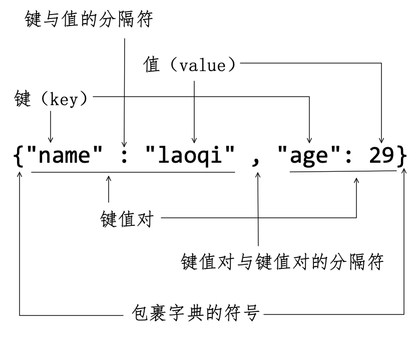
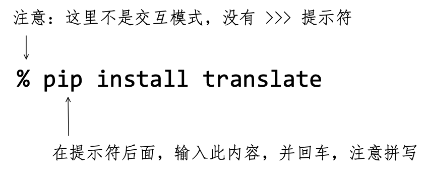
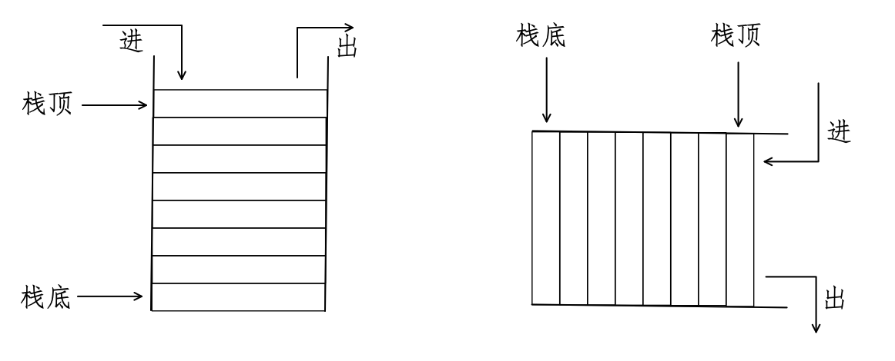
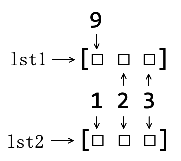
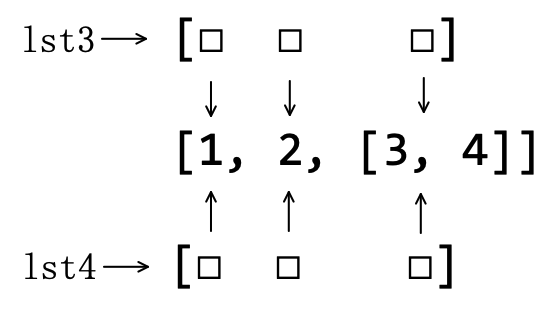

[TOC]

# 第5章 容器

> 莫听穿林打叶声，何妨吟啸且徐行。竹杖芒鞋轻胜马，谁怕？ 一蓑烟雨任平生。
>
> ——苏轼

将字符串、列表和元组视为序列，是因为组成它们的成员具有顺序，如果更换了顺序，就不是原来的对象。这是对 Python 内置对象归类的一种方式。在有的资料中，还提出了“基础对象类型”的类别，包括整数类型、浮点数类型、字符串类型和布尔类型。也就是根据对象的不同特点，可以有不同的聚类结果。本章中的“容器”，也是一种归类方式，一般认为包括列表、元组和字典、集合，前两种已经在第4章学习过，这里将开始学习后两种。诚然，读者也可以创造其他的归类方式。

## 5.1 字典

假设有一种需要，要存储城市和电话区号，用前面已经学习过的知识，可以这么做：

```python
>>> cities = ['soochow', 'hangzhou', 'shagnhai']
>>> phones = ['0512', '0571', '021']
```

为了让城市和区号能对应起来，在创建列表的时候必须按照同样的索引顺序。若要显示 `'soochow'` 的电话号码，必须通过每个列表的索引获取：

````python
>>> print(f"{cities[0]}: {phones[0]}")
soochow: 0512
````

类似这样，一个对象与另外一个对象之间建立对应关系，也是日常生活和生产中常见的事情，比如建立员工的姓名和工资、奖金之间的对应关系，建立学生和各个科目考试成绩之间的对应关系等等。既然如此司空见惯，Python 必然要有内置对象类型，这就是**字典**（Dictionary）——印刷的字典（比如《新华字典》）就是对应关系的典型代表。 

### 5.1.1 创建字典

在此之前，已经用引号创建了字符串、用圆括号创建了元组，用方括号创建了列表，低头看看键盘，按照此思路发展，并且排除在其他地方已经使用的符号——比如 `*` 等，如果选用一个用于创建字典的符号，最可能用哪一个？

Python 发明人选择了 `{ }` ，你是否也想到这个了？如果是，则英雄所见略同；如果不是，也要认可此规定。

```python
>>> d = {"name": "laoqi", "age": 29}    # (1)
>>> type(d)
<class 'dict'>
>>> d
{'name': 'laoqi', 'age': 29}
```

注释（1）创建了一个字典对象，并用变量 `d` 引用此对象。从 `type(d)` 的返回值可知，Python 中以 `dict` 表示字典（或字典类型）。下面参照图5-1-1，理解字典的组成和要求：

- 字典对象用英文状态下的符号 `{ }` 包裹。
- 符号 `{}` 里面的成员是“键值对”，键值对与键值对之间用英文状态的逗号分割。
- 所谓键值对，即两个对象之间建立对应关系，并以英文冒号作为分隔符，冒号左侧的称为**键**（key），右侧的称为此键所对应的**值**（value）。键与值配对，组成一个字典中的单元，称为“键值对”。



<center>图5-1-1 字典的组成</center>

字典中键值对，不能随心所欲地创立——本书的目录和页码之间也是一种对应关系，不能乱写——有如下要求：

- “键”必须唯一，不能重复——参考本书目录理解，目录名称不能重复。
- “键”必须是不可变对象——如果书的目录名称会变化，那就不仅仅是眼花缭乱，而是手忙脚乱了。
- “值”可以是 Python 中任何类型对象。
- “值”可以重复。“键”已经作为“键值对”的唯一标识了，对“值”就不做唯一性要求。

比如，如果创建这样的字典：

```python
>>> {'name': 'laoqi', 'name': 'zhangsan'}
{'name': 'zhangsan'}
```

不会报错，但是结果会“最后一个有效”——“键”是键值对的唯一标识。

至此，在已经学过的 Python 内置对象类型中，能够作为键值对中“键”的有：数字（整数、浮点数、复数）、字符串、元组。

```python
>>> {1: 'first', (1,2,3): [1,2,3], 3.14: {} }
{1: 'first', (1, 2, 3): [1, 2, 3], 3.14: {}}
```

 如果用列表作为键，会怎样呢？

```python
>>> {[1, 2, 3]: "python"}
Traceback (most recent call last):
  File "<stdin>", line 1, in <module>
TypeError: unhashable type: 'list'
```

出现了 `TypeError` 异常，特别注意看提示信息，告诉我们出问题的根源在于列表是 `unhashable` 类型。这是什么意思？简要说明：

- hash：翻译为“散列”或“哈希”，“hashable”意即“可散列”、“可哈希”。截止目前，已经学习过的 Python 内置对象中，数字、字符串、元组都是可散列的，也是不可变对象。
- unhasable：翻译为“不可散列”、“不可哈希”，此前学过的列表和现在正在学习的字典，都是此类型的对象，同时为可变对象。

所以，字典也不能作为键值对的键。

```python
>>> {{1:2}:"python"}
Traceback (most recent call last):
  File "<stdin>", line 1, in <module>
TypeError: unhashable type: 'dict'
```

特别提醒，如果用元组作为键值对的键，其成员只能是数字、字符串或者元组，不能包括任何可变对象。例如下面的示例，要仔细观察。

```python
>>> {([1,2],3,4): 'tuple'}
Traceback (most recent call last):
  File "<stdin>", line 1, in <module>
TypeError: unhashable type: 'list'
    
>>> {(([1,2],),3,4): 'tuple'}
Traceback (most recent call last):
  File "<stdin>", line 1, in <module>
TypeError: unhashable type: 'list'
```

成员的成员，并且照此循环，都不能包括可变对象。

老生常谈，既然字典类型的名称是 `dict` ，Python 的内置函数就会有 `dict()` 。

```python
>>> dct = dict()    # (2)
>>> dct
{}
>>> bool(dct)
False
```

用注释（2）创建一个空字典（直接用 `dct = {}` 也能创建空字典），其布尔值是 `False` 。特别观察，注释（2）中的变量名称，千万不要使用 `dict` ，否则后患无穷、自食其果。

如果创建非空字典，必须使用关键词参数的形式声明对应关系（关键词参数，详见第4章4.2.6节或第7章7.2.1节）。比如：

```python
>>> dict(name='laoqi', age=38)
{'name': 'laoqi', 'age': 38}
```

所得字典的键就是 `dict()` 中的关键词 `name` 和 `age` ——虽然键是字符串，在 `dict()` 中不要将 `name` 和 `age` 写成 `'name'`、`'age'` ，特别要注意此细节。

此外，`dict()` 还支持以可迭代对象为参数创建字典，例如：

```python
>>> dict([('a', 1), ('lang', 'python')])
{'a': 1, 'lang': 'python'}
```

此处以列表 `[('a', 1), ('lang', 'python')]` 为参数，列表中的成员是元组，每个元组内有两个对象，用这种方式约定了两个对象之间的映射关系。

在理解了字典的创建方法之后，读者也应该初步理解“容器”的含义。不论列表，元组还是字典，里面的可以放很多个成员（容器里面的“东西”），每个成员之间用逗号分隔。第4章曾经提到过“列表是个筐”，“筐”就是容器——容器更显得文雅一些。

### 5.1.2 字典的基本操作

不同于序列中的列表、字符串等，字典有着特有的基本操作——有的在形式上与列表近似。

**1. 键值对数量**

Python 内置函数 `len()` 能够返回字符串、列表和元组——都是序列——中的成员数量，且在第4章4.2.3节阅读过它的帮助文档，其中明确指出：“Return the number of items in a container”。毫无疑问，字典是 “container”，所以可以作为 `len()` 的参数，并返回字典中的成员数量，即键值对的数量。

```python
>>> cities_phone = {"soochow": "0512", "shanghai": "021", "hangzhou": "0571"}
>>> len(cities_phone)
3
```

字典中键值对的数量，通俗地说，就是“字典的长度”。

**2. 键值对的读写**

如果从数学角度来理解字典中的“键”和“值”之间的对应关系，可称之为是“映射”，且属于“单射”，即 $\rm{key}\to\rm{value}$​ ，反之不一定成立（关于“映射”的概念，参阅拙作《机器学习数学基础》）。其实，将“映射”的概念也可以用于列表、元组和字符串，它们的索引和成员之间的对应关系也是映射，且可以认为是“双射”，即“一一对应”。由此总结，不论是之前的序列中的索引与成员之间，还是现在的键值对中的键与值之间，都存在着 $index/key \to value$​ 的关系。在序列类对象中，通过索引读取到对应的成员，使用了 `[]` 符号，既然字典与它们存在上述一样的映射关系，符号 `[]` 也可用于字典中，通过“键”读取相应的“值”。

```python
>>> cities_phone['soochow']
'0512'
```

除了“读取”之外，还可以通过键修改值。

```python
>>> cities_phone['shanghai'] = '011'
>>> cities_phone
{'soochow': '0512', 'shanghai': '011', 'hangzhou': '0571'}
```

以上操作，跟列表中通过索引读取成员、修改成员的操作在形式上很类似。但是，下面的就不同了：

```python
>>> cities_phone['beijing'] = '010'     # (3)
>>> cities_phone
{'soochow': '0512', 'shanghai': '011', 'hangzhou': '0571', 'beijing': '010'}
```

原来的字典 `cities_phone` 没有键值对 `'beijing': '010'` ，现在用注释（3）的方式，为它增加了这个键值对——列表中能用类似的形式增加成员吗？试一试便知：

```python
>>> lst = [1, 2, 3]
>>> lst[4] = 99
Traceback (most recent call last):
  File "<stdin>", line 1, in <module>
IndexError: list assignment index out of range
```

再思考一个问题，执行了注释（3）之后，字典 `cities_phone` 的内存地址是否变化了？也就是变量 `cities_phone` 所引用的对象还是不是先前的？读者应该能自行回答此问题——答案：执行注释（3）后字典原地修改。

**3. 成员检测**

在字符串、列表的基本操作中，使用关键词 `in` 可以检测其中是否有某个成员（参阅第4章4.2.3节）。对于字典，其成员是键值对，如前所述，键值对是以键作为唯一标识——键不可重复，所以，只要判断键是否在字典中，即可实现成员检测。

```python
>>> cities_phone
{'soochow': '0512', 'shanghai': '011', 'hangzhou': '0571', 'beijing': '010'}
>>> 'hangzhou' in cities_phone
True
>>> 'suzhou' in cities_phone
False
```

> **自学建议**
>
> 读者细心体会一番上述的学习过程，不断地将字典和列表进行对比，从而发现它们的异同。在比较中，不难体会到编程语言中各种规则的设计是非常符合逻辑的。比如 `[ ]` 符号在列表、字典等对象中应用的原因。这种逻辑还可以推广到更大范围，凡是操作 Python 对象中的成员，都应该用 `[ ]` 符号。Numpy 中的数组对象、Pandas 中的 DataFrame 对象都如此（关于 Numpy 和 Pandas ，参阅第12章12.4节）——若不如此，才是“反 Python”的。
>
> 由此，就提示我们要掌握一种重要的自学方法：比较。将现在学习的知识，与已经掌握的知识进行对比，找出异同，重点理解差异之处，这样就能快速掌握一种新的知识。如果你已经完全掌握了一种编程语言，比如 Python ，再学习另外一种编程语言，遵循此方法，会学得非常快。所以，学得越多学得越快。如此，“老年”程序员依然可以“老夫聊发少年狂”。

### 5.1.3 字典的方法

按照第4章学习字符串和列表的顺序，也要了解字典对象的方法。

**1. 读取值的方法**

在5.1.2节中，曾使用 `d[k]` 读取了字典中已经存在的键值对的值，例如：

```python
>>> d = {"name": "laoqi", "city": ['shanghai', 'soochow', 'hangzhou']}
>>> d['city']
['shanghai', 'soochow', 'hangzhou']
```

如果 `d[k]` 中的 `k` 不在字典中，会怎样？

```python
>>> 'age' in d
False
>>> d['age']
Traceback (most recent call last):
  File "<stdin>", line 1, in <module>
KeyError: 'age'
```

在程序中，如果遇到这个错误，程序就会中止运行，能不能对这种情况进行处理？Python 的字典方法中给出两种处理方案。

- 字典的 `get()` 方法

字典的 `get()` 方法帮助文档这样描述：

```python
get(key, default=None, /) method of builtins.dict instance
    Return the value for key if key is in the dictionary, else default.
```

在 `get()` 的参数中，`key` 表示键——对此很好理解，要根据键读取值，必然要告诉此方法键是什么；还有一个关键词参数 `default=None` ，默认值是 `None` ，也可以设置为任何其他值。

```python
>>> d.get('name')    # (4)
'laoqi'
```

键 `'name'` 存在于字典 `d` 中，注释（4）理所应当返回它所在键值对的值，这就是帮助文档中所说的“Return the value for key if key is in the dictionary”。

```python
>>> d.get('age')
```

字典中没有键 `'age'` ，但这里没有报错，也没有返回值——根据以往的经验，应该是返回了 `None` 。这就是帮助文档中后半句“else default”的含义，且 `default` 的默认值是 `None` 。

```python
>>> d.get('age', 28)   # (5)
28
```

注释（5）中设置 `default` 的值是 `28` ，于是返回了此值。

- 字典的 `setdefault()` 方法

还是先看 `setdefault()` 方法的帮助文档：

```python
setdefault(key, default=None, /) method of builtins.dict instance
    Insert key with a value of default if key is not in the dictionary.

    Return the value for key if key is in the dictionary, else default.
```

与 `get()` 方法的文档比较：两个方法的参数形式一致； `setdefault()` 方法说明中的第二句与 `get()` 方法中的说明一致；下面就重点看看 `get()` 方法中没有的第一句。但是，在此之前，先要解决一个非常严峻的问题：官方文档都是英文的，如果英文比较差，看不懂怎么办？下面就向读者秘密地介绍一项绝技——之所以将这个绝技很隐蔽地在这里介绍，是因为只有真正的读者才能认真地看到此处。

此绝技就是两个字：翻译。不要急着评论，不是让你打开某个翻译软件进行翻译，而是要非常“程序地”翻译。

首先从交互模式中退回到终端，并执行图5-1-2所示的操作。输入指令并执行后，会自动安装，一般需要等待一会。



<center>图5-1-2 安装 translate 库</center>

如果最终看到了下面的内容，则说明安装成功：

```python
Successfully installed appdirs-1.4.4 certifi-2021.5.30 cfgv-3.3.0 chardet-4.0.0 click-8.0.1 distlib-0.3.2 filelock-3.0.12 identify-2.2.7 idna-2.10 lxml-4.6.3 nodeenv-1.6.0 packaging-20.9 pluggy-0.13.1 pre-commit-2.13.0 py-1.10.0 pyparsing-2.4.7 pyyaml-5.4.1 requests-2.25.1 toml-0.10.2 tox-3.23.1 translate-3.5.0 urllib3-1.26.5 virtualenv-20.4.7
```

然后，继续在终端（不要进入到交互模式），按照下面的方式执行一条翻译指令：

```shell
 % translate-cli -t zh "Insert key with a value of default if key is not in the dictionary."
```

返回内容为：

```shell
Translation: 如果键不在字典中，则插入值为 default 的键。
-------------------------
Translated by: MyMemory
```

这种非常“程序地”翻译，非本书真正读者是不告诉他的——请守口如瓶。

这样，我们就全面理解了 `setdefault()` 的含义。下面通过操作体会一番（进入到交互模式）：

```python
>>> d = {"name": "laoqi", "city": ['shanghai', 'soochow', 'hangzhou']}
>>> d.setdefault('name')    # 同 get() 方法
'laoqi'
>>> d.setdefault('age')     # (6)
```

对于注释（6），按照帮助文档中的描述，应该返回了 `default` 的值 `None` ，并且将以 `'age'` 为键 `default` 的值为值的键值对 `'age': None` 插入到字典中。所以，此时字典成为：

```python
>>> d
{'name': 'laoqi', 'city': ['shanghai', 'soochow', 'hangzhou'], 'age': None}
```

如果 `default` 的值不为 `None` ，则：

```python
>>> d.setdefault('years', 28)
28
>>> d
{'name': 'laoqi', 'city': ['shanghai', 'soochow', 'hangzhou'], 'age': None, 'years': 28}
```

**2. 视图对象**

Python 字典对象有三个能够分别读取键、值和键值对的方法：

```python
>>> dct = {"book": "learn python", "price": 99}
>>> dct.keys()
dict_keys(['book', 'price'])
>>> dct.values()
dict_values(['learn python', 99])
>>> dct.items()
dict_items([('book', 'learn python'), ('price', 99)])
```

 以上操作的返回值，不是前面学过的列表，在 Python 中称之为“视图对象”（view object）——这是 Python 3 中才引入的，在 Python 2 中没有此名词。它有什么特点呢？请特别观察如下操作：

```python
>>> v = dct.values()
>>> v
dict_values(['learn python', 99])
```

用变量 `v` 引用了 `dct.values()` 返回的视图对象。下面修改字典 `dct` 中键值对 `"price": 99` 的值，将 `99` 改为 `89` ：

```python
>>> dct['price'] = 89
>>> dct
{'book': 'learn python', 'price': 89}
```

变量 `dct` 引用的字典对象中的键值对已经改为 `'price': 89` ，再来看此时变量 `v` 所引用的对象中，原来的 `99` 是否会变成 `89` ——注意，没有再次执行 `v = dct.values()` 。

```python
>>> v
dict_values(['learn python', 89])
```

由此，显示了视图对象的特点，即字典改变，视图也随之变化。 

能不能通过修改视图对象的成员来改变字典呢？可以试试：

```python
>>> v[1] = 79    # (7)
Traceback (most recent call last):
  File "<stdin>", line 1, in <module>
TypeError: 'dict_values' object does not support item assignment
```

试一试的结果说明，不能使用注释（7）的方式修改视图内的成员。但是，可以用 `list()` 函数将视图对象转化为列表：

```python
>>> vlst = list(v)
>>> vlst
['learn python', 89]
>>> vlst[1] = 79
>>> vlst
['learn python', 79]
>>> v
dict_values(['learn python', 89])
```

变量 `vlst` 引用的列表相对原来的视图对象而言是一个新的对象，固然能够通过它修改其成员，但不会影响原来的视图对象。

建议读者仿照上述内容，再对字典的 `items()` 和 `keys()` 两方法进行操练，其含义三者相同，不赘述。

字典的这三个方法所得到的视图对象，也是可迭代对象，在第6章6.3.1节还会用到它们。

**3. 增加键值对**

向字典中增加键值对的一种常用方法，就是前面已经介绍过的 `d[k] = v` 方式，但这种方式只能一次增加一个键值对。

字典中还有一个名为 `update()` 的方法，它则能实现批量“更新”字典。以如下两个字典为例：

```python
>>> dct
{'book': 'learn python', 'price': 89}
>>> author = {'name': 'laoqi', 'age': 28}
>>> id(dct)
140554197614336
```

并且提醒读者注意观察 `dct` 所引用字典对象的内存地址。然后执行：

```python
>>> dct.update(author)    # (8)
>>> id(dct)
140554197614336
>>> dct
{'book': 'learn python', 'price': 89, 'name': 'laoqi', 'age': 28}
```

注释（8）以字典 `author` 为参数，用它“更新”了字典 `dct` ——只是“更新”，并没有生成新的对象，还要注意，注释（8）没有返回值。

除了像注释（8）那样用字典作为 `update()` 方法的参数之外，还可以使用如下参数“更新”字典。

```python
>>> dct.update([('lang', 'python'), ('pub', 'PHEI')])    # (9)
>>> dct
{'book': 'learn python', 'price': 89, 'name': 'laoqi', 
 'age': 28, 'lang': 'python', 'pub': 'PHEI'}
```

注释（9）中以 `[('lang', 'python'), ('pub', 'PHEI')]` 为 `update()` 的参数，仔细观察此参数的结构，它也表示了一种对应关系，等效于 `{'lang': 'python', 'pub': 'PHEI'}` 。把它们作为 `dict()` 函数的参数，同样能创建字典。

```python
>>> dict([('lang', 'python'), ('pub', 'PHEI')])
{'lang': 'python', 'pub': 'PHEI'}
```

用来表示对应关系的形式，除了字典和类似 `[('lang', 'python'), ('pub', 'PHEI')]` 的结构之外，还可以使用“关键词参数”，所以方法 `update()` 的参数也能用如下代码所示的方式提供。

```python
>>> d = {'a': 10}
>>> d.update(b=100, c=200)    # (10)
>>> d
{'a': 10, 'b': 100, 'c': 200}
```

注释（10）中用关键词参数表示了对应关系，也能实现对原字典的“更新”。

经过以上操作之后，再来阅读 `update()` 方法的帮助文档，定会对其含义有了深刻的理解。

```python
update(...) method of builtins.dict instance
    D.update([E, ]**F) -> None.  Update D from dict/iterable E and F.
    If E is present and has a .keys() method, then does:  for k in E: D[k] = E[k]
    If E is present and lacks a .keys() method, then does:  for k, v in E: D[k] = v
    In either case, this is followed by: for k in F:  D[k] = F[k]
```

注释（8）（9）（10）的三个操作，正好对应帮助文档中所说的三种情况：

- 注释（8）中的参数是字典，字典有 `keys()` 方法；
- 注释（9）中的参数是列表（列表的成员是元组），且可迭代，但没有 `keys()` 方法；
- 注释（10）的关键词参数，对应于帮助文档中的 `**F` （这里的 `**` 不是数学运算符号，表示 `F` 收集关键词参数，参阅第7章7.2.1节）。

所以，认真地、耐心的读文档是多么重要呀，无怪乎子曰：“我非生而知之者，好古敏以求之者也。”

**4. 删除键值对**

列表中的 `pop()` 、`remove()` 和 `clear()` 可以用于删除列表成员（参阅第4章4.3.2节）。对字典而言，其成员是键值对，能够实现删除成员的方法有 `pop()` 、`popitem()` 、`clear()` ，这些方法在完成了删除操作之后，字典（容器）还是原来的对象，内存地址不变，也就是常说的“原地修改”。

因为列表和字典中都有 `pop()`方法，根据“温故而知新”的教诲，建议读者新复习第4章4.3.2节中对此方法的介绍，并理解下述操作。

```python
>>> lst = ['a', 'b', 'c']
>>> lst.pop(1)
'b'
>>> lst
['a', 'c']
>>> lst.pop()
'c'
>>> lst
['a']
```

与之对比，字典的 `pop()` 方法肯定不会以“索引”为参数——字典没有索引，根据5.1.1节所学知识，读者肯定能想到，其参数必然是键值对的键。下面就检验此猜测：

```python
>>> dct    # 注释（9）使用过的字典，读者在调试的时候，内存中若没有，可以新建
{'book': 'learn python', 'price': 89, 'name': 'laoqi', 
 'age': 28, 'lang': 'python', 'pub': 'PHEI'}
>>> dct.pop('price')    # (11)
89
```

注释（11）的操作结果证实了猜测。继续与列表中的同名方法类比，能不能如同 `lst.pop()` 那样，不提供任何参数的时候，删除“最后一个”成员呢？

```python
>>> dct.pop()    # (12)
Traceback (most recent call last):
  File "<stdin>", line 1, in <module>
TypeError: pop expected at least 1 argument, got 0
```

不能。并且错误提示告诉我们，字典的 `pop()` 方法最少要有一个参数——言外之意，除了像注释（11）那样提供一个键作为参数之外，还可以有别的参数。看来光凭猜测，还不能解决深层次问题，必须要认真地、耐心地阅读文档。

```
pop(...) method of builtins.dict instance
    D.pop(k[,d]) -> v, remove specified key and return the corresponding value.

    If key is not found, default is returned if given, otherwise KeyError is raised
```

由此文档可知，使用字典的 `pop()` 方法必须知悉如下事项：

-  `D.pop(k[,d])` 中的 `k` 说明必须以键为参数，且不可省略，所以注释（12）的操作是不被允许的。
-  `D.pop(k[,d])` 中的 `d` 是可选项。如果提供值，当字典中没有要删除的 `k` 时，就会返回 `d` 的值（If key is not found, default is returned if given）；如果不提供 `d` 的值，此时就会返抛出 `KeyError` 异常（otherwise KeyError is raised）。例如下面的注释（13）（14）的操作。

```python
>>> dct.pop('price')    # (13)
Traceback (most recent call last):
  File "<stdin>", line 1, in <module>
KeyError: 'price'
>>> dct.pop('pirce', 314)    # (14)
314
>>> dct
{'book': 'learn python', 'name': 'laoqi', 
 'age': 28, 'lang': 'python', 'pub': 'PHEI'}
```

注释（12）显示了字典和列表的 `pop()` 方法的一个差异，但是字典中的另外一个方法则酷似列表中的 `lst.pop()` 删除最后一个成员。

```python
>>> dct
{'book': 'learn python', 'name': 'laoqi', 
 'age': 28, 'lang': 'python', 'pub': 'PHEI'}
>>> dct.popitem()    # (15)
('pub', 'PHEI')
>>> dct
{'book': 'learn python', 'name': 'laoqi', 'age': 28, 'lang': 'python'}
```

字典的 `popitem()` 方法，如注释（15），调用的时候参数为空，删除了原字典最后一对键值对，且将其以元组的形式返回。此方法的帮助文档很值得我们阅读，因为其中提到了一个新的术语：LIFO。

```
popitem() method of builtins.dict instance
    Remove and return a (key, value) pair as a 2-tuple.

    Pairs are returned in LIFO (last-in, first-out) order.
    Raises KeyError if the dict is empty.
```

LIFO ，即“Last in, First out”，译为“后进先出”，这是计算机科学中插入、删除数据一种原则，例如，一种名为“栈”（stack）的数据结构，只能在栈顶执行插入和删除操作。先进入的数据就被压入到栈底，后进入的在栈顶；执行删除操作时，就要先删除位于栈顶的后进入的操作，故“后进先出”（如图5-1-3所示）。



<center>图5-1-3 栈示意图</center>

虽然 Python 的字典与栈不同，但它也遵循了 LIFO 原则。读者观察之前所有创建字典和向字典中增加成员的操作，是不是先加入的键值对在左侧，后加入的在右侧。这种排序，其实是从 Python 3.6 开始具有的，在 Python 3.6 之前，字典中的键值对是“无序”的。按照本书学习要求，使用的是 Python 3.9 。

借着顺序问题，顺便看看字典作为内置函数 `sorted()` 参数的结果：

```python
>>> dct
{'book': 'learn python', 'name': 'laoqi', 'age': 28, 'lang': 'python'}
>>> sorted(dct)    # (16)
['age', 'book', 'lang', 'name']
```

注释（16）返回了排序结果：字典中键的顺序。有了键的顺序，就可以更进一步得到对应的值了。在第4章4.3.2节将 `sorted()` 函数用之于列表，对于序列进行排序是顺理成章的事情。而字典，固然它的成员符合 LIFO 原则，毕竟是“键值对的集合”——集合没有顺序（参阅5.2节）。字典之所以能作为 `sorted()` 的参数，原因就是字典是可迭代对象（请思考，怎么判断字典是不是可迭代对象。参阅第4章4.3.2节），`sorted()` 函数对参数要就即如此。注意，字典没有 `sort()` 方法——不同于列表。

第三个字典对象删除成员的方法 `clear()` ，和列表中同名方法无差别，都是将容器清空。

```python
>>> dct
{'book': 'learn python', 'name': 'laoqi', 'age': 28, 'lang': 'python'}
>>> id(dct)
140554197614336
>>> dct.clear()    # 注意观察此方法前后字典的内存地址
>>> id(dct)
140554197614336
```

> **自学建议**
>
> 本节内容是继第3章3.3节的【自学建议】之后，进一步以实际学习过程为例，演示了如何边学习边理解帮助文档，依靠帮助文档加深对操作的理解。
>
> 这不是“手把手”“保姆式”的教授方法，会有人对本节内容非常反感——按照常理推断，数量不会很少，毕竟被“灌输”会有一种省时省力地接受所谓“干货”的虚假愉悦感和虚假满足感。那么，本书或许很不适合此类读者，恭请尽快寻找其他读物，以免耽误锦绣前程。 

## 5.2 集合

在数学中，“集合”（Set）有“无序性”、“互异性”和“确定性”三个特性。在 Python 中，作为内置对象（也是对象类型）的集合，同样具有这些特性，也能实现数学中集合的运算。可以说，Python 中的“集合”就是数学中“集合”在编程中的实现。

### 5.2.1 创建集合

Python 有内置函数 `set()` ，可用于创建集合：

```python
>>> s = set([1, 2, 1, 2])    # (1)
>>> s
{1, 2}
>>> type(s)
<class 'set'>
```

注释（1）中以列表 `[1, 2, 1, 2]` 为参数创建了集合——变量 `s` 引用的对象。如果读者查看 `set()` 的帮助文档，会发现其参数被要求是可迭代对象（这很重要）。至此，我们已经学过的 Python 内置对象中，符合此要求的有：字符串、列表、元组、字典。这些对象类型均可作为 `set()` 的参数。

```python
>>> set((1, 2, 1, 2))
{1, 2}
>>> set("book")
{'b', 'o', 'k'}
>>> set({'name': 'laoqi', 'age':28})
{'name', 'age'}
```

从上述各项操作不难看出，所得到的集合中的成员是组成可迭代对象的成员（字典则是成员的键），且它们不能重复，即“互异”。

再观察返回的集合对象的“形状”，跟列表类似，但是用符号 `{ }` 包裹。所以，通常也可以这样创建集合：

```python
>>> s2 = {1, 2, 'python'}
>>> type(s2)
<class 'set'>
```

但要注意某些特殊情况，毕竟字典和集合使用了同样的包裹符号。

```python
>>> s3 = {}       # (2)
>>> type(s3)
<class 'dict'>
>>> s4 = set()    # (3)
>>> type(s4)
<class 'set'>
```

注释（2）所创建的对象，不是空集合，是一个空字典，如果要创建空集合，须使用注释（3）的方式。

与字典一样，集合没有索引，或者说它不属于序列，即其中的成员本“无序”——这里的无序与字典中“无序”理解一样，即不需要用序列中的索引为每个成员建立映射关系，故不支持诸如列表中的索引、切片和其他序列特有的操作。

```python
>>> s = set("python")
>>> s
{'p', 't', 'n', 'o', 'y', 'h'}
>>> s[1]
Traceback (most recent call last):
  File "<stdin>", line 1, in <module>
TypeError: 'set' object is not subscriptable
```

但是，有些基本操作对于集合而言是许可的：

```python
>>> 'p' in s   # 成员检测
True
>>> len(s)     # 成员数量
6
```

并且，集合也是可迭代对象：

```python
>>> hasattr(s, "__iter__")
True
```

于是乎，凡是要求以可迭代对象为参数的函数，均可以用之于集合，例如：

```python
>>> sorted(s)
['h', 'n', 'o', 'p', 't', 'y']
>>> list(s)
['p', 't', 'n', 'o', 'y', 'h']
```

最后要说明的，不论用 `set()` 还是用符号 `{ }` 创建集合对象，其的成员必须是“不可变对象”——在5.1.1节中解释字典的键值对的键时曾使用过这个术语。再总结一下，到现在所学的 Python 内置对象类型中，属于“不可变对象”的有：浮点数、整数、复数、字符串、元组；属于“可变对象”的有：列表、字典。

```python
>>> set([[1,2], 3, 4])    # (4)
Traceback (most recent call last):
  File "<stdin>", line 1, in <module>
TypeError: unhashable type: 'list'
```

注意区分注释（4）和（1），在注释（4）中，试图得到一个成员分别是 `[1 ,2]`、`3`、`4` 的集合，而不是 `{1, 2, 3, 4}` 。但是未果，因为 `[1, 2]` 是可变对象，它不能作为集合的成员。

注释（4）执行后的报错信息中，在此出现 `unhashable` ，相关说明参阅5.1.1节。

同样，字典也不能成为集合的成员。

```python
>>> set([{1: 2}, 3, 4])
Traceback (most recent call last):
  File "<stdin>", line 1, in <module>
TypeError: unhashable type: 'dict'
```

假设，集合中的成员是列表，当对这个列表内的成员进行增、删、改操作时，该列表本身没有变（内存地址不变），但其中的成员变化了。这在逻辑上就与集合的“确定性”不和谐了。故，假设不成立。编程语言中的规定必然要符合逻辑。

最后，请读者执行并思考下面的操作：

```python
>>> {(1,2), 1, 2}
{1, 2, (1, 2)}

>>> {([1,2],), 1, 2}
Traceback (most recent call last):
  File "<stdin>", line 1, in <module>
TypeError: unhashable type: 'list'
```

能不能发现什么奥妙？请参考5.1.1节的有关内容。

### 5.2.2 集合的方法

在交互模式中执行 `dir(set)` ，观察返回的方法名称，会立刻得到一个结论，5.2.1节中所创建的集合是可变的。

**1. 增加成员**

创建一个空集合，然后用 `add()` 方法向其中增加成员，注意观察下述操作中集合的内存地址，从而体会“容器”的特点。

```python
>>> s = set()
>>> id(s)
140554232026048
>>> s.add(1)
>>> s
{1}
>>> id(s)
140554232026048
```

执行了集合的方法 `add()` 后，其参数就成为了集合的成员，如：

```python
>>> s.add('python')
>>> s
{1, 'python'}
```

如果参数与集合中已有成员一样，则什么也不会发生——不报异常。

```python
>>> s.add(1)
```

集合也有一个名为 `update()` 的方法——类似字典中的 `update()` 方法，但参数不同。

```python
>>> s
{1, 'python'}
>>> s2 = {1, 2, 3}
>>> s.update(s2)
>>> s
{1, 2, 'python', 3}
```

其实，任何可以用于 `set()` 的参数对象均可作为 `update()` 的参数。如：

```python
>>> s.update("py")
>>> s
{1, 2, 'python', 3, 'p', 'y'}
>>> s.update([5, 6])
>>> s
{1, 2, 'python', 3, 'p', 'y', 5, 6} 
```

**2. 删除成员**

能够实现删除集合成员的方法有 `pop()` 、 `remove()` 、`discard()` 和 `clear()` ，其中部分与列表中的同名，所以在学习的时候，也要注意比较。

由于集合没有索引——与列表的区别，所以 `pop()` 方法不可能像列表那样能够删除任何指定的成员，只能不提供任何参数，删除一个成员。特别注意，不是随机删除，但是，关于其删除规则，已经超出本书的范畴，有兴趣的读者可以在网上搜索，相关探讨很多。

````python
>>> sp = {"book", "web", "machine learnging"}
>>> sp
{'web', 'machine learnging', 'book'}
>>> sp.pop()
'web'
>>> sp
{'machine learnging', 'book'}
>>> sp.pop()
'machine learnging'
>>> sp
{'book'}
>>> sp.pop()
'book'
>>> sp
set()
>>> sp.pop()
Traceback (most recent call last):
  File "<stdin>", line 1, in <module>
KeyError: 'pop from an empty set'4
````

每执行一次 `pop()` 方法，就从集合中删除一个成员，并将该成员作为返回值。直到成为空集合后，再执行 `pop()` 方法就会抛出 `KeyError` 异常。

如果要删除指定的成员，可以使用 `remove()` 方法——与列表的 `remove()` 方法雷同。

 ```python
 >>> s = set('book')
 >>> s.remove("b")
 >>> s
 {'o', 'k'}
 >>> s.remove('k')
 >>> s
 {'o'}
 >>> s.remove('k')    # (5)
 Traceback (most recent call last):
   File "<stdin>", line 1, in <module>
 KeyError: 'k'
 ```

`remove()` 方法的参数就是指定删除的成员，注意没有返回值。如果参数所引用的对象不是集合的成员，则报错，如注释（5）操作的结果。

还有一个与 `remove()` 方法在某些方面等效，但亦有差异的方法 `discard()` ，首先它也用于删除指定的集合中的成员。

```python
>>> s
{'o'}
>>> s.discard('o')    # (6)
```

注释（6）的操作执行完毕，此集合已经是空集合了。

```python
>>> s
set()
>>> s.discard('o')    # (7)
```

注释（7）再执行删除，显然 `'o'` 不是集合中的成员，但是执行之后并不报异常，这是与前述 `remove()` 方法的显著区别。

集合的 `clear()` 方法与字典、列表中同名方法执行和效果完全一样，即“Remove all elements from this set”（引用自帮助文档）。

```python
>>> s = set("yourself")
>>> s
{'u', 's', 'e', 'r', 'o', 'f', 'y', 'l'}
>>> s.clear()
>>> s
set()
```

对照列表和字典，集合对象不支持符号 `[ ]` 的有关操作，比如：

```python
>>> lst = ["python", "java", "rust"]
>>> lst[1]
'java'
>>> lst[1] = 'php'
>>> lst
['python', 'php', 'rust']

>>> dct = {'lang': 'php', 'order':1}
>>> dct['lang']
'php'
>>> dct['lang'] = 'python'
>>> dct
{'lang': 'python', 'order': 1}
```

集合中没有类似的操作，也是符合集合特点的——既没有索引，也没有键值对。

### 5.2.3 不变的集合

在5.2.1节所创建的集合是可变的，在5.2.2节中有关方法的介绍业已体现了——读者可以用已经学过的方法自行验证5.2.2节的各个方法是否改变了容器对象。

除了“可变集合”之外，还有一种集合是“不可变的”，创建这种集合要使用 `frozenset()` 函数。

```python
>>> fs = frozenset([1,2,3])    # (8)
>>> fs
frozenset({1, 2, 3})           # (9)
>>> type(fs)
<class 'frozenset'>            # (10)
>>> dir(fs)
['__and__', '__class__', '__class_getitem__', '__contains__', '__delattr__', '__dir__', '__doc__', '__eq__', '__format__', '__ge__', '__getattribute__', '__gt__', '__hash__', '__init__', '__init_subclass__', '__iter__', '__le__', '__len__', '__lt__', '__ne__', '__new__', '__or__', '__rand__', '__reduce__', '__reduce_ex__', '__repr__', '__ror__', '__rsub__', '__rxor__', '__setattr__', '__sizeof__', '__str__', '__sub__', '__subclasshook__', '__xor__', 'copy', 'difference', 'intersection', 'isdisjoint', 'issubset', 'issuperset', 'symmetric_difference', 'union']
```

注释（8）用 `frozenset()` 函数创建了不可变集合对象，其参数要求与 `set()` 函数的一样（参阅5.2.1节）。注释（9）是不可变集合对象的形式，注释（10）是它的类型，这些与可变集合均有所不同。此外，从不可变集合的属性和方法来看，5.2.1节中曾介绍的各个方法在这里难觅其踪。

```python
>>> fs.add(4)
Traceback (most recent call last):
  File "<stdin>", line 1, in <module>
AttributeError: 'frozenset' object has no attribute 'add'
```

不可变集合和可变集合之间，可以通过内置函数 `set()` 和 `frozenset()` 进行相互转换。

```python
>>> fs
frozenset({1, 2, 3})
>>> set(fs)        # fs 转换为可变集合
{1, 2, 3}
>>> s = set((1,2))
>>> s
{1, 2}
>>> frozenset(s)    # s 转换为不可变集合
frozenset({1, 2})
```

### 5.2.4 集合的关系和运算

数学上，集合之间有“子集”、“超集”的关系和“交、差、并”等运算，在 Python 中也提供了完成集合运算的方法，在程序中恰当使用，可以优化程序。

**1. 成员与集合的关系**

成员与集合只有一种关系，那就是要么属于某个集合，要么不属于。

```python
>>> s = set("learn")
>>> s
{'a', 'e', 'r', 'n', 'l'}
>>> 'a' in s
True
>>> 'b' not in s
True
>>> 'b' in s
False
```

**2. 集合与集合的关系**

如果两个集合的成员完全一样，那么这两个集合则相等，否则不等——这是集合与集合之间的一种关系。

```python
>>> a = set([2, 4, 6, 8])
>>> b = set([1, 3, 5, 7])
>>> a == b
False

>>> c = set([2, 4, 6, 8])
>>> a is c
False
>>> a == c
True
```

此外，还有一种子集（或超集）的关系，如图5-2-1所示，如果集合 A 的所有成员也是集合 B 的，那么 A 是 B 的子集，或者说 B 是 A 的超集。


<center>图5-2-1 子集（超集）</center>

```python
>>> a
{8, 2, 4, 6}
>>> b = set([2, 4, 6, 8, 10])
>>> a.issubset(b)      # a 是 b 的子集
True
>>> b.issuperset(a)    # b 是 a 的超集
True
```

从方法命名的角度看， `issubset()` 和 `issuperset()` 表达明确，可读性强。但是，如果有读者非常习惯于数学中的运算符号 $\subset$ 、$\subseteq$ 等，会觉得这些符号更简洁明了，为此 Python 也有“同感”，所以提供了如下符号：

```python
>>> a < b
True
>>> a <= b
True
>>> b > a
True
>>> b >= a
True
```

这里的 `<` 、`<=` 不应视为比较运算符，而是集合运算中的 $\subset$ 和 $\subseteq$ 符号，相应地，`>` 表示 $\supset$ ，`>=` 表示 $\supseteq$ 。

**3. 集合间的运算**

在数学上，集合之间有并（符号 $\cup$ ）、交（符号 $\cap$ ）、差（符号 $-$ ）、对称差（符号 $\vartriangle$​ ）等运算，在 Python 的集合对象上，也支持这些运算，且有可读性很强的方法以及对应的符号两套方式。

**并**

给定集合 $A$ 、$B$ ，定义运算 $\cup$ 为：

$A\cup B = \{e|e\in A 或 e \in B\}$

$A\cup B$ 称为 $A$ 和 $B$ 的并集。

Python 中支持运算符号“ `|` ” 表示数学中的 $\cup$ ，也可以使用方法 `union()` 。

```python
>>> a = set([1, 3, 5])
>>> b = set([3, 6, 9])
>>> a | b
{1, 3, 5, 6, 9}
>>> a.union(b)
{1, 3, 5, 6, 9}
>>> a
{1, 3, 5}
>>> b
{9, 3, 6}
```

从上述示例可知，集合的并运算生成了一个新的集合对象，并没有修改原有集合对象——下述各项运算均有此特点。

利用符号 `|` 或者方法 `union()` 还可以实现多个集合之间的运算。

```
>>> c = set([2, 4, 6])
>>> a | b | c
{1, 2, 3, 4, 5, 6, 9}
>>> a.union(b, c)
{1, 2, 3, 4, 5, 6, 9}
```

**交**

给定集合 $A$ 、$B$ ，定义运算 $\cap$ 为：

$A\cap B = \{e | e\in A 且 e \in B \}$

$A\cap B$ 称为 $A$ 和 $B$ 的交集。 

Python 中支持运算符号“ `&` ”表示数学中的 $\cap$ ，也可以使用方法 `intersection()` 。

```python
>>> a
{1, 3, 5}
>>> b
{9, 3, 6}
>>> c
{2, 4, 6}
>>> a & b
{3}
>>> a & b & c
set()
>>> a.intersection(b)
{3}
>>> a.intersection(b, c)
set()
```

**差**

给定集合 $A$ 、$B$ ，定义运算 $-$ 为：

$A - B = \{e|e\in A 且 e \notin B\}$

$A-B$ 称为 $B$ 对于 $A$ 的差集，或相对补集。

如果有全集 $U$ ，对于 $U$ 的一个子集 $A$ ，通常称 $U-A$ 为 $A$ 的补集。

Python 中支持运算符“ `-` ” 表示数学中的 $-$ （都是键盘中的 `-` 键所对应的符号），也可以使用方法 `difference()` 。

```python
>>> a
{1, 3, 5}
>>> b
{9, 3, 6}
>>> a - b
{1, 5}
>>> b - a    # a - b 不等于 b - a
{9, 6}
>>> a.difference(b)
{1, 5}
>>> b.difference(a)
{9, 6}
```

**对称差**

给定集合 $A$ 、$B$ ，定义运算 $\vartriangle$ 为：

$A\vartriangle B = (A-B)\cup(B-A)$

Python 中支持运算符“ `^` ”表示数学中的 $\vartriangle$ ，也可以使用方法 `symmetric_difference()` 。

```python
>>> a
{1, 3, 5}
>>> b
{9, 3, 6}
>>> a ^ b
{1, 5, 6, 9}
>>> a.symmetric_difference(b)
{1, 5, 6, 9}
```

在使用运算符进行有关集合运算时，参与运算的必须是集合——可变集合或者不可变集合。

```python
>>> a
{1, 3, 5}
>>> fs = frozenset([2,3,4])
>>> a & fs    # (11)
{3}
```

注释（11）计算了可变集合与不可变集合的交集，Python 会自动先执行 `set(fs)` ，将不可变集合转换为可变集合，再计算 `a & set(fs)` 。

但是，如果使用集合的方法 `union()`、 `intersection()` 、 `difference()` 、 `symmetric_difference()` 、 `issubset()` 、 `issuperset()` ，它们的参数除了集合对象之外，可以是其他可迭代对象——任何可用 `set()` 创建集合的 Python 对象。

```python
>>> a
{1, 3, 5}
>>> a.union([5, 6, 7])
{1, 3, 5, 6, 7}
>>> a.union({5:'a', 6:'b'})
{1, 3, 5, 6}
>>> a.union("255")
{1, 3, 5, '5', '2'}
```

> **自学建议**
>
> 从开始自学到现在，一直在学 Python 的内置对象类型，有的读者可能会质疑：这些东西怎么用？甚至有的人会认为，这样的自学方式太慢了。
>
> 现代社会生活节奏比较快，为了迎合我们的这种感觉，就有了诸如“X天学会某某”的广告满天飞——其中 X 是不能大于21的，因为有人说21天会改掉一个坏习惯并养成一个好习惯，虽然这并未得到严格证实，但很多人相信——这无疑又是对本来焦虑的人们雪上加霜。
>
> 不过，我们还是要理智地思考：学习能不能“快餐化”？或许有的内容可以。根据我个人经验，至少在编程语言的学习中，“快餐化”地学习，貌似在较短时间内入门，实则只是照葫芦画瓢——以所谓的实战项目自欺欺人。所以，请读者稍安勿躁，打牢基础，养成独立研习的习惯，掌握学习方法，假以时日，必能厚积薄发，前途无量。

## 5.3 引用和拷贝

在第2章2.3节学习变量的时候曾强调过 Python 中的变量与对象之间是引用关系。以列表为例：

```python
>>> lst1 = [1, 2, 3]
>>> lst2 = lst1
>>> id(lst1)
140425588751424
>>> id(lst2)
140425588751424
```

变量 `lst1` 和 `lst2` 引用了同一个对象，如果借用 `lst1` 修改该对象成员，会发现 `lst1` 和 `lst2` “同步变化”——本质上是同一个列表对象内的成员变化。

```python
>>> lst1.append(4)
>>> lst1
[1, 2, 3, 4]
>>> lst2
[1, 2, 3, 4]
```

同样的情况也适用于字典和集合。

```python
# 变量引用字典
>>> dct1 = {'lang':'python'}
>>> dct2 = dct1
>>> dct2 is dct1
True
>>> dct1['name'] = 'laoqi'
>>> dct1
{'lang': 'python', 'name': 'laoqi'}
>>> dct2
{'lang': 'python', 'name': 'laoqi'}

# 变量引用集合
>>> s1 = set('book')
>>> s2 = s1
>>> s1 is s2
True
>>> s1.add('hello')
>>> s1
{'o', 'b', 'k', 'hello'}
>>> s2
{'o', 'b', 'k', 'hello'}
```

在复习了变量与对象之间的“引用”关系之后，再来探讨列表、字典、集合都有的一个方法：`copy()` ，先观察它们的帮助文档是如何描述这个方法的：

- 列表： `Return a shallow copy of the list` 。
- 字典： `D.copy() -> a shallow copy of D` 。
- 集合： `Return a shallow copy of a set` 。

在帮助文档中都用到了“shallow copy”这个词语，中文翻译为“浅拷贝”，所谓“浅”是如何体现的？以列表为例：

```python
>>> lst1 = [1, 2, 3]
>>> lst2 = lst1.copy()    # (1)
>>> lst2 is lst1          # (2)
False
>>> lst2 == lst1          # (3)
True
```

注释（1）执行了列表的 `copy()` 方法，得到了变量 `lst2` 引用的一个新对象，注释（2）的结果显示 `lst1` 和 `lst2` 分别引用了两个不同的列表，但是它们的内容完全一样，所以注释（3）的结果为 `True` 。这符合我们通常理解的“copy”含义：复制一次之后有了两个完全一样的对象。此时，如果修改 `lst1` 引用的对象，`lst2` 引用的对象则不会随之改变。

```python
>>> lst1.append(4)
>>> lst1
[1, 2, 3, 4]
>>> lst2
[1, 2, 3]
```

通过上面操作，我们已经明确，运用其 `copy()` 方法，得到了一个新的对象。然而，再向下考察：两个不同容器里的“东西”是否不同？——直觉上，应该是不同的对象，即 `lst1` 中的 `1` 与 `lst2` 中的 `1` 不是同一个对象。

```python
>>> lst1[0] is lst2[0]
True
>>> lst1[1] is lst2[1]
True
>>> lst1[2] is lst2[2]
True
```

仅以每个列表中的前三个为例，所发现的结果是不是有点“反直觉”：当注释（1）执行完之后，两个不同的容器里面居然“装着”同一个对象。如果用更严谨但稍显啰嗦的语言表述：执行了注释（1）的 `copy()`  方法之后，得到的用变量 `lst2` 引用的列表与 `lst1` 引用的列表不是同一个对象，但两个列表中的成员，是同一个对象（如图5-3-1所示）。


<center>图5-3-1 列表浅拷贝后对象关系</center>

`copy()` 方法的这个效果最大好处是节省了内存空间，一个对象被两个不同“筐”里面的“位置”引用——现实生活中是无法做到同一个苹果既在这个筐也在哪个筐里的。

```python
>>> lst1[0] = 9    # (4)
>>> lst1
[9, 2, 3]
>>> lst2
[1, 2, 3]
```

注释（4）令列表 `list1` 的第一个位置引用对象 `9` ，其他不变，如图5-3-2所示。



<center>图5-3-2 更改列表中成员</center>

由此可见，`copy()` 方法“一点也不浪费”。固然“节约光荣”，但是，不小心也会容易遇到 Bug ，例如：

```python
>>> lst3 = [1, 2, [3, 4]]
>>> lst4 = lst1.copy()
>>> lst3 is lst4
False
```

变量 `lst3` 引用的列表与 `lst1` 的不同之处在于列表里面有一个成员还是列表，即“容器套容器”。再执行 `copy()` 后得到 `lst4` 引用的另外一个对象。

```python
>>> lst3[2].append(9)    # (5)
>>> lst3
[1, 2, [3, 4, 9]]
```

注释（5）旨在对列表 `lst3` 中的索引是 `2` 的列表成员追加一个对象。请思考，执行此操作之后，`lst4` 引用的列表是否还是 `[1, 2, [3, 4]]` ？

继续延续前面的思想——列表中的成员位置引用了对象。如图5-3-3所示，列表 `lst3` 和 `lst4` 的索引 `2` 的位置都引用了同一个列表对象。



<center>图5-3-3 列表中含列表</center>

当执行注释（5）之后，向该列表对象 `[3, 4]` 中追加了一个整数 `9` ，且此列表对象原地修改，即 `lst3` 和 `lst4` 的索引 `2` 的位置所引用的对象没有变——变的是它里面的成员。因此，列表 `lst4` 不再是 `[1, 2, [3, 4]]` ，而是：

```python
>>> lst4
[1, 2, [3, 4, 9]]
```

与此类似，字典、集合中的成员与相应的对象之间都是“引用”关系，在执行 `cop()` 方法时也会看到类似以上列表的现象，例如：

```python
>>> d1 = {'name':"laoqi", 'city':['shanghai', 'soochow']}
>>> d2 = d1.copy()
>>> d1 is d2
False
>>> d2
{'name': 'laoqi', 'city': ['shanghai', 'soochow']}
>>> d1['name'] = '老齐'
>>> d1
{'name': '老齐', 'city': ['shanghai', 'soochow']}
>>> d2
{'name': 'laoqi', 'city': ['shanghai', 'soochow']}
>>> d1['city'].append('hangzhou')
>>> d1
{'name': '老齐', 'city': ['shanghai', 'soochow', 'hangzhou']}
>>> d2
{'name': 'laoqi', 'city': ['shanghai', 'soochow', 'hangzhou']}
```

运用归纳法，可以将 `copy()` 方法理解为：

- 新建一个容器对象；
- 新的容器对象相对于原来的容器对象，只复制了“最外层”容器对象；
- 新容器内的成员与旧容器内的相应的成员，都引用同一个对象。

这就是帮助文档中的“shallow copy”——“浅拷贝”之含义。

下面用 `for` 循环语句（参阅第6章6.3节）将列表、字典、集合三个容器“浅拷贝”前后的成员引用对象的内存地址打印出来，从中进一步理解上述“浅拷贝”的含义。

```python
# 列表
>>> lst1 = [1, 2, [3, 4]]
>>> lst2 = lst1.copy()
>>> id1 = {id(e):e for e in lst1}
>>> id2 = {id(e):e for e in lst2}
>>> print(f'{id(lst1)}:lst1 => {id1}')
140425643229312:lst1 => {140425563347248: 1, 
                         140425563347280: 2, 
                         140425643297088: [3, 4]}
>>> print(f'{id(lst2)}:lst2 => {id2}')
140425643230080:lst2 => {140425563347248: 1, 
                         140425563347280: 2, 
                         140425643297088: [3, 4]}
  
# 字典
>>> d1 = {'name':"laoqi", "city":["shanghai", "soochow"]}
>>> d2 = d1.copy()
>>> id1 = {id(v):v for _,v in d1.items()}
>>> id2 = {id(v):v for _,v in d2.items()}
>>> print(f"{id(d1)}:d1 ==> {id1}")
140425643232704:d1 ==> {140425643295152: 'laoqi', 
                        140425588845120: ['shanghai', 'soochow']}
>>> print(f"{id(d2)}:d2 ==> {id2}")
140425643283776:d2 ==> {140425643295152: 'laoqi', 
                        140425588845120: ['shanghai', 'soochow']}
  
# 集合
>>> s1 = {1, 2}
>>> s2 = s1.copy()
>>> id1 = {id(e):e for e in s1}
>>> id2 = {id(e):e for e in s2}
>>> print(f"{id(s1)}:s1 ==> {id1}")
140425588735776:s1 ==> {140425563347248: 1, 
                        140425563347280: 2}
>>> print(f"{id(s2)}:s2 ==> {id2}")
140425588770176:s2 ==> {140425563347248: 1, 
                        140425563347280: 2}
```

“浅拷贝”仅仅拷贝了容器的“最外层”，如果想得到容器内所有成员的“拷贝”，`copy()` 方法就无能为力了，必须使用另外一个专门工具。

```python
>>> import copy                  # (6)
>>> lst1
[1, 2, [3, 4]]
>>> lst3 = copy.deepcopy(lst1)    # (7)
>>> lst1 is lst3
False
```

注释（6）引入了标准库中的模块 `copy` ，注释（7）使用 `copy.deepcopy()` 函数得到了 `lst1` 的“一份拷贝” `lst3` ，它与 `lst1` 不是同一个对象，但这还不能说明它是否连同容器内部的对象都复制了一份。

```python
>>> {id(e):e for e in lst1}
{140425563347248: 1, 140425563347280: 2, 140425643297088: [3, 4]}
>>> {id(e):e for e in lst3}
{140425563347248: 1, 140425563347280: 2, 140425643296384: [3, 4]}
```

比较以上所显示的每个成员对象的内存地址，会发现，注释（7）中的 `copy.deepcopy()` 不仅仅“拷贝了最外层容器”，也“拷贝了内层的容器”，这就是“深拷贝”。

建议读者将注释（7）的深拷贝操作也应用于字典，并检查内存地址，从而深刻理解深拷贝和浅拷贝的不同。

> **自学建议**
>
> 到现在为止，已经学完了 Python 内置对象，它们是以后编写程序的基础，务必要熟练掌握。为此，提出以下建议供读者参考：
>
> - 根据本书内容，对一种对象类型进行总结，最好能绘制思维导图。
> - 阅读每种对象的普通方法的官方文档或帮助文档，从而加深对其调用方式的理解。
> - 完成本书在线资料中提供的练习题（访问网站 www.itdiffer.com 查阅练习题）。

