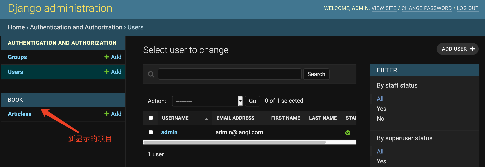
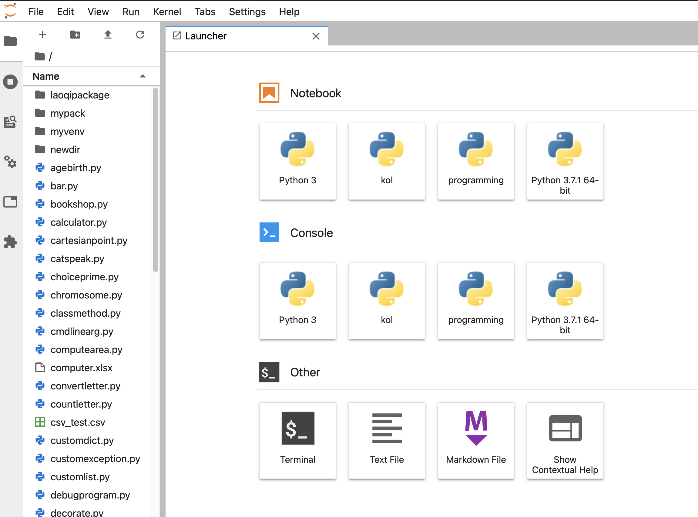
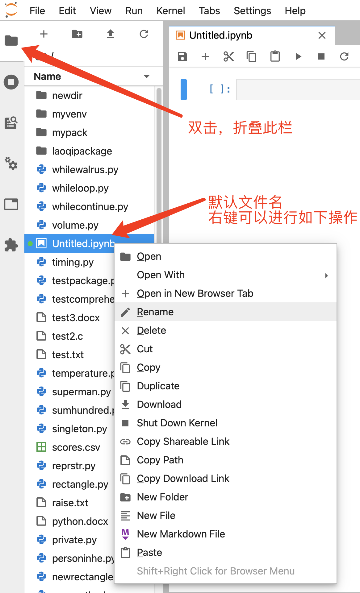
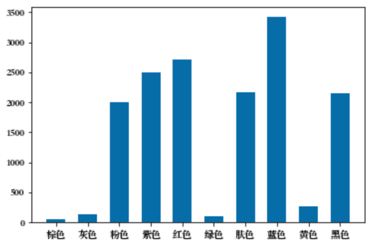
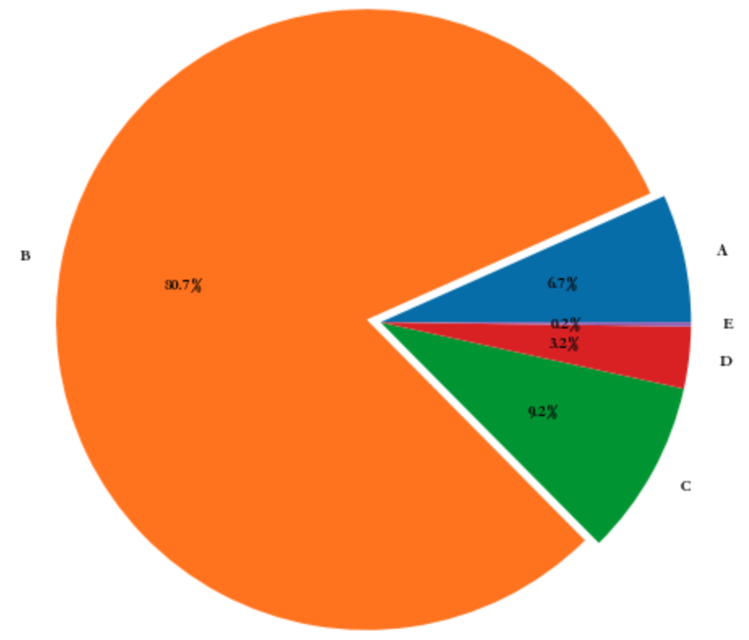
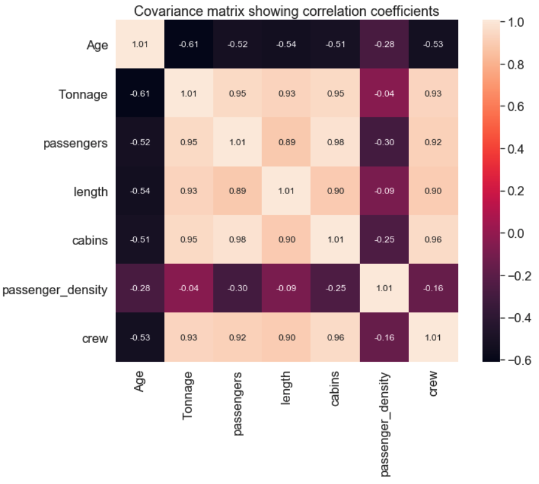
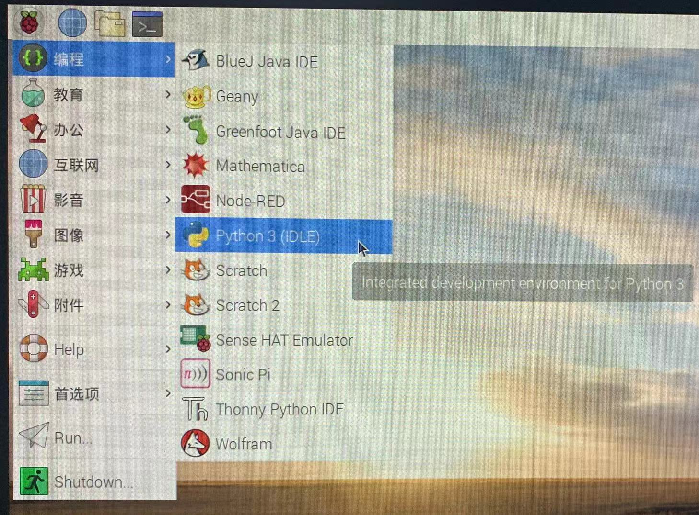
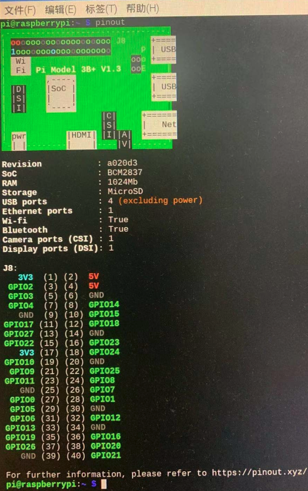

# 第12章 应用举例

> 忘记背后，努力面前，向着标杆直跑。
>
> ——保罗

Python 语言的应用领域很广，在第1章的1.6.1节已经结合官方网站，对其应用领域做了简要介绍。本章就从那些领域中选取几个典型案例。特别声明，本章各节仅仅是对有关应用的简介，不能作为该应用的完整的学习资料，若想深入学习，请参阅专门资料——请读者务必知悉此声明。

## 12.1 编辑文件

文件，不论在日常社会生活还是计算机系统中，都占有重要位置，也经常被提及。利用 Python 程序能够对各种文件施行自动化操作，从而为办公或者其他有关需要提供了技术支持。

### 12.1.1 基本的读写操作

Python 通过内置函数 `open()` 实现对文件的最基本读写操作。

```python
>>> f = open('raise.txt', 'w')
```

用内置函数 `open()` 打开文件 `raise.txt` （如果在当前位置不存在此文件，则新建），其中参数 `'w'` 表示打开模式，表12-1-1显示了 `open()` 可以有的若干种打开模式。

表12-1-1 常用文件打开方式

| 序号 | 模式 | 说明                                                         |
| ---- | ---- | ------------------------------------------------------------ |
| 1    | r    | 以读的方式打开文件。文件指针在文件的开始。这是文件的默认打开模式。 |
| 2    | w    | 以写的方式打开文件。如果文件已经存在，则覆盖原文件；否则新建文件。 |
| 3    | a    | 以写的方式打开文件。如果文件已经存在，则指针在文件的最后，可以实现向文件中追加新内容；否则，新建文件，并能实现读写操作。 |
| 4    | b    | 以二进制模式打开文件，但不单独使用，配合r/w/a等模式使用。    |
| 5    | +    | 同时实现读写操作，但是不单独使用，配合r/w/a等模式使用        |
| 6    | x    | 创建文件，但是如果文件已经存在，则无法创建。                 |

这些打开模式也可以组合使用，比如 `'rb'` 表示打开二进制只读文件；`'r+'` 表示打开一个可以读、写的文件；`'wb+'` 表示打开一个可读写的二进制文件，并且如果文件已存在，会覆盖它，否则新建。

```python
>>> f
<_io.TextIOWrapper name='raise.txt' mode='w' encoding='UTF-8'>
>>> dir(f)
['_CHUNK_SIZE', '__class__', '__del__', '__delattr__', '__dict__', '__dir__', '__doc__', '__enter__', '__eq__', '__exit__', '__format__', '__ge__', '__getattribute__', '__gt__', '__hash__', '__init__', '__init_subclass__', '__iter__', '__le__', '__lt__', '__ne__', '__new__', '__next__', '__reduce__', '__reduce_ex__', '__repr__', '__setattr__', '__sizeof__', '__str__', '__subclasshook__', '_checkClosed', '_checkReadable', '_checkSeekable', '_checkWritable', '_finalizing', 'buffer', 'close', 'closed', 'detach', 'encoding', 'errors', 'fileno', 'flush', 'isatty', 'line_buffering', 'mode', 'name', 'newlines', 'read', 'readable', 'readline', 'readlines', 'reconfigure', 'seek', 'seekable', 'tell', 'truncate', 'writable', 'write', 'write_through', 'writelines']
```

函数 `open()` 返回的是一个对象，它提供了写、读等方法，实现对文件的基本操作。

```python
>>> f.write("You raise me up.")
16
>>> len("You raise me up.")
16
```

利用方法 `f.write()` 将字符串 `"You raise me up."` 写入到当前的文件对象 `f` 中，返回值表示写入的字符串的长度。但是，如果这时查看 `raise.txt` 的内容，它里面还是空的（以下是新打开一个终端，并且使用的是 Linux 命令。在 Windows 上，可以使用自带的文本工具查看）。

```shell
% cat raise.txt    # 不显示任何内容。注意，这里不是 Python 交互模式
```

还必须紧跟一个操作：

```python
>>> f.close()
```

这样才将字符串保存在了文件 `raise.txt` 中。

```shell
% cat raise.txt
You raise me up.
```

或者用文本工具打开查看。

以上即完成了打开（新建）文件、写入内容、关闭文件三步，实现了对文件“写”的基本操作。并且，应该注意到，写入、关闭这些操作都是执行变量 `f` 引用的 `open()` 的返回对象。

```python
>>> type(f)
<class '_io.TextIOWrapper'>
```

变量 `f` 所引用的对象是某类的实例，只不过这个类的名称长了一些。为了理解它，先要从 I/O 说起。所谓 “I/O”，就是 “Input/Output”。其实以往使用的 `print()` 也属于 I/O，只不过是输出在控制台界面罢了。文件，是另外一种形式的 I/O 。

Python 标准库中有针对 I/O 的模块 `io` （https://docs.python.org/3/library/io.html）。对于 I/O 而言，所有的输入输出内容都可以看做数据流（streams，简称“流”），在模块 io 的官方网页，有这样一句话：Core tools for working with streams ，它概括了 模块 `io` 的基本作用。打开文件所用的内置函数 `open()` 也是由模块 io 来定义的。注意，这里说的是 `io` ，而在前面所显示的 `f` 的类（或类型）中，是 `_io` （前面有单下划线），这两者有什么关系？

```python
>>> import io
>>> io
<module 'io' from '/Library/Frameworks/Python.framework/Versions/3.9/lib/python3.9/io.py'>

>>> import _io
>>> _io
<module 'io' (built-in)>
```

`_io` 是 `io` 的 C 语言表达。在 Python 中，会对某些模块用 C 语言重写，以进一步提高其运行速度。相应的模块名称就由 `modulename` 变为 `_modulename` 形式。

综上所述，就明确了由变量 `f` 引用的对象是模块 `io` 中的 `TextIOWrapper` 类的实例对象——可称之为**文件对象**。

从 `dir(f)` 的返回值中发现，其中包括了 `__iter__` 、`__next__` 这两个特殊方法，说明文件对象是迭代器（参阅第9章9.6节）。既然如此，就可以针对它使用循环语句了。

在以上对文件对象的认识基础上，继续研究读文件的方法。如果承接前面的操作，执行一下步骤：

```python
>>> f.read()
Traceback (most recent call last):
  File "<stdin>", line 1, in <module>
ValueError: I/O operation on closed file.
```

试图执行 `f.read()` 方法读取到文件中的内容，抛出了 `ValueError` 异常，这是因为此前执行了 `f.close()` ，所以，还需要重新打开：

```python
>>> f = open("raise.txt")
>>> f.read()
'You raise me up.'
>>> f.close()
```

此处没有为 `open()` 提供打开模式参数，意味着使用默认的模式 `'r'` ，也可以写成 `open("raise.txt", "r")` 。

再用 `f.read()` 方法读出文件中的所有内容，并返回字符串类型。可想而知，这种方式比较适合于读取内容较少的文件。

特别提示，要养成一个“随手关门”的习惯，不论是写、还是读，操作完毕，务必要执行 `f.close()` 将文件关闭，这样能避免因误操作或者其他不可控因素修改文件。是不是感觉有点麻烦？“有没有自动门”？“这个可以有”。

```python
>>> with open('raise.txt', 'a') as f:
...     f.write("so I can stand on mountains.\nYou raise me up to walk on stormy seas.\nI am strong when I am on your shoulders.\nYou raise me up to more than I can be.")
...
148
```

这里使用了一种新的语句：with 语句。`with` 是 Python 的一个关键词，这种语句被称为**上下文管理器**（Context Manager，或：Contextor），意思是自动根据上下文的内容决定某些操作。对于当前的操作而言，将 `f.write()` 作为 with 语句的代码块，当代码块结束，也就意味着对文件的操作结束，于是 with 语句会据此“判断”对象 `f` 应该关闭了，即自动执行了 `f.close()` 。这样就不用担心打开文件后忘记关闭了。

前面已经分析了，文件对象是迭代器，所以可以用循环语句，将其中的内容一行一行地读出（ `\n` 是换行符）：

```python
>>> f = open('raise.txt')
>>> for line in f:
...     print(line, end="")
...
You raise me up.so I can stand on mountains.
You raise me up to walk on stormy seas.
I am strong when I am on your shoulders.
You raise me up to more than I can be.>>>
```

因为每行的最后有换行符 `\n` ，所以在 `print()` 函数中增加了参数 `end= ""` ，意味着打印输出一行之后，以空字符串结尾。否则，会发现打印出来的每一行之后会有一个空行（读者不妨尝试）。

既然文件是迭代器，那么，在 for 循环的过程中，“指针”也随着向文件尾端移动。当循环结束，指针移到了文件的最后。如果试图再次读取内容，返回的就是空了。下面的操作结果验证了此分析。

```python
>>> f.read()
''
```

在文件对象的方法中，提供了移动“指针”的方法 `seek()` ，能够将“指针”移动到文件中指定位置。

用 `help()` 查看其文档（ `help(f.seek)` ），可知此方法的基本调用方式是：

```python
seek(cookie, whence=0, /)
```

其中参数 `whence` 用于定义“指针”移动的“参照物”：默认 0 ，表示相对文件的开始，移动量应该是非负整数；1 表示相对当前位置移动，移动量可以是负整数（负数表示向当前位置之前移动，更靠近文件的开始）；2 表示相对文件的末端移动，移动量通常是负整数。

```python
>>> f.seek(0)
0
```

这表示“指针”已经移动到了文件的最开始，返回值表示当前“指针”相对文件开始的绝对位置。

```python
>>> f.read(3)
'You'
```

如果在 `read()` 方法中指定参数，则意味着只读取指定个数的字符。

```python
>>> f.readline()
' raise me up.so I can stand on mountains.\n'
```

方法 `readline()` 的作用是从指针所在位置开始，读到所在行的末端（以 `\n` 表示行末端），返回字符串。

```python
>>> f.readlines()
['You raise me up to walk on stormy seas.\n', 'I am strong when I am on your shoulders.\n', 'You raise me up to more than I can be.']
```

方法 `readlines()` （注意拼写）则会从“指针”所在位置开始，逐行读取，并返回列表，每行作为列表中的一个成员。

文件对象还有很多其它方法，读者使用本书中反复提及的方法—— `dir()` 和 `help()` ——能够容易地知道如何使用，此处不再赘述。

### 12.1.2 编辑 Word

对于 Microsoft Office 中的 Word 文件的读写，有很多第三方包可供选择，在这里，介绍名为 python-docx 的第三方包。

先要在本地安装它。

```shell
% pip install python-docx
```

安装完毕，用它来创建一个 Word 文件，操作如下：

```python
>>> from docx import Document                          # (1)
>>> d = Document()                                     # (2)
>>> d.add_paragraph("Life is short, You need Python.") # (3)
<docx.text.paragraph.Paragraph object at 0x7fef463cc580>
>>> d.save('python.docx')                              # (4)
```

以上4步操作，是创建和保存 Word 文档的基本步骤。

1. 注释（1）从 `docx` 包中引入 `Document` 类；
2. 注释（2）实例化该类，创建文档对象；
3. 注释（3）应用文档对象的方法 `add_paragraph()` ，向文档中增加一个段落，并同时增加该段落的内容；
4. 注释（4）将文档对象保存为 `.docx` 格式的文件，存储到硬盘中。注意，这里没有注明路径，意味着保存到了进入当前交互模式前所在的目录中。

用 Office 工具打开文件 `python.docx` ，如图12-1-1所示。


<center>图12-1-1 Word文档截图（局部）</center>

在进行上面的操作时，注意观察注释（3）的结果。这里利用文档对象增加了一个新的段落，同时返回了段落对象（段落也是对象，进一步理解“万物皆对象”的含义），于是就可以用变量引用这个段落对象：

```python
>>> para = d.add_paragraph("用《Python 完全自学教程》学习 Python，\
                           不仅学知识，更重要的是长能力。")                 # (5)
>>> insert_para = para.insert_paragraph_before("老齐，一个敲代码的老农。") # (6)
>>> d.save('python.docx')
```

当注释（4）执行了“保存文件”操作之后，此文件并没有关闭——与用 Office 工具操作 Word 文档一样，“保存”文件不是“退出”当前编辑的文件。还可以继续对变量 `d` 所引用的 Word 文件进行编辑，于是接续注释（3）段落之后，继续写入注释（5）的所示的段落，并用变量 `para` 引用该段落对象。

注释（6）则使用 `para.insert_paragraph_before()` 方法，在 `para` 段落之前插入一个段落（由此可见取名字的重要性，从方法名称即可知道该方法的含义）。最后保存此文件。

再次查看操作效果（重新打开该 Word文 件），效果如图12-1-2所示。


<center>图12-1-2 增加新段落之后的效果</center>

Word 文档通常还要有图，可以用下面的方法插入图：

```python
>>> d.add_picture("laoqi.png")
<docx.shape.InlineShape object at 0x7f9091cafe50>
>>> d.save('python.docx')
```

以上简要地介绍了对 Word 文件的基本编辑方法，除了上述操作之外，还可以实现更复杂的编辑操作，对这方面有需要的读者，不妨参阅官方文档（https://python-docx.readthedocs.io/en/latest/index.html）

在12.1.1节，曾使用 `open()` 函数实现了对文件的读写操作（示例中是 `.txt` 格式的文件），那么这个函数是否可用于 Word 文件？

```python
>>> with open('python.docx') as f:
...     for line in f: print(line)
...
Traceback (most recent call last):
  File "<stdin>", line 2, in <module>
  File "/Library/Frameworks/Python.framework/Versions/3.9/lib/python3.9/codecs.py", line 322, in decode
    (result, consumed) = self._buffer_decode(data, self.errors, final)
UnicodeDecodeError: 'utf-8' codec can't decode byte 0xfd in position 12: invalid start byte
```

出现了 `UnicodeDecodeError` ，解决方法是改变打开模式，再试试：

```python
>>> with open('python.docx', 'rb') as f:
...     for line in f: print(line)
...
b'PK\x03\x04\x14\x00\x00\x00\x08\x00WR\xfdR\xfc\xa7\xae\xd0\x9b\x01\x00\x00\xfc\x06\x00\x00\x13\x00\x00\x00[Content_Types].xml\xb5\x95OO\xe30\x1 ... 
# 省略后面显示的内容
```

虽然可以正常打开，并读取出来了里面的信息——注意 `'b'` 是以二进制模式打开文件（参阅12.1.1节表12-1-1）。除了 `.docx` 格式的文件之外，如各种格式的图片文件、视频文件等，也都要使用 `'b'` 模式才能打开，这类文件可以称为“二进制文件”。与之对应的是“文本文件”，如 `.txt` 文件、 `.py` 文件、或其他编程语言的程序文件。以这种方式划分文件类型，主要是基于这两类文件有不同的编码方案。但从文件在计算机中的存储机制看，都是以二进制形式存储的，皆可称“二进制文件”。一般认为后者是广义的“二进制文件”，前者是狭义上的。

> 常见的二进制文件扩展名：
>
> - 图片：jpg，png，gif，bmp，tiff，psd，……
> - 视频：mp4，mkv，avi，mov，mpg，vob，……
> - 音频：mp3，aac，wav，flac，ogg，mka，wma，……
> - 文档：pdf，doc，xls，ppt，docx，odt，……
> - 压缩包：zip，rar，7z，tar，iso，……
> - 数据库：mdb，accde，frm，sqlite，……
> - 可执行文件：exe，dll，so，class，……
>
> 常见的文本文件扩展名：
>
> - 网页：html，xml，css，svg，json，……
> - 源码：c，cpp，py，java，js，php，……
> - 文档：txt，tex，markdown，rtf，……
> - 表格数据：csv，tsv，……

### 12.1.3 编辑 Excel

如果读者遇到了跟“数据”有关的业务，通常 Excel 文档是不可缺少的——注意，不是“大数据”。Excel 是一个有着悠久历史的工具软件，貌似操作简单，却内涵深刻。下面根据《维基百科》中有关词条内容，整理几条与“电子表格”软件有关的要点，供读者参考：

- 1982年，Microsoft 推出一款电子表格软件——Multiplan ，同年，Lotus 公司推出电子表格软件 Lotus 1-2-3。两款软件的竞争结果是 Multiplan 完败。
- Microsoft 开始研制 Excel ，目的就是与 Lotus1-2-3 竞争，不仅要做 Lotus1-2-3 能做到的，并且要做得更好。1985年，第一款 Excel 诞生，当时它只能运行在 MacOS 系统上。1987年，运行在 Windows 系统的 Excel 也诞生了（1985年11月20日，Windows 1.0.1 发布）。但 Lotus1-2-3 迟迟没有发布适用于 Windows 系统的版本，结果到1988年，Excel 销量超过了 Lotus1-2-3。
- Excel 提供 GUI 操作功能，同时也保留了 VisiCalc 的特点——VisiCalc 是世界上第一款电子表格软件。

跌宕起伏的发展历程，正所谓“江山代有才人出，各领风骚数百年”。Excel 的江湖地位会被谁代替？此问题留给预言家去研究吧。我们现在要做的是找一个能操作 Excel 文件的第三方包。

如同针对 Word 的第三方包一样，有很多包能够操作 Excel ，此处仅以 OpenPyXL 为例，其官方网站：https://openpyxl.readthedocs.io/en/stable/index.html 。毫无疑问，还是要先安装：

```shell
% pip install openpyxl
```

然后在交互模式中研究如何使用。

```python
>>> from openpyxl import Workbook
>>> wb = Workbook()
```

实例化 `Workbook` 类，即创建了“工作簿”对象。Excel 的组成部分包括“工作簿”“工作表”和“单元格”，工作簿中至少有一个工作表，工作表中包含若干个单元格。

如同用 Office 工具打开 Excel 文件一样，默认就会有一个工作表。现在已经有了工作簿 `wb` ，当前也有一个工作表等待获取。

```python
>>> ws = wb.active
>>> ws.title
'Sheet'
```

这个工作表的默认名称是 `'Sheet'` ，可以修改此名称：

```python
>>> ws.title = 'macbook'
>>> ws.title
'macbook'
```

还可以继续增加工作表。

```python
>> ws_dell = wb.create_sheet("dell")          # (7)
>>> ws_huawei = wb.create_sheet("huawei", 0)  # (8)
```

注释（7）将工作表 `ws_dell` 追加在 `ws` 后面，注释（8）则将工作表 `ws_huawei` 插入在原来索引是 `0` 的工作表 `ws` 之前。现在工作簿中已经有三个工作表，可以这样查看它们：

```python
>>> wb.sheetnames
['huawei', 'Sheet', 'dell']
```

工作簿 `wb` 可以用于循环语句，依次获得每个工作表对象。

```python
>>> hasattr(wb, "__iter__")    # 检验是否为可迭代对象
True
>>> for s in wb: print(s)
...
<Worksheet "huawei">
<Worksheet "Sheet">
<Worksheet "dell">
```

工作簿 `wb` 还支持“ `[ ]` ”符号——类似字典：

```python
>>> wb['huawei']
<Worksheet "huawei">
```

有了工作表之后，就可以对单元格进行操作了。工作表中的单元格是以“行列式”形状排列，但是要注意：行的索引是从 1 开始；列的索引是从 A 开始（行列的最大值，根据版本的差异有所不同，针对一般操作可以认为足够大）。每个单元格用列和行的索引标识，如图12-1-3所示，A3、B2等，都可以看成相应单元格的名称。


<center>图12-1-3 工作表中的单元格</center>

通过工作表对象，以单元格名称为键，可以得到该单元格对象——工作表也是类字典对象。

```python
>>> ws
<Worksheet "macbook">    # 编辑此工作表
>>> ws['E1'] = 7
```

在单元格 E1 中填入数字 7 。此外，工作表对象的 `cell()` 方法提供了按照函数形式写入数据的方法。

```python
>>> ws.cell(row=2, column=2, value=28)
<Cell 'macbook'.B2>
```

从返回值可知，数字 28 写入了工作表 macbook 中的 B2 单元格。

做过上述操作，如果要看看最终效果，就要将所有内容保存到 Excel 文件中。

```python
>>> wb.save('computer.xlsx')
```

用 Microsoft Excel 软件打开此文件，效果如图12-1-4所示。


<center>图12-1-4 写入数据的工作表 macBook</center>

还可以用循环语句，对多个单元格写入数据。下面的示例中，编辑 `ws_huawei` 工作表：

```python
>>> for r in range(4):
...     for c in range(5):
...         ws_huawei.cell(row=r, column=c, value=3.14)
...
Traceback (most recent call last):
  File "<stdin>", line 3, in <module>
  File "/Library/Frameworks/Python.framework/Versions/3.9/lib/python3.9/site-packages/openpyxl/worksheet/worksheet.py", line 238, in cell
    raise ValueError("Row or column values must be at least 1")
ValueError: Row or column values must be at least 1
```

为什么会有异常？在 Python 中习惯从 0 开始计数了，但是在 Excel 的工作表中，单元格是从 1 开始计数的（没有第 0 行、第 0 列单元格），故应改写为：

```python
>>> for r in range(1, 5):
...     for c in range(1, 6):
...         ws_huawei.cell(row=r, column=c, value=3.14)
...
<Cell 'huawei'.A1>
<Cell 'huawei'.B1>
<Cell 'huawei'.C1>
<Cell 'huawei'.D1>
<Cell 'huawei'.E1>
<Cell 'huawei'.A2>
<Cell 'huawei'.B2>
<Cell 'huawei'.C2>
<Cell 'huawei'.D2>
<Cell 'huawei'.E2>
<Cell 'huawei'.A3>
<Cell 'huawei'.B3>
<Cell 'huawei'.C3>
<Cell 'huawei'.D3>
<Cell 'huawei'.E3>
<Cell 'huawei'.A4>
<Cell 'huawei'.B4>
<Cell 'huawei'.C4>
<Cell 'huawei'.D4>
<Cell 'huawei'.E4>
>>> wb.save("computer.xlsx")
```

再次打开文件，查看效果（如图12-1-5所示）。


<center>图12-1-5 写入数据的工作表 huawei</center>

通过上述内容，读者对用 OpenPyXL 编辑 Excel 有了初步的认识，如果要在项目中对 Excel 执行更多的编辑功能，还请读者到 OpenPyXL 官方网站查阅更详细的使用说明。

> **自学建议**
>
> 打开本章的内容，会感觉 Python 的应用领域很广，那么对于初学者而言，是否在各个方向都要学习呢？非也！我建议读者按照如下原则学习本章的内容：
>
> 1. 如果有等待去做的项目，看看该项目属于哪个方向，就先选择对应的节学习（如果本章包括的话），之后在那个方向上再找一些专门资料，并在项目中边做边学。
> 2. 如果没有项目，可以先按照本书所列内容对各个应用方向“蜻蜓点水”，之后结合自己的兴趣或需要深入研习某个方向。
>
> 弱水三千，只取一瓢饮。

## 12.2 存储数据

宽泛地说，任何文件都可以用以保存数据。但是，不同应用会有不同要求，比如 web 应用中会频繁地读写数据，且对数据安全性要求也高；在某些数据分析应用中，则要求数据能够方便地传送；等等。为了满足不同的要求，也就有了多种存储数据的方式。

### 12.2.1 CSV 文件

**CSV**，即 Comma-Separated Values，中文译为“逗号分隔值”，其文件以文本形式存储表格数据——这是一种轻量级存储数据的方式。通常，在 Excel 文件中，可以选择将当前文件保存为“ `.csv` ”格式。所有的 CSV 文件，也可以用电子表格软件打开。但是，CSV 文件与 Excel 文件有很多不同之处，比如：CSV 文件中所有值都是字符串；不能进行图文编辑等，它是一个文本文件。

在 Python 的标准库中，有专门操作 CSV 文件的模块。

```python
>>> import csv
>>> datas = [('math', 99), ('english', 98), ('physics', 97)]
>>> with open('scores.csv', 'w') as f:     # (1)
...     writer = csv.writer(f)             # (2)
...     writer.writerows(datas)            # (3)
...
```

注释（1）使用 with 语句打开文件 `scores.csv` ，注释（2）以文件 `f` 作为 `csv.writer()` 的参数，创建了一个 CSV 文件的写对象 `writer` ，然后用 `writer` 的方法 `writer.writerows()` 实现多行的数据写入（注释（3）所示）。

上述操作结束之后，在当前目录中就看到了 `scores.csv` 文件，此文件能够用 Excel 软件打开，也可以用文本编辑工具软件打开。

如果用 Python 读取 CSV 文件的内容，可以按照如下演示操作：

```python
>>> f = open("scores.csv")
>>> reader = csv.reader(f)
>>> for row in reader:
...     print(row)
...
['math', '99']
['english', '98']
['physics', '97']
```

其基本使用流程与写入数据的流程相似，不再赘述。但要提醒读者注意，上述方法仅限于数据量较少的时候应用。如果数据量较大，比如在机器学习中所使用的数据也有的保存在 CSV 文件中，这种情况下，通常会使用 Pandas 中的函数读取数据（参阅12.5节）。

### 12.2.2  SQLite 数据库

SQLite 是一个小型的关系型数据库，它最大的特点在于不需要单独的服务、零配置。Python 已经将驱动模块作为了标准库的一部分，可以类似操作常见文件那样来操作 SQLite 数据库文件。还有一点，SQLite 源代码不受版权限制。

```python
>>> import sqlite3
>>> conn = sqlite3.connect("lite.db")    # (4)
```

注释（4）旨在创建与数据库的连接对象，其中的 `lite.db` 是数据库文件，如果它已经存在，则连接它；如果不存在，会自动创建此文件，并连接。注意，在参数中可以指定任意路径，这里依然使用的是当前交互模式所在的工作目录。

有了连接对象 `conn` 之后，要通过它的方法 `conn.coursor()` 再建立游标对象，通过游标对象实现对数据库“增、删、改、查”等各种操作——除了 SQLite 之外，其他数据库也是类似操作流程。

```python
>>> cur = conn.cursor()
```

变量 `cur` 所引用的就是游标对象，接下来对数据库内容的操作，都是用游标对象方法来实现。

操作关系型数据库，离不开 SQL 指令。所谓 SQL ，是专门用于管理关系型数据库的程序语言。本书的主要目标不是介绍数据库相关知识，读者欲学习有关 SQL 知识，可以阅读专业资料。但是，为了操作 SQLite 数据，在下面的操作中不得不用到 SQL 指令，当然都是比较简单的。

每个数据库中包含多张“表”，每张“表”中包含多条“记录”，一条记录是一行，每列是记录的字段。其实，这种结构很类似于 Excel 的工作表结构（如表12-2-1所示）。

表12-2-1 Excel 和关系型数据库比较

| **Excel** | **关系型数据库** |
| --------- | ---------------- |
| 工作簿    | 数据库           |
| 工作表    | 数据表           |
| 行        | 记录             |
| 列        | 字段             |

所以，首先要为注释（4）所创建的数据库建表。

```python
>>> create_table = "create table books (title text, author text, lang text)" # (5)
>>> cur.execute(create_table)    # (6)
<sqlite3.Cursor object at 0x7f88a3761960>
```

注释（5）的字符串里是一条创建表的 SQL 语句，即创建名为 `books` 的表，其字段名称（即列）分别为 `title` 、`author` 、`lang` ，并且规定了字段的类型（ `text` ）——特别注意，这里仅仅是演示基本操作，并不是数据库的教程，为了简化，故将所有字段设置为 `text` 类型，这并不符合真实的数据库操作要求。

注释（6）使用游标对象的 `execute()` 方法，执行注释（5）的 SQL 语句——任何 SQL 语句都可以用此方法执行。

这样就在数据库 `lite.db` 中建立了一个表 `books` 。然后向表中增加数据，即添加记录。

```python
>>> cur.execute('insert into books values ("Learn Python", "laoqi", "python")')
<sqlite3.Cursor object at 0x7f88a3761960>
```

注意 SQL 语句的书写方式。仅此操作，该记录还没有真正保存到数据库，必须紧接着完成 `commit()` 操作。

```python
>>> conn.commit()
```

假设至此完成了对数据的操作，如同操作文件一样，在退出之前要分别将游标对象和连接对象关闭。

```python
>>> cur.close()
>>> conn.close()
```

究竟有没有真的写入？如果笃信“眼见为实”——不一定真实，姑且满足直觉的需要——可以使用管理 SQLite 的 GUI 工具软件（比较多，读者可以自行选择），下面的演示中使用了 SQLite Studio ，打开当前已经创建的数据库和表，会看到如图12-2-1和图12-2-2所示的效果。


<center>图12-2-1 表 books 的结构</center>


<center>图12-2-2 表 books 的数据</center>

GUI 工具软件中查询仅能满足“眼睛”的需要，如果要在程序中使用数据库中的数据，必须运行查询语句。

```python
>>> conn = sqlite3.connect("lite.db")
>>> cur = conn.cursor()
>>> cur.execute("select * from books")    # (7)
<sqlite3.Cursor object at 0x7f88a3761b90> 
>>> cur.fetchall()                        # (8)
[('Learn Python', 'laoqi', 'python')]
```

注释（7）实现从数据库表 `books` 中查询所有的记录，注释（8）中的游标方法 `fetchall()` 返回所有的查询结果。因为目前只有一条记录，所以在返回结果的列表中只有一项，其中包含了这条记录的所有内容。

还可以再增加记录，比如，一次性增加多条记录。

```python
>>> books = [("first book","first","c"), ("second book","second","c"), ("third book","second","python")]
>>> cur.executemany('insert into books values (?,?,?)', books)
<sqlite3.Cursor object at 0x7f88a3761b90>
>>> conn.commit()
```

如果一次性向表中增加多条记录，提倡使用 `cur.executemany()` ，而不是用循环语句一条一条地增加。

此时表 `books` 中已经不止一条数据了，还是用注释（7）的方式，将所有记录都读出来。

```python
>>> cur.execute("select * from books")
<sqlite3.Cursor object at 0x7f88a3761b90>
>>> cur.fetchall()
[('Learn Python', 'laoqi', 'python'), ('first book', 'first', 'c'), ('second book', 'second', 'c'), ('third book', 'second', 'python')]
```

游标的方法 `cur.ececute()` 可以用来执行任何 SQL 语句，如果对数据库中的数据做其他操作，只要将 SQL 语句以字符串的形式传给此方法即可。比如按照条件修改（更新）记录：

```python
>>> cur.execute("update books set title='PHYSICS' where author='first'")
<sqlite3.Cursor object at 0x7f88a3761b90>
>>> conn.commit()
```

按照条件查找刚才更改的记录：

```python
>>> cur.execute("select * from books where author='first'")
<sqlite3.Cursor object at 0x7f88a3761b90>
>>> cur.fetchone()
('PHYSICS', 'first', 'c')
```

如果确认只有一条返回结果，或者只要第一条返回结果，可以使用 `cur.fetchone()` 实现。

最后，演示删除记录。网络上曾经爆出某厂发生了“删库跑路”事件，这提醒我们，从数据库中删除记录，是一件高风险工作。所以，有时候可以用“假删除”，即对欲删除的记录做个“标记”，查询的时候不包含该记录。如果要“真”删除——高风险的操作——可以使用如下 SQL 语句实现：

```python
>>> cur.execute("delete from books where author='second'")
<sqlite3.Cursor object at 0x7f88a3761b90>
>>> conn.commit()
>>> cur.execute("select * from books")
<sqlite3.Cursor object at 0x7f88a3761b90>
>>> cur.fetchall()
[('Learn Python', 'laoqi', 'python'), ('PHYSICS', 'first', 'c')]
```

从查询结果可知，成功地删除了符合条件的记录。

最后不要忘记，一定要“关门”才能走人。

```python
>>> cur.close()
>>> conn.close()
```

SQLite 是一个小巧的数据库，用途广泛，特别是对于终端应用。建议读者可以结合官方网站（https://docs.python.org/3.5/library/sqlite3.html），了解更多关于此数据库的知识。

在开发实践中所用到的数据库，特别是网站开发中，一般比 SQLite 更复杂一些，比如 PostgreSQL、MySQL 等。除了关系型数据库外，还有非关系型数据库，比如 MongoDB 等。在 Python 程序中操作这类数据库，也都有专门的的“轮子”——包（或模块），基本流程与本节所介绍的有类似之处。如果在项目中用到或有兴趣学习，可以搜索专门资料查阅。

> **自学建议**
>
> 针对数据库，Python 提供了通用数据库接口（Generic Database Interfaces and APIs），网址是 https://wiki.python.org/moin/DatabaseInterfaces ，其中介绍了 Python 支持的关系型数据库、非关系型数据库、数据仓库和图数据库等。在 PyPI 上，可以找到针对每种数据库的第三方包（有的不止一个）。
>
> 数据库是各类应用的基础，特别是大数据技术日新月异的今天。不论读者将来从事哪个细分领域的研发，都应该学习一些数据库的相关知识，最低标准是能够使用常用的 SQL 语句。

## 12.3 制作网站

网站，现在可谓是司空见惯，就连本书作者也有个人网站（www.itdiffer.com），用以向读者提供所编写书籍的参考资料。那么，怎么制作网站？如果从理论上说，这是一个听起来、讲起来都比较复杂的事情。首先要全面了解有关计算机网络的有关知识（推荐阅读《计算机网络》，谢希仁编著，电子工业出版社出版），然后要能够运用多项技术，比如搭建服务器并部署有关程序、创建数据库、编写网站代码（还分前端和后端）、配置网站域名等，甚至还要考虑网站的并发量、安全性。所以，通常制作网站的项目，都是由若干个人组成一个团队协作完成。

不过，随着技术发展，制作网站的技术门槛正在不断降低，很多底层的东西都被“封装”和“模块化”，开发者将更多精力集中在网站的功能上。这就类似于 Python 中的包和模块一样，比如12.2.2 节中使用的  `sqlite3` 模块，我们不需要了解其内部工作机制，关注点在于用它实现数据库的连接和操作。

Python 生态中，提供了很多制作网站的包——更习惯的说法是**Web框架**（Web Framework），比如 Web.py 、Tornado 、Flask 、Django 等，不同框架会有各自的特点，很难用“好、坏”这种简单标准来评价——有的人热衷于“二进制”思维，但愿本书读者不要陷入“0/1”口水战。

下面使用 Django 框架，简要演示用它快速制作网站的流程。

Django 的官方网站（https://www.djangoproject.com/）上显示，撰写本节内容时所发布的最新版是 Django 3.2.5 ，此前 Django 有过 2.x 和 1.x 的各个版本。读者在阅读到本书并调试代码的时候，或者阅读其他有关资料时，务必注意版本问题，不同版本之间会有所差异。此外，围绕 Django 框架还有很多第三方插件（亦即 Python 语言的包或模块），它们也有所适用的版本。

其实，在第11章11.5节，已经在虚拟环境中安装了 Django ，下面就启动该虚拟环境，在其中用 Django 框架制作网站。

### 12.3.1 创建项目

Django 中的**项目**（Project）可以看做是一个专有名词，后面还有一个与之有关的名词**应用**（Application）。所谓项目，可以理解为一个网站。

在虚拟目录 `myvenv` 内，创建一个 Django 项目（要确认已经进入虚拟环境，参阅第11章11.5节），执行如下指令（本节演示中所有操作系统指令，均为 Linux 指令，请使用 Windows 系统的读者注意）：

```shell
(myvenv) myvenv % ls
bin		include		lib		pyvenv.cfg
(myvenv) myvenv % django-admin startproject mysite
(myvenv) myvenv % ls
bin		include		lib		mysite		pyvenv.cfg
```

指令 `django-admin startproject mysite` 创建名为 `mysite` 的项目，执行此指令后，在当前目录中新增了 `./mysite` 子目录。这个子目录并非是空的，Django 会默认为其添加如下内容（以下显示此时 `./mysite` 的结构）：

```shell
(myvenv) myvenv % tree mysite
mysite
├── manage.py
└── mysite
    ├── __init__.py
    ├── asgi.py
    ├── settings.py
    ├── urls.py
    └── wsgi.py

1 directory, 6 files
```

然后进入到项目的子目录中，执行 `manage.py` 程序：

```shell
(myvenv) myvenv % cd mysite
(myvenv) mysite % python manage.py runserver
Watching for file changes with StatReloader
... （省略其他显示信息）
Starting development server at http://127.0.0.1:8000/
Quit the server with CONTROL-C.
```

这样我们就把一个基于 Django 的网站跑起来了，由提示信息可知：

- 可以通过 http://127.0.0.1:8000/ 访问本网站；
- 结束当前服务的方法是按 Ctrl-C 组合键。

打开浏览器，在地址栏中输入 http://127.0.0.1:8000 或者 http://localhost:8000 ，就会看到图12-3-1所示界面。


<center>图12-3-1 网站默认首页</center>

就这样，已经创建了一个非常简单的网站——好像挺容易的呀。

### 12.3.2 创建应用

项目已经创建好，网站也有了，接下来要实现网站的具体功能。在 Django 中，人们把这些具体的功能称为**应用**（Application）。

结束图12-3-1所示的服务（按“Ctrl-C”组合键），继续在虚拟目录中执行如下操作：

```shell
(myvenv) mysite % ls
db.sqlite3	manage.py	mysite
```

与12.3.1节所看到的 `./mysite` 目录结构相比较，这里多了一个文件 `db.sqlite3` ，这个文件就是12.2.2节所介绍过的 SQLite 数据库文件，Django 默认使用此类型的数据库，本节的浮光掠影地演示中，也使用这个数据库。

在当前目录中，继续执行：

```shell
(myvenv) mysite % python manage.py startapp book
(myvenv) mysite % ls
book		db.sqlite3	manage.py	mysite
```

指令 `python manage.py startapp book` 创建一个名为 `book` 的应用，并在当前目录中以子目录 `./book` 的形式表现。这个子目录中也不是空的，默认配置如下：

```shell
(myvenv) mysite % tree book
book
├── __init__.py
├── admin.py
├── apps.py
├── migrations
│   └── __init__.py
├── models.py
├── tests.py
└── views.py

1 directory, 7 files
```

如果把应用理解为项目的子集，当应用创建好之后，就需要向项目“汇报”存在此应用了。用 IDE 工具打开项目目录中的 `./mysite/settings.py` 文件（如12.3.1节中执行 `tree mysite` 后的显示的目录结构），找到第 33 行，对 `INSTALLED_APPS`  的值做如下修改：

```python
INSTALLED_APPS = [
    'django.contrib.admin',
    'django.contrib.auth',
    'django.contrib.contenttypes',
    'django.contrib.sessions',
    'django.contrib.messages',
    'django.contrib.staticfiles',
    'book',    # 增加一个应用
]
```

如此就完成了应用的配置——不要忘记保存文件。

### 12.3.3 数据模型类

一般的动态网站（与之对应的是“静态网站”）都有数据库。Django 为了简化开发，让开发者用 Python 语言可以实现一切，于是对数据库操作提供了 ORM 技术，即 Object-Relational Mapping（对象关系映射）。ORM 的作用是在关系型数据库和业务实体对象之间进行映射，这样在操作业务对象时，就不需要再去和复杂的 SQL 语句打交道，只需简单地操作对象的属性和方法。

Django 的 ORM 实现方式就是编写数据模型类，这些类可以写到任何文件中，通常写在每个应用的`models.py` 文件中。每个数据模型类都是 `django.db.models.Model` 的子类。应用的名称（小写字母）和数据模型类的名称（小写字母）共同组成一个数据库表的名称。

用 IDE 打开 `./book/models.py` 文件，并编写如下数据模型类：

```python
from django.db import models
from django.utils import timezone
from django.contrib.auth.models import User

class Articles(models.Model):
    title = models.CharField(max_length=300)                     # (1)
    body = models.TextField()
    publish = models.DateTimeField(default=timezone.now)
    class Meta:                                                  # (2)
        ordering = ("-publish",)
    def __str__(self):
        return self.title
```

类 `Articles` 中的 `title` 、`author` 、`body` 、`publish` 是类属性，对应着数据库表的字段。每个类属性的类型（即字段类型）由等号右侧定义——可以理解为类属性的初始值为等号右侧的实例。例如注释（1）中，类属性（字段）`title` 引用了实例 `models.CharField(max_length=300)` —— `CharField()`  类型，并且以参数 `max_length=300` 的形式说明字段的最大数量。

注释（2）从名称上看貌似 Python 中的元类，但它跟元类不同。在此处，通过 `ordering = ("-publish",)` 规定了 `Articles` 实例对象的显示顺序，负号表示按照 `publish` 字段值的倒序显示。

数据模型类 `Articles` 编写好之后，再执行如下操作，从而在数据库中创建对应的表结构：

```shell
# 第一步
(myvenv) mysite % python manage.py makemigrations
Migrations for 'book':
  book/migrations/0001_initial.py
    - Create model Articles

# 第二步
(myvenv) mysite % python manage.py migrate
Operations to perform:
  Apply all migrations: admin, auth, book, contenttypes, sessions
Running migrations:
  Applying contenttypes.0001_initial... OK
  Applying auth.0001_initial... OK
  Applying admin.0001_initial... OK
  Applying admin.0002_logentry_remove_auto_add... OK
  Applying admin.0003_logentry_add_action_flag_choices... OK
  Applying contenttypes.0002_remove_content_type_name... OK
  Applying auth.0002_alter_permission_name_max_length... OK
  Applying auth.0003_alter_user_email_max_length... OK
  Applying auth.0004_alter_user_username_opts... OK
  Applying auth.0005_alter_user_last_login_null... OK
  Applying auth.0006_require_contenttypes_0002... OK
  Applying auth.0007_alter_validators_add_error_messages... OK
  Applying auth.0008_alter_user_username_max_length... OK
  Applying auth.0009_alter_user_last_name_max_length... OK
  Applying auth.0010_alter_group_name_max_length... OK
  Applying auth.0011_update_proxy_permissions... OK
  Applying auth.0012_alter_user_first_name_max_length... OK
  Applying book.0001_initial... OK
  Applying sessions.0001_initial... OK
```

以上操作完成之后，已经在数据库 `db.sqlite3` 中创建了多个表，其中包括 `Articles` 类对应的表，图12-3-2显示的是当前已经有的表（其他表都是 Django 默认创建的。图示所用工具仍然是 12.2.2 节用过的软件）


<center>图12-3-2 Article 对应的表结构</center>

### 12.3.4 发布文章

用 Django 默认的管理功能可以在已经创建的网站上发布文章。要使用此功能，必须先创建超级管理员。

```shell
(myvenv)  mysite % python manage.py createsuperuser
Username (leave blank to use 'qiwsir'):
```

注意执行上述指令的位置，在项目目录中，即 `manage.py` 文件所在位置。输入用户名：

```shell
(myvenv) mysite % python manage.py createsuperuser
Username (leave blank to use 'qiwsir'): admin
Email address:
```

再输入邮箱（只要符合邮箱格式就行）：

```shell
(myvenv) mysite % python manage.py createsuperuser
Username (leave blank to use 'qiwsir'): admin
Email address: admin@laoqi.com
Password:
```

输入密码。注意密码不能太简单，若太简单，系统会给予友好提示。输入一遍之后，再验证一遍，最终出现：

```shell
(myvenv) qiwsir@qiwsirs-MacBook-Pro mysite % python manage.py createsuperuser
Username (leave blank to use 'qiwsir'): admin
Email address: admin@laoqi.com
Password:
Password (again):
Superuser created successfully.
```

则超级管理员创建完毕——请牢记用户名和密码。

然后运行服务器。

```shell
(myvenv) qiwsir@qiwsirs-MacBook-Pro mysite % python manage.py runserver
Watching for file changes with StatReloader
...
Starting development server at http://127.0.0.1:8000/
Quit the server with CONTROL-C.
```

在浏览器的地址栏中输入 http://127.0.0.1:8000/admin/ ，打开图12-3-3所示的界面。


<center>图12-3-3 管理端登录界面</center>

输入刚才创建的超级管理员的用户名和密码进入系统，如图12-3-4所示。


<center>图12-3-4 管理界面</center>

Groups 和 Users 是 Django 在用户管理应用中默认的两项。单击 Users 会看到当前项目仅有的一个用户 admin，当然可以增加用户，读者一定要试一试。

目前暂不研究用户问题，重点在于发布文章。但是目前还找不到发布文章的地方。

稍安勿躁。用 IDE 打开 `./book/admin.py` 文件，输入如下代码，并保存文件。

```python
from django.contrib import admin
from .models import Articles

admin.site.register(Articles)
```

在调试状态下，如果没有新增加的文件，只是修改了原有文件，则不需要重新启动 Django 服务（如果 Django 服务没有启动，请确保启动）。刷新图12-3-4所示的页面，即可看到图12-3-5所示的效果。



<center>图12-3-5 增加对 book 应用的管理</center>

点击“Add”按钮可以添加文章，如图12-3-6所示所示。


<center>图12-3-6 编辑文章</center>

然后点击“SAVE”按钮即可保存此文章。有兴趣可以多发布几篇。

发布文章的目的是给别人看，别人怎么看？接下来解决这个问题。

### 12.3.5 文章标题列表

根据阅读网站上文章的经验，一般是有一个页面显示文章标题，然后点击标题，呈现该文章的完整内容。本节首先做一个显示标题列表的页面。

用 IDE 打开 `./book/views.py` 文件，编写一个能够从数据库中已存储的文章标题的函数——在 Django 中称之为**视图函数**。

```python
from django.shortcuts import render
from .models import Articles

def book_title(request):  
    posts = Articles.objects.all()  
    return render(request, "book/titles.html", {"posts":posts})  
```

函数 `book_title()` 的参数是 `request` ，这个参数负责响应所接收到的请求且不能缺少，并总是位于第一的位置。除这个不可或缺的参数外，还可以根据需要在其后增加别的参数。

 return 语句中的 `render()` 函数的作用是将数据渲染到指定模板上（关于模板，见下文内容）。`render()` 的第一个参数必须是 `request` ，然后是模板位置和所传送的数据，数据是用类字典的形式传送给模板的。

在 `render()` 中出现的` book/titles.html` 就是标题列表的前端展示页面——被称为“模板”。在每一个应用中都可以有一个专门的模板目录。进入应用 book 的目录 `./book` ，建立一个子目录 `./templates` ，名称和位置必须如此，再按照如下方式建立有关文件和子目录。

```shell
(myvenv) book % tree templates
templates
└── book
    └── titles.html

1 directory, 1 file
```

`templates` 目录是 Django 默认的存放本应用所需模板的目录，如果不用自定义的方式指定模板位置，Django 会在运行时自动来这里查找 `render()` 函数中所指定的模板文件。

然后编写 `titles.html` 文件的代码，这不是 Python 程序文件，是 HTML 文件，关于它的知识超出本书范畴，读者可以参考有关资料（在此处，可以照抄如下代码）。

```html
<!DOCTYPE html>
<html lang="zh-cn">
<head>
    <meta http-equiv="X-UA-Compatible" content="IE=Edge">
    <meta charset="utf-8">
    <meta  name="viewport" content="width=device-width, initial-scale=1">
    <title>my website</title> 
    <!-- Bootstrap 核心 CSS 文件 -->
    <link rel="stylesheet" href="https://stackpath.bootstrapcdn.com/bootstrap/3.4.1/css/bootstrap.min.css" integrity="sha384-HSMxcRTRxnN+Bdg0JdbxYKrThecOKuH5zCYotlSAcp1+c8xmyTe9GYg1l9a69psu" crossorigin="anonymous">
</head>

<body>
<div class="container">
<center><h1>老齐的书</h1></center>
    <div class="row">
        <div class="col-md-8">
            <ul>
             
                <li>{{ post.title }}</li> 
            
            </ul>
        </div>
        <div class="col-md-4">
            <h2>老齐教室</h2>
            <p>欢迎访问我的网站：www.itdiffer.com</p>
            <p>包括各种学习资料</p>
        </div>
    </div>
</div>
<!-- Bootstrap 核心 JavaScript 文件 -->
<script src="https://stackpath.bootstrapcdn.com/bootstrap/3.4.1/js/bootstrap.min.js" integrity="sha384-aJ21OjlMXNL5UyIl/XNwTMqvzeRMZH2w8c5cRVpzpU8Y5bApTppSuUkhZXN0VxHd" crossorigin="anonymous"></script>
</body>
</html>
```

视图函数和模板都编写好之后，要想通过网页访问，还需要进行 URL 配置。首先要配置 `./mysite/urls.py` ，在这个文件中配置本项目的各个应用。

```python
from django.contrib import admin
from django.urls import path
from django.conf.urls import url, include

urlpatterns = [
    path('admin/', admin.site.urls),
    path('book/', include("book.urls"), name='book'),
]
```

然后在 `book` 目录中创建文件 `urls.py` ，并写入如下代码：

```python
from django.conf.urls import url
from . import views

urlpatterns = [
    url(r'^$', views.book_title, name="book_title"),
]
```

重启 Django 服务，在浏览器中输入 http://127.0.0.1:8000/book/ ，会看到图12-3-7所示界面，显示了文章标题。


<center>图12-3-7 显示文章标题的界面</center>

### 12.3.6 查看文章内容

每一篇文章，在数据库中都会有唯一的 id，因此可以通过文章 id 从数据库中读出该文章，并显示与网页上。

按照用户的操作顺序，在 `titles.html` 页面中显示的标题应该有超链接，点击该超链接即向服务器请求显示该标题的文章，所以，应该在 `titles.html` 中显示标题的部分做如下修改。

```html
<ul>
     
        <li><a href="{{post.id}}">{{ post.title }}</a></li> \\ 修改
    
</ul>
```

而后编辑 `./book/views.py` ，增加响应查看文章请求的视图函数 `book_article()` 。

```python
def book_article(request, article_id):
    article = Articles.objects.get(id=article_id)
    return render(request, 'book/content.html', {"article": article})
```

视图函数 `book_article` 的参数除了 `request` 之外，还有 `article_id` ，这个参数需要通过前端的请求获得，在后续的 URL 配置中会给予实现。

然后编写展示文章内容的模板文件 `./templates/book/content.html` 文件，代码如下：

```html
<!DOCTYPE html>
<html lang="zh-cn">
<head>
    <meta http-equiv="X-UA-Compatible" content="IE=Edge">
    <meta charset="utf-8">
    <meta  name="viewport" content="width=device-width, initial-scale=1">
    <title>my website</title> 
    <!-- Bootstrap 核心 CSS 文件 -->
    <link rel="stylesheet" href="https://stackpath.bootstrapcdn.com/bootstrap/3.4.1/css/bootstrap.min.css" integrity="sha384-HSMxcRTRxnN+Bdg0JdbxYKrThecOKuH5zCYotlSAcp1+c8xmyTe9GYg1l9a69psu" crossorigin="anonymous">
</head>

<body>
<div class="container">
<center><h1>老齐的书</h1></center>
    <div class="row">
        <div class="col-md-8">
            <center><h2>{{article.title}}</h2></center>
            <center>{{article.publish}}</center>
            <p class="lead">{{article.body}}</p>
        </div>
        <div class="col-md-4">
            <h2>老齐教室</h2>
            <p>欢迎访问我的网站：www.itdiffer.com</p>
            <p>包括各种学习资料</p>
        </div>
    </div>
</div>
<!-- Bootstrap 核心 JavaScript 文件 -->
<script src="https://stackpath.bootstrapcdn.com/bootstrap/3.4.1/js/bootstrap.min.js" integrity="sha384-aJ21OjlMXNL5UyIl/XNwTMqvzeRMZH2w8c5cRVpzpU8Y5bApTppSuUkhZXN0VxHd" crossorigin="anonymous"></script>
</body>
</html>
```

接着配置 URL，因为还是针对 book 这个应用而言，所以不需要修改 `./mysite/urls.py` ，只需要在 `./book/urls.py` 文件中增加新的 URL 路径。

```python
from django.conf.urls import url
from . import views

urlpatterns = [
    url(r'^$', views.book_title, name="book_title"),
    url(r'(?P<article_id>\d)/$', views.book_article, name='book_content'), # new
]
```

视图函数 `book_article(request, article_id)` 的参数 `article_id` ，用于获得 URL 中每篇文章的 id，即 `./book/templates/book/titles.html` 文件中的超链接 `<a href='{{title.id}}'>` 所产生的请求地址中最后的数字，例如 `http://127.0.0.1/blog/1/` 。因此，使用 `r'(?P<article_id>\d)/$'` 这种方式，得到该请求的 id 数值并赋值给参数 `article_id` 。

现在访问文章标题网页，则所发布的文章已经具有了超级链接（要养成习惯，每次测试效果时，都要查看 Django 是否启动了），点击该标题，即可显示如图12-3-8所示的文章详情页。


<center>图12-3-8 文章详情页</center>

至此，以不求甚解的精神和实践，制作了一个非常简陋的网站——严格地说，是编写了网站源码。要想让这个网站能够成为万维网上的一员，还需要做很多工作，不过那些不是本书要介绍的了，有兴趣的读者可以参考有关资料。

> **自学建议**
>
> 制作网站，是软件开发中一个非常普遍的领域，又由于网站的用途和功能、性能要求各异，也出现了各类不同的技术形态，每种技术还会对应专门化的岗位及具有相应专业技能的从业者。
>
> - 目前常用于网站开发的编程语言包括 PHP、Java、Python、C#、JavaScript等等（此处仅列举常见几种，事实上远不止所列几项）——选用哪一种语言，是一个争论不休的话题。
> - 有的网站，可以用工具软件生成（即使不懂编程语言也能做网站），比如常见的 WordPress（基于 PHP ）等。有的网站是静态的（只发布多媒体信息，没有用户注册、登录、用户发布个人信息等功能），比如我的个人网站（www.itdiffer.com ）就是利用 GitBook  制作的静态网站。
> - 动态网站（本节所演示的就是一个动态网站）还必须配备数据库，常用的关系型数据库，如 PostgreSQL、MySQL 等。非关系型数据库近年也开始在网站中使用，比如 MongoDB 等。
> - 如果对网站的界面要求比较高，通常要有专门开发前端的工程师和 UI 设计工程师。前端工程师所要掌握的技能包括但不限于 HTML、CSS、JavaScript，以及各种前端开发框架，如 Vue.js 等（前端开发框架发展变化很快，或许过几年 Vue.js 已经成为了历史）。UI 设计工程师通常要会熟练使用各种图片处理工具，并且要有较高的审美和设计能力。
> - 开发好的网站最终要部署到服务器上，目前比较常见的做法是部署到云服务器上，同时要利用诸如 Ngnix 等服务器软件系统，并对网站做各种配置。这也是一项专业技能，特别是在网站的性能、安全性等方面有较高要求的时候。
>
> 以上仅仅列出制作和发布网站所涉及到的主要方面，还有很多其他内容，比如网站源码管理、网站测试、网站开发流程、网站功能设计等。总而言之，制作网站是一项综合性很强的系统工程，需要多个技能配合应用（大型项目就把每个技能落实到专业人员上）。
>
> 有志于从事 Web 开发的读者，不妨参考上述介绍，在自学完本书内容之后，向着选定的专业技能方向发展。
>
> 如果读者愿意以 Django 框架作为 Web 开发的学习起点（这个选择很明智），可以参阅拙作《跟老齐学Python：Django 实战（第二版）》（电子工业出版社）。

## 12.4 科学计算

科学计算是科学、工程等项目中必不可少的，MATLAB 曾风光一时，但它是收费的，并且有“被禁”的风险——坚决反对用盗版软件，“被禁”不是盗版的理由。其实，Python ——开源、免费——是做科学计算的选择之一，它不仅能做 MATLAB 所能做的一切，还能做它不能做的。所以隆重推荐，在科学计算上选用 Python 。

### 12.4.1 Jupyter 

Jupyter 是一款基于浏览器的开源的交互开发环境，常用于科学计算、数据科学、机器学习等业务中。其官方网站是：https://jupyter.org/ ，目前有 JupyterLab 和 Jupyter Notebook ，一般认为 JupyterLab 更趋近于 IDE，功能多于 Jupyter Notebook。下面以 JupyterLab 为例，演示安装和使用方法。

```shell
% pip install jupyterlab
```

使用 `pip` 安装，安装之后，执行如下指令启动 JupyterLab ：

```shell
% jupyter-lab
... （省略部分显示信息）
    Or copy and paste one of these URLs:
        http://localhost:8888/?token=549de63a2fcd53325c5d17b8dd7a00ce4b63766aa368efb1
     or http://127.0.0.1:8888/?token=549de63a2fcd53325c5d17b8dd7a00ce4b63766aa368efb1
```

一般情况下，会自动打开本地计算机操作系统默认的浏览器，并显示图12-4-1所示效果。



<center>图12-4-1 JupyterLab 默认页面</center>

如果没有打开图12-4-1所示页面，或者打算用其他浏览器，可以复制终端所显示的地址（如： `http://localhost:8888/?token=549de63a2fcd53325c5d17b8dd7a00ce4b63766aa368efb1` ）到指定浏览器地址栏，同样能打开图12-4-1所示界面（注意，地址中的 `token` 项不能缺少）。

JupyterLab 所提供的各项功能，与通常 IDE 类似，此处不做详细说明，有意逐项了解的读者可以自行查阅专门资料。下面仅就如何使用它编写程序和执行所编写的代码给予说明，这是最基本的应用。

在图12-4-1所示界面的 `Launcher` 标签下，选择 Notebook 中的第一项“Python 3”（读者的开发环境可能与图中所示不同，只要选择“Python 3 ”作为程序执行的驱动即可。然后进入图12-4-2所示页面。


<center>图12-4-2 编辑页面</center>

参照图12-4-3所示的功能，将当前文件改名为 `scicomputing.ipynb` ，并将左侧文件栏折叠收起。此外，从图示中还可看到其他关于文件和目录的基本操作，供读者参阅。



<center>图12-4-3 基本操作</center>

然后点击菜单 `View` ，并选中如图12-4-4所示的项目，即可在代码块中显示行号。


<center>图12-4-4 显示代码块中的行号</center>

将鼠标移动到代码块中并单击，如图12-4-5所示，开始输入一行代码，然后回车，输入第二行——注意，这里与 Python 交互模式不同，回车意味着换行，而不是执行当前行代码。输入完图12-4-5所示的所有代码。


<center>图12-4-5 编写代码</center>

按照图12-4-5所示，点击该按钮，可以执行当前代码块；或者按组合键 `shift + Return/Enter` 执行，效果如图12-4-6所示。


<center>图12-4-6 执行代码块</center>

执行了代码块 [1] 之后，执行结果显示在代码之后，并自动进入下一个代码块。在编辑界面顶部，有各种常见的编辑、控制按钮，把鼠标滑动到按钮上，会显示该按钮的作用。

以上是 JupyterLab 的最基本使用方法，其他复杂功能，可以在应用过程中学习。

### 12.4.2 第三方库

Python 生态中拥有非常丰富的支持科学计算的第三方库，常用的有 NumPy 、Pandas 、SciPy 、Matplotlib 、SymPy 等，建议读者将这些库依次安装。

```shell
% pip install numpy pandas sympy scipy matplotlib
```

除了能在终端执行安装指令之外，在 JupyterLab 的代码块中也可以执行终端指令，如图12-4-7所示，在代码块中输入 `!pip install numpy` 并执行——注意前面的 `!` 符号。其效果等同于以往在终端执行安装 `pip install numpy` 指令。


<center>图12-4-7 在代码块中执行安装指令</center>

安装好之后，在代码块中输入如下代码，并执行，即可查看所安装的 NumPy 的版本。

```python
[3]: import numpy as np
     np.__version__
[3]: '1.19.4'       # 上述代码块的输出结果
```

在数据科学中，引入一些常用的第三方库时，习惯于再命名一个别称（或简称），例如以 `np` 作为 `numpy` 的别称，并且这是一种习惯命名，如果非要以 `ny` 为别称，语法上没有问题，但不是大多数人的习惯——代码更多时候是给人看的。

安装好基础库之后，再列举几个示例（随后几个小节内容），体会 Python 在科学计算中的应用。

### 12.4.3 矩阵

矩阵不仅在线性代数中占据重要地位，也是科学计算的主角。如果读者还忌惮于当初用纸笔完成有关矩阵计算的痛苦，现在使用 Python 中科学计算的工具包则会体验到无比的畅快。

在 JupyterLab 代码块中输入如下代码（如无特别声明，本节的代码均在 JupyterLab 中调试）。

```python
[4]: import numpy as np
     I_m = np.array([[1, 0, 0], [0, 1, 0], [0, 0, 1]])
     I_m
[4]: array([[1, 0, 0],
            [0, 1, 0],
            [0, 0, 1]])
```

变量 `I_m` 引用的对象是用 `np.array()` 创建的二维数组，可以用二维数组表示矩阵—— `I_m` 表示一个 $3\times3$ 的单位矩阵。

此外，用 NumPy 中的 `np.mat()` 也能生成矩阵对象：

```python
[5]: np.mat("1 2 3; 4 5 6")
[5]: matrix([[1, 2, 3],
             [4, 5, 6]])
```

以这两种形式表示的矩阵，在矩阵加法和数量乘法上没有任何差别，例如：

```python
# 二维数组表示的矩阵相加
[6]: a = np.array([[1, 4], [8, 9]])
     b = np.array([[2, 3], [7, 11]])
     a + b
[6]: array([[ 3,  7],
            [15, 20]])
```

```python
# 矩阵对象相加
[7]: ma = np.mat("1 4; 8 9")
     mb = np.mat("2 3; 7 11")
     ma + mb
[7]: matrix([[ 3,  7],
             [15, 20]])
```

```python
# 矩阵数量乘法
[8]: print('array: ', 7 * a)
     print("")
     print('mat: ', 7 * ma)
[8]: array:  [[ 7 28]
              [56 63]]

     mat:  [[ 7 28]
            [56 63]]
```

但是，矩阵乘法会有所不同。首先来看数组 `a` 和 `b` ，如果计算 `a * b` ，其所得并不是它们所表征的矩阵乘法结果。

```python
[9]: a * b    # 数组相乘，不是矩阵乘法
[9]: array([[  2,  12],
            [ 56,  99]])
```

而矩阵对象 `ma` 和 `mb` 直接相乘 `ma * mb` 的结果是根据矩阵相乘规则所得。

```python
[10]: ma * mb
[10]: matrix([[ 30,  47],
              [ 79, 123]])
```

如果用数组表示矩阵，且计算矩阵乘法，可以通过 `np.dot()` 函数或者数组的方法 `dot()` 实现。

```python
[11]: np.dot(a, b)   # 或者 a.dot(b)
[11]: array([[ 30,  47],
             [ 79, 123]])
```

在实际的项目中，经常会遇到稀疏矩阵——详细内容请参阅拙作《机器学习数学基础》（电子工业出版社）。例如：

```python
[12]: sm = np.array([[1, 0, 2, 0, 0, 0, 0, 0],
                     [0, 0, 0, 0, 0, 0, 0, 0],
                     [0, 0, 3, 0, 0, 0, 0, 0]])
      sm
[12]: array([[1, 0, 2, 0, 0, 0, 0, 0],
             [0, 0, 0, 0, 0, 0, 0, 0],
             [0, 0, 3, 0, 0, 0, 0, 0]])
```

用 `sm` 表示一个稀疏矩阵，由于行列数还不是很多，像上面那样写出来还能忍受。稀疏矩阵包含了很多零，虽然耗费了时间和精力，但它们事实上没有什么意义，还占用内存空间。为此可以对此类矩阵进行压缩，并直接生成压缩矩阵对象。

```python
[13]: from scipy.sparse import csr_matrix
      row = np.array([0, 0, 2])
      col = np.array([0, 2, 2])
      data = np.array([1, 2, 3])
      csrm = csr_matrix((data, (row, col)), shape=(3, 8))
      csrm
[13]: <3x8 sparse matrix of type '<class 'numpy.longlong'>'
      	      with 3 stored elements in Compressed Sparse Row format>
```

现在得到的压缩矩阵 `csrm` 如果转化为数组，与前面创建的 `sm` 一样。

```python
[14]: csrm.toarray()
[14]: array([[1, 0, 2, 0, 0, 0, 0, 0],
             [0, 0, 0, 0, 0, 0, 0, 0],
             [0, 0, 3, 0, 0, 0, 0, 0]], dtype=int64)
```

本书作者在《机器学习数学基础》一书中，专门介绍了矩阵及其有关计算的 Python 实现方法，推荐有兴趣的读者深入学习参考。

### 12.4.4 解线性方程组

最一般的解线性方程组的方法是高斯消元法，在传统的数学教材中，还会列出其他巧妙的方法。这个工作如果教给 Python ，就是找到适合的函数——背后的事情教给了发明者，如果读者立志创新研究，可以自己成为发明者。

例如，求方程组的解：

$\begin{cases}-x_1 + 3x_2 - 5x_3 &= -3 \\2x_1 -2x_2 + 4x_3 &= 8 \\ x_1 + 3x_2 &= 6\end{cases}$

用矩阵的方式，可以将方程组表示为：

$\begin{bmatrix}-1&3&-5\\2&-2&4\\1&3&0\end{bmatrix}\begin{bmatrix}x_1\\x_2\\x_3\end{bmatrix}=\begin{bmatrix}-3\\8\\6\end{bmatrix}$

然后，编写如下代码：

```python
[15]: A = np.mat("-1 3 -5; 2 -2 4; 1 3 0")    # 系数矩阵
      b = np.mat('-3 8 6').T                  # 常数项
      r = np.linalg.solve(A, b)               # 求解
      print(r)
[15]: [[ 4.5]
       [ 0.5]
       [-0. ]]
```

这里使用 `np.linalg.solve()` 函数求解线性方程组，从输出结果可知，其解为 $x_1 = 4.5, x_2 = 0.5, x_3 =0$ 。

但是，如果遇到这样的方程组：

$\begin{cases}x_1+3x_2-4x_3+2x_4&=0\\3x_1-x_2+2x_3-x_4&=0\\-2x_1+4x_2-x_3+3x_4&=0\\3x_1+9x_2-7x_3+6x_4&=0\end{cases}$

还是使用前面的函数，对此方程组求解。

```python
[17]: A = np.mat("1 3 -4 2;3 -1 2 -1;-2 4 -1 3;3 0 -7 6")
      b = np.mat("0 0 0 0").T
      r = np.linalg.solve(A, b)
      print(r)
[17]: [[ 0.]
       [ 0.]
       [-0.]
       [ 0.]]
```

当所有变量的解都是 0 ，原线性方程组成立，但这仅仅是一个特解。根据线性代数的知识可以判断，此方程组有无穷多个解（参阅《机器学习数学基础》2.4.2节），还能用程序计算吗？

```python
[18]: from sympy import *
      from sympy.solvers.solveset import linsolve
      x1, x2, x3, x4 = symbols("x1 x2 x3 x4")
      linsolve([x1 + 3*x2 - 4*x3 + 2*x4, 
                3*x1 - x2 + 2*x3 - x4, 
                -2*x1 + 4*x2 - x3 + 3*x4, 
                3*x1 +9*x2 - 7*x3 + 6*x4], 
               (x1, x2, x3, x4))
```

输出：


这就是该线性方程组的通解，如果对应到未知量，即：

$\begin{cases}x_1=\frac{x_4}{10}\\x_2=-\frac{7}{10}x_4\\x_3=0\\x_4=x_4\end{cases}$

其中 $x_4$ 是自由变量。

### 12.4.5 假设检验

假设检验是统计学中的重要内容，也广泛地应用在科学研究和工程项目中。下面选用《机器学习数学基础》6.5.1节的一个案例，读者从中感受 Python 在这方面的应用。

假设有人制造了一个骰子，他声称是均匀的，也就是假设分布律为：

$H_0:P(X=i)=\frac{1}{6}, (i=1,2,3,4,5,6)$

为了证明自己的判断，他做了 $n=6\times10^{10}$​ 次投掷试验，并将各个点数出现的次数记录下来（为了便于观察，出现次数用 $10^{10}$​ 加或减一个数表示。

| 点数 | 1                | 2                         | 3                     | 4                       | 5                       | 6                       |
| ---- | ---------------- | ------------------------- | --------------------- | ----------------------- | ----------------------- | ----------------------- |
| 次数 | $10^{10}-10^{6}$ | $10^{10}+1.5\times10^{6}$ | $10^{10}-2\times10^6$ | $10^{10}+4\times10^{6}$ | $10^{10}-3\times10^{6}$ | $10^{10}+0.5\times10^6$ |

接下来利用 $\chi^2$ 检验法，通过如下程序对此人的结论——假设——进行检验。

```python
[19]: from scipy.stats import chisquare
      chisquare([1e10-1e6, 1e10+1.5e6, 
                 1e10-2e6, 1e10+4e6, 1e10-3e6, 1e10+0.5e6])
[19]: Power_divergenceResult(statistic=3250.0, pvalue=0.0)
```

输出结果显示，检验统计量的值 $\chi^2 =3250.0$ 。根据如下公式（对此公式详细讲解，请参阅《机器学习数学基础》6.5.1节）：

$\chi^2 = \sum_{i=1}^k\frac{(np_i-f_i)^2}{np_i}$

此处 $𝑘=6$ ，则在 $\alpha = 0.05$ 的显著水平下，$\chi^2_{0.05}(6-1)$ 的值为：

```python
[20]: from scipy.stats import chi2 
      chi2.isf(0.05, (6-1))
[20]: 11.070497693516355
```

由输出值可知，在显著水平 $\alpha = 0.05$ 下，$\chi^2\gt\chi^2_{0.05}(6-1)=11.07$ ，故试验数据不支持“骰子均匀”这个假设。

还可以根据 p 值检验此假设。

```python
[21]: p_value = 1 - chi2.cdf(3250.0, (6-1)) 
      print(p_value)
[21]: 0.0
```

得到的 p 值结果说明拒绝原假设犯错误的概率是 0.0% 。

> **自学建议**
>
> 科学计算不仅仅是科研和工程项目的必备技能，也是后面所列举的数据分析、机器学习的基础。所以，有意在数据科学方向发展的读者务必要学习科学计算。首先，要具备相关的数学基础，其次要掌握相关计算的第三方包的引用，最后要将前两者应用到实际问题之中。也正是基于这些思考，我去年出版了《机器学习数学基础》，在这本书中，不强调传统数学教材中的“纸笔计算”，重点是在理解有关数学原理之后，用程序工具完成计算，并以贴近真实的问题为案例。有兴趣的读者不妨参阅。

## 12.5. 数据分析

随着数据科学的发展，数据分析或者数据挖掘已经越来越受到各种业务的重视，比如商业、生产等领域，各种决策也更多地依靠数据分析的结果，逐渐减少个人经验和“拍脑门”“抖机灵”等在决策中的成分。

如果要分析小量的结构化数据，用类似于电子表格的工具软件就能完成。但是，数据量如果很大（所谓“大数据”，是一个相对的模糊概念），还可能遇到非结构化的数据，再使用类电子表格的工具软件或许不太适合，这时候编程语言就有用武之地了。

下面以一个开网店的案例，说明数据分析对商业决策的支持作用。

张三发现网上购物已经成为了人们的习惯，就打算开个小网店——“梦想还是要有的，万一实现了呢”。他笃信广为流传的“犹太人赚钱法则”：“要想赚钱，就必须为女性服务”——此结论可用数据进行证实，有兴趣的读者不妨尝试。在“家庭会议上”，“大领导”支持了他的理想，还为网店所销售的商品做出了重要指示：专卖文胸。但是，卖什么类型的，什么颜色的，尺码多大的，就需要张三自己来决定了。张三就是一名数据分析师，他深知不能凭直觉来——更不能根据影视作品中看到的做出决策，必须要“依据数据决策”。于是张三根据“家庭会议”精神开始了有条不紊的数据分析工作。

首先，到某电商平台上，利用网络爬虫技术（数据工程师如果会这项技术，如虎添翼），获得了一些文胸的评论数据，准备通过这些数据分析出消费者的消费取向。本节的重点是数据分析，网络爬虫技术留给读者研究。

下面使用 Pandas 开始研究这些数据。Pandas 是数据科学中常用的第三方库，在 12.4.2 节已经安装，更多关于 Pandas 的使用方法，推荐参阅拙作《跟老齐学 Python：数据分析》（电子工业出版社出版）。

```python
[1]: import pandas as pd
     datas = pd.read_csv("./data/bra.csv")
     datas.head()
[1]: 	         creationTime	productColor	productSize
     0	2016-06-08 17:17:00	     22咖啡色	        75C
     1	2017-04-07 19:34:25	     22咖啡色	        80B
     2	2016-06-18 19:44:56	      02粉色	         80C
     3	2017-08-03 20:39:18	     22咖啡色	        80B
     4	2016-07-06 14:02:08	     22咖啡色	        75B
```

将获取到的数据保存在了 `bra.csv` 文件中，读取其中的前几条，先对数据有直观认识。接下来要认真地查看特征 `'productColor'` 中的数据。

```python
[2]: datas['productColor'].unique()
[2]: array(['22咖啡色', '02粉色', '071蓝色', '071黑色', '071肤色', '0993无痕肤色', 
            '0993无痕黑色', '071红色', '0993无痕酒红色', 'h03无痕蓝灰', '蓝灰色', 
     # .... （省略部分内容）
            '黑色 单件', '蓝色 单件', '浅紫', '紫色套装（其他颜色备注）', 
            '粉色套装（含内裤）', '虾粉'], dtype=object)
```

这么多颜色，对于数据分析来说，应该进行“数据清洗”——这是数据科学中最耗费时间和精力的工作（参阅拙作《数据准备和特征工程》，电子工业出版社出版）。并且，对业务越熟悉，数据清洗得就越“干净”，且符合分析所需。此处为了突出“数据分析”，暂将重要的“数据清洗”过程省略，直接显示清洗后的数据。

```python
[3]: cleaned_datas = pd.read_csv("./data/cleaned_data.csv", index_col=0)
     cleaned_datas.head()
[3]: 	         creationTime	productColor	productSize	color
     0	2016-06-08 17:17:00	    22咖啡色	          75C	  棕色
     1	2017-04-07 19:34:25    	22咖啡色	          80B	  棕色
     2	2016-06-18 19:44:56	      02粉色	         80C	 粉色
     3	2017-08-03 20:39:18	     22咖啡色	        80B  	棕色
     4	2016-07-06 14:02:08	     22咖啡色	        75B	  棕色
```

所显示的 `'color'` 列是清洗之后的数据，后续分析所用数据即为此列。

为了知道样本的颜色分布，要绘制柱形图，反映出 `color` 特征下不同值的样本数量。

绘图的工具 Matplotlib 默认不支持中文（此第三方库已经在 12.4.2 节安装），要先把这个小问题解决了。

```python
[4]: from matplotlib.font_manager import FontManager
     import subprocess

     mpl_fonts = set(f.name for f in FontManager().ttflist)

     print('all font list get from matplotlib.font_manager:')
     for f in sorted(mpl_fonts):
         print('\t' + f)
[4]: all font list get from matplotlib.font_manager:
           	.Aqua Kana
          	.Arabic UI Display
          	.Arabic UI Text
            ... #(省略部分输出)
            Songti SC
            ... #(省略部分输出)
```

用代码块 [4] 可以显示出本地计算机系统所支持的字体，可能很多，从中细心地找出中文字体。然后将该字体用于下面的代码块中（本例中使用的是 `Songti SC` 字体，读者可以根据自己的情况设置）。

```python
[5]: import matplotlib.pyplot as plt
     import matplotlib
     matplotlib.rc("font",family='Songti SC')     # 设置字体

     color_count = cleaned_datas.groupby('color').count()    # 分组统计
     numbers = color_count['productColor']
     labels = numbers.index
     position = range(len(labels))

     plt.bar(x=position, height=numbers.values, 
             width=0.6, tick_label=labels)           # 绘制柱形图
     plt.xticks(position, labels)
```

输出图示：



从输出结果中可以一目了然知道当前数据集中，哪些颜色的样本较少——购买者少，哪些颜色的样本较多——购买者多。

如此，张三就知道网店应该销售什么颜色的文胸了。

接下来，就要解决大小问题。路数与前面类似，先看看原始数据。

```python
[6]: datas['productSize'].str.upper().unique()
[6]: array(['75C', '80B', '80C', '75B', '70C', '85B', '70B', '85C', 
            '75C/34C','80B/36B', '85C/38C', '85A/38A', '85B/38B', '80A/36A', 
            '70A/32A','80C/36C', '75B/34B', '75A/34A', '70B/32B', '70C/32C', 
            'B80','B75', 'C80', '170/82/XL', 'C75', '160/70/M', 'B70', 
            '165/76/L','C70', nan, '90C/40C', '90B/40B', '85D/38D', 
            '85B+(内裤)套装','85E/38E', '80D/36D', '90D/40D', '80E/36E', 
            '75E/34E', '90E/40E','75D/34D', '95C', '95E', '85E+(内裤)套装', 
            '95D', '75B+(内裤)套装','75B=34B', '80B=36B', '80C=36C', '90D=40D', 
            '85B=38B', '80A=36A','85C=38C', '90B=40B', '75A=34A', '90C=40C', 
            '85A=38A', '75C=34C','85/38C', '75B/34', '85B/38', '80B/36', 
            '70B/32', 'A75', 'A80', 'A70', '75A', '80A', '70A', '85A', 
            '70A=32A', '70B=32B', 'A85', 'C85', 'B85', '90C', '40/90A=XL码', 
            '34/75D=L码', '32/70B=S码', '36/80B=L码', '38/85A=L码', 
            '38/85C=XL码', '36/80C=L码', '38/85B=XL码', '38/85D=XL码', 
            '34/75B=M码', '34/75C=M码', '34/75A=S码', '40/90C=XL码', 
            '36/80A=M码', '75B=34B ', '34/75AB中厚2CM', '75B=34AB', 
            '80B=36AB', '75B  ', '38/85AB中厚2CM', '34/75C薄款0.8CM', '80B ', 
            '85B=38AB  ', '85B=38AB', '70B=32AB', '80A=36A厚杯', '70A=32A厚杯', 
            '75A=34A厚杯', '75B=34B（粉色预发货17号）', '75B=34B粉色预计4天发', 
            '75B=34B（粉色预发货20号）', '75B=34B（粉色预发货26号）', '34B/75B', 
            '34/75B', '40C/90C', '32B/70B', '34A/75A', '36C/80C', '34C/75C', 
            '36B/80B', '34B=75B', '36A/80A', '32A/70A', '38B/85B', 
            '38A/85A'], dtype=object)
```

也很复杂——超出了张三的原有认识。还要继续进行数据清洗，在有关“专家”的指导下，经过如下一番操作（为了简化并好理解，“专家”特别建议将大小进行简化，用 A-E 表示），将数据清洗完毕。

```python
[7]: size_1 = datas['productSize'].str.upper().str.findall('[a-zA-Z]').str[0]
     size_2 = size_1.str.replace('M', 'B')
     size_3 = size_2.str.replace('L', 'C')
     size_4 = size_3.str.replace('XC', 'C')
     size_5 = size_4.str.replace('AB', 'B')
     size_6 = size_5.str.replace('X', 'D')
     datas['size'] = size_6
     datas.head()
[7]: 	         creationTime	productColor	productSize	size
     0	2016-06-08 17:17:00	    22咖啡色	         75C	   C
     1	2017-04-07 19:34:25	    22咖啡色	         80B	   B
     2	2016-06-18 19:44:56	      02粉色       	  80C   	C
     3	2017-08-03 20:39:18	    22咖啡色	         80B	   B
     4	2016-07-06 14:02:08	    22咖啡色	         75B	   B
```

新增的 `size` 列就是清洗的结果，下面对该特征进行分组统计，然后绘制饼图，显示不同尺寸的文胸的分布。

```python
[8]: size_count = datas.groupby('size').count()

     labels = ["A", "B", "C", "D", "E"]
     fig, ax = plt.subplots()
     explode = (0, 0.1, 0, 0, 0)
     ax.pie(size_count['productColor'], explode=explode, 
            labels=labels, autopct="%1.1f%%", 
            radius=1.2, startangle=0)
     ax.set(aspect='equal')
```

输出图示：



通过此图，也知道应该销售多大尺码的了。

诚然，上述数据对于网店的运营决策还比较单薄，这里仅仅以此为例，说明数据分析的作用。读者如果有兴趣深入研究，不妨参考拙作《跟老齐学 Python：数据分析》的有关内容。

> **自学建议**
>
> 1997年11月，统计学家吴建福提出将统计学重命名为“数据科学”，同时统计学家应称为“数据科学家”。现在一般认为数据科学（data science）综合了多个领域的理论和技术，包括但不限于统计分析、数据挖掘、机器学习等，其目标是从数据中提取出有价值的部分，应用于相关的数据产品之中。
>
> 在我的个人网站（www.itdiffer.com）有关于数据科学的学习内容和职业发展的讲座资料，有兴趣的读者可以参考。

## 12.6 机器学习

提及“人工智能”，觉得很前沿且神秘，并由此认为它“前（钱）景”很好，于是有很多人投入其中——听说大学的这个专业招生分数都很高。作为本书读者，如果已经坚持自学到这里，就不会被浮华的名词所诱惑了，而是要理智地研究其内涵。

毋庸置疑，人工智能是个好东西，但是现在还找不到一个人人都信服的定义来说明它究竟是什么，本书作者更没有能力对它进行定义了。所以，究竟什么是人工智能，只能由读者自行查阅资料去学习了。图12-6-1显示了“人工智能”、“机器学习”和“深度学习”这三个常见术语之间的关系，本节将用两个案例，分别演示**机器学习**（Machine Learning）和**深度学习**（Deep Learning），让读者对它们有初步感受。


<center>图12-6-1 人工智能、机器学习和深度学习</center>

### 12.6.1 预测船员数量

数据集 `cruise.csv` 包含了船的吨位、大小、乘客密度、船员数量等特征，业务需要建立一个船员数量与其他相关特征的回归模型，从而能估计船员数量。

下面演示机器学习项目的一般流程，并建立回归模型。

**1. 初步了解数据**

当拿到数据集之后，首先要对数据有比较直观的印象，比如数据的特征都是什么、各个特征的数据分布情况等——对业务和数据越熟悉，越有助于创建有效的模型。

```python
[1]: import pandas as pd
     df = pd.read_csv("./data/cruise.csv")
     df.head()
[1]: 	    Ship_name	... length	cabins	passenger_density	  crew
     0	    Journey	...	  5.94	  3.55	            42.64	  3.55
     1	      Quest	...	  5.94	  3.55	            42.64	  3.55
     2	Celebration	...	  7.22	  7.43	            31.80	  6.70
     3	   Conquest	...	  9.53	 14.88	            36.99	 19.10
     4	    Destiny	...	  8.92	 13.21	            38.36	 10.00
```

如果读者调试上述代码，可以显示完整的特征名称，这里因为排版的需要，将部分特征省略。也可以用下面的操作将所有特征名称单独显示出来。

```python
[2]: df.columns
[2]: Index(['Ship_name', 'Cruise_line', 'Age', 'Tonnage', 'passengers', 
            'length','cabins', 'passenger_density', 'crew'],
           dtype='object')
```

然后，对所有由数字组成的特征进行统计，从而对各特征中的数值分布状况有总体的印象。

```python
[3]: df.describe()
[3]: 	            Age	     Tonnage	passengers	    length	    cabins	passenger_density	       crew
     count	158.000000	158.000000	158.000000	158.000000	158.000000	            158.000000	158.000000
      mean	 15.689873	 71.284671	 18.457405	  8.130633	  8.830000	             39.900949	  7.794177
       std	  7.615691	 37.229540	  9.677095	  1.793474	  4.471417	              8.639217	  3.503487
       min	  4.000000	  2.329000	  0.660000	  2.790000	  0.330000	             17.700000	  0.590000
       25%	 10.000000	 46.013000	 12.535000	  7.100000	  6.132500	             34.570000	  5.480000
       50%	 14.000000	 71.899000	 19.500000	  8.555000	  9.570000	             39.085000	  8.150000
       75%	 20.000000	 90.772500	 24.845000	  9.510000	 10.885000	             44.185000	  9.990000
       max	 48.000000	220.000000	 54.000000	 11.820000	 27.000000	             71.430000	 21.000000
```

由上述描述性统计可知，这个数据集共有 158 个样本。比较各个特征，数据范围分布“不平衡”，比如特征 `Age` 的数据范围是 `4~48` ，`Tonnage` 的数据则分布在 `2.329~220` 之间，从统计量标准差 `std` 也能观察到这种“不平衡”。如果将这样的数据直接用于模型训练，会导致不同特征对模型的影响有较大差异。所以，必须要经过“特征工程”这一步，对原始数据进行变换之后，才能用于训练模型。

**2. 标准化变换**

所谓标准化，是指“标准差标准化”，即根据平均值和标准差计算每个数据的标准分数：

$x_{std}^{(t)} = \frac{x^{(t)}-\mu_x}{\sigma_x}$​

有的资料将“标准化”和“区间化”笼统地称为“归一化”，这种说法并不正确，因为这是两个完全不同的计算方法，若有意深入理解，请参阅拙作《数据准备和特征工程》第3章3.6节（电子工业出版社）。

在 Python 中有一个实现机器学习的常用的第三方库：Scikit-learn ，官方网站：https://scikit-learn.org/ 。依照惯例，先安装再使用。

```shell
% pip install scikit-learn
```

安装好之后，继续在 JupyterLab 中执行如下代码，实现对数据集 `df` 中某些特征中数值的标准化。

```python
[4]: from sklearn.preprocessing import StandardScaler
     stdsc = StandardScaler()
     X_std = stdsc.fit_transform(df.iloc[:,2:])
     X_std[:5, :]
[4]: array([[-1.27640208, -1.10498441, -1.19395611, -1.2253308 , -1.18458832,
              0.31805658, -1.21526718],
            [-1.27640208, -1.10498441, -1.19395611, -1.2253308 , -1.18458832,
              0.31805658, -1.21526718],
            [ 1.35810515, -0.64731003, -0.37292634, -0.50936264, -0.31409539,
             -0.9406764 , -0.31330399],
            [-0.61777527,  1.04321543,  1.16961443,  0.78273616,  1.35734078,
             -0.33801734,  3.23728127],
            [ 0.1725769 ,  0.81021512,  0.82544539,  0.44153258,  0.98266985,
             -0.17893393,  0.63160983]])
```

仔细观察 [4] 的输出结果，并且与 [3] 的输出结果对比，先从直观上感受标准化变换的结果——参考前面推荐的拙作《数据准备和特征工程》，则知其然还知其所以然。

**3. 选择特征**

代码块 [2] 输出的特征，并不是都与特征 `crew` 的预测有关的，如何选出相关的特征呢？一种比较简单的方法就是计算各个特征之间的相关系数。

在下面的代码中，使用了另外一个数据可视化的第三方库：Seaborn（官方网站：https://seaborn.pydata.org/），它的安装方法是：

```shell
% pip install seaborn
```

利用 Seaborn，能够比较容易地绘制相关系数矩阵的可视化图示（关于相关系数，请参阅拙作《机器学习数学基础》，电子工业出版社）。

```python
[5]: import seaborn as sns
     import numpy as np
     cols = df.columns[2:]
     cov_mat =np.cov(X_std.T)

     sns.set(font_scale=1.5, rc={'figure.figsize':(11.7,8.27)})
     hm = sns.heatmap(cov_mat,
                      cbar=True,
                      annot=True,
                      square=True,
                      fmt='.2f',
                      annot_kws={'size': 12},
                      yticklabels=cols,
                      xticklabels=cols)
     hm.set_title('Covariance matrix showing correlation coefficients')
```

输出图示：



由于特征数量不多，用观察法就可以选出与特征 `crew` 有较强关系的特征，从而确定用于模型训练的数据集。

```python
[6]: cols_selected = ['Tonnage', 'passengers', 'length', 'cabins','crew']
     X = df[cols_selected].iloc[:,0:4].values    # 特征
     y = df[cols_selected]['crew'].values        # 标签
     X_std = StandardScaler().fit_transform(X)
     y_std = StandardScaler().fit_transform(y.reshape(-1,1))
```

代码块 [6] 中所得到的 `X_td` 和 `y_td` 分别是经过标准化变换之后的数据集，然后将此它们划分为训练集和测试集两部分。

```python
[7] :from sklearn.model_selection import train_test_split
     X_train, X_test, y_train, y_test = train_test_split( X_std, y_std, 
                                                         test_size=0.4, 
                                                         random_state=0)
```

将 `X_train` 、`y_train` 用于训练模型——训练集，用 `X_test` 、`y_test` 测试模型的预测效果——测试集。

**3. 构建模型**

在 Scikit-learn 中提供了普通的线性回归模型 `LinearRegression` 以及分别使用了 L1 和 L2 正则化的线性回归模型 `Rige` 和 `Lasso`  ，还有一个综合了 L1 和 L2 正则化的 `ElasticNet` 模型。对于代码块 [7] 的训练集，使用哪一个模型？不能猜，只能逐个尝试。下面分别对 `LinearRegression` 、 `Rige` 和 `Lasso`  模型进行训练和测试。

```python
[8]: from sklearn.linear_model import LinearRegression
     lrg = LinearRegression()     # 创建模型实例
     lrg.fit(X_train, y_train)    # 用训练集数据训练模型
     lrg.score(X_test, y_test)    # 用测试集数据测试模型
[8]: 0.9282797824863903
```

代码块 [8] 用三步完成了模型的创建、训练和测试，其中 `lrg.score()` 返回的是该模型实例的决定系数，通常记作 $R^2$ ，其计算方法是：

$R^2 = 1-\frac{\sum_{i=1}^n(y^{true}_i-y^{pred}_i)^2}{\sum_{i=1}^n(y^{true}_i-\overline{y}^{true})^2}$

显然，$R^2$ 的值最大是 1 ，它也可以为负数（模型太差了），但此值不是模型预测结果的正确率，虽然越接近于 1 表示预测结果越准确。请读者特别注意，有一些不严肃的资料将 `lrg.score()` 的结果解释得太随性了。

用与代码块 [8] 一样的步骤，训练和测试 `Ridge` （通常翻译为“岭回归”）模型。

```python
[9]: from sklearn.linear_model import Ridge
     rdg = Ridge(alpha=3)
     rdg.fit(X_train, y_train)
     rdg.score(X_test, y_test)
[9]: 0.911520190945518
```

注意比较代码块 [8] 和 [9] ，操作流程没有什么变化，最后返回值有所不同，这意味着什么？

```python
[10]: from sklearn.linear_model import Lasso
      las = Lasso(alpha=0.1)
      las.fit(X_train, y_train)
      las.score(X_test, y_test)
[10]: 0.904787627849592
```

根据上述三个模型的 $R^2$ 值，可以认定 `lrg` 模型实例更好——这种结论太匆忙。如何选定模型，推荐读者参阅拙作《机器学习数学基础》第6章6.4.5节（电子工业出版社）。

通过上述示例，读者可以初步了解机器学习项目的基本过程。当然，这里没有涉及到算法的原理以及更复杂的数据清洗和特征功能，仅仅通过一个示例了解 Python 语言在机器学习中的运用。

### 12.6.2 猫狗二分类

深度学习是机器学习的一个分支，目前常用的深度学习框架有 TensorFlow、PyTorch和飞桨等（飞桨，即 PaddlePaddle，全中文的官方文档，让学习者不为语言而担忧）。本小节中将以 PyTorch 演示一个经典的案例，让初学 Python 的读者对深度学习有感性地认识。所以，以下代码可不求甚解，只要能认识到所涉及到的基础知识并不陌生即可——除了 PyTorch 部分。

“Dogs vs. Cats”是一个传统的二分类问题，下面示例所用的数据集来自于 kaggle.com ，在项目网页（https://www.kaggle.com/c/dogs-vs-cats-redux-kernels-edition/）上可以看到两个压缩包（登录网站之后可以下载），`train.zip` 用作训练集（其中一部分作为验证集），`test.zip` 用作测试集。在训练集中（将所下载的 `train.zip` ，解压缩之后，放到 `./data/train` 目录中），所有图片都是用 `cat.<id>.jpg` 和 `dog.<id>.jpg` 格式命名，用图片文件的名称作为每张图片的标签（如图12-6-2所示）。


<center>图12-6-2 训练集中的图片</center>

**1. 组织数据**

将所下载的压缩包 `train.zip` 在目录 `./data` 中解压缩。并在 `./data/train` 中创建两个子目录，即 `./data/train/cats` 和 `./data/train/dogs` 。然后创建子目录 `./data/val` ，在其中也创建另两个子目录 `./data/val/dogs` 和 `./data/val/cats` 。将 `./data/train` 中的数据称为**训练集**，`./data/val` 中的称为**验证集**。

将所下载的压缩包 `test.zip` 也在 `./data` 中解压缩，得到子目录 `./data/test` ，此目录中的数据称为**测试集**。

经过上述操作之后，得到了如下所示的目录结构：

```python
% tree data -d
data
├── test
├── train
│   ├── cats
│   └── dogs
└── val
    ├── cats
    └── dogs

7 directories
```

然后写一段代码，按照前述要求，将本来已经存在 `./data/train` 中的图片，按照文件名中所标示出的 `dog` 和 `cat` 分别移动到 `./data/train/cats` 和 `./data/train/dogs` 目录中。

```python
[11]: import re
      import shutil
      import os

      # 训练集目录
      train_dir = "./data/train"
      train_dogs_dir = f"{train_dir}/dogs"
      train_cats_dir = f"{train_dir}/cats"
      # 验证集目录
      val_dir = "./data/val"
      val_dogs_dir = f"{val_dir}/dogs"
      val_cats_dir = f"{val_dir}/cats"

      files = os.listdir(train_dir) 
      for f in files:
          cat_search = re.search('cat', f)    # (1)
          dog_search = re.search('dog', f)
          if cat_search:
              shutil.move(f'{train_dir}/{f}', train_cats_dir)  # (2)
          if dog_search:
              shutil.move(f"{train_dir}/{f}", train_dogs_dir)
```

在代码 [11] 中将前面所创建的目录结构分别用变量引用，并且实现了图片移动。注释（1）中使用了标准库中的 `re` 模块，用正则表达式判断字符串 `cat` 是否在文件名中。例如（在 Python 交互模式中演示）：

```python
>>> import re
>>> bool(re.search('cat', 'cat.5699.jpg'))
True
>>> bool(re.search('cat', 'dog.10149.jpg'))
False
```

关于模块 `re` 的更多内容，可以参考官方文档（https://docs.python.org/3/library/re.html）。

注释（2）中使用的 `shutil` 模块也是 Python 标准库的一员，函数 `shutil.move()` 能够将文件移动到指定目录中（ shutil 模块的官方文档地址：https://docs.python.org/3/library/shutil.html）。

运行代码块 [11] 后，将猫和狗的图片分别放在了两个不同的目录中，在 Jupyter 中可以这样查看（ `ls` 是 Linux 命令）：

```python
[12]: print("目录 train_dir 中已经没有图片")
      !ls {train_dir} | head -n 5

      print("目录 train_dogs_dir 中是狗图片（显示5个）")
      !ls {train_dogs_dir} | head -n 5

      print("目录 train_cats_dir 中是猫图片（显示5个）")
      !ls {train_cats_dir} | head -n 5
      
# 输出
      目录 train_dir 中已经没有图片
      cats
      dogs
      目录 train_dogs_dir 中是狗图片（显示5个）
      dog.0.jpg
      dog.1.jpg
      dog.10.jpg
      dog.100.jpg
      dog.1000.jpg
      目录 train_cats_dir 中是猫图片（显示5个）
      cat.0.jpg
      cat.1.jpg
      cat.10.jpg
      cat.100.jpg
      cat.1000.jpg
```

在 `./data/train/cats` 和 `./data/train/dogs` 两个目录中，各有 12500 张图片，再从每个目录中取一部分（此处取 1000 张）图片分别放到对应的验证集目录 `./data/val/cats` 和 `./data/val/dogs` 中。

```python
[13]: dogs_files = os.listdir(train_dogs_dir)
      cats_files = os.listdir(train_cats_dir)

      for dog in dogs_files:
          val_dog_search = re.search("7\d\d\d", dog)
          if val_dog_search:
              shutil.move(f"{train_dogs_dir}/{dog}", val_dogs_dir)

      for cat in cats_files:
          val_cat_search = re.search("7\d\d\d", cat)
          if val_cat_search:
              shutil.move(f"{train_cats_dir}/{cat}", val_cats_dir)
        
      print("目录 val_dogs_dir 中是狗图片")
      !ls {val_dogs_dir} | head -n 5
      print("目录 val_cats_dir 中是狗图片")
      !ls {val_cats_dir} | head -n 5
# 输出：
      目录 val_dogs_dir 中是狗图片
      dog.7000.jpg
      dog.7001.jpg
      dog.7002.jpg
      dog.7003.jpg
      dog.7004.jpg
      目录 val_cats_dir 中是狗图片
      cat.7000.jpg
      cat.7001.jpg
      cat.7002.jpg
      cat.7003.jpg
      cat.7004.jpg
```

代码块 [13] 将文件名中 `<id>` 为 7000 至 7999 的图片移动到相应的验证集目录中。

**2. 训练模型**

数据已经组织好了，即将使用 PyTorch 创建并训练模型。PyTorch 的官方网站是：https://pytorch.org/ ，它提供了非常友好的 Python 接口，与其他第三方包一样，安装后即可使用。

```shell
% pip install torch torchvision
```

安装完毕。如果在如下所演示的 Jupyter 代码中提示无法找到 `torch` ，可以关闭并退出当前的 Jupyter Lab 后，从新执行 `jupyter-lab` ——如果还找不到 `torch` ，请在网上搜索有关资料，并结合本地环境进行修改（导致“搜索路径”问题的因素较多，比如环境变量设置等，需要读者细心、耐心地解决）。

```python
[14]: import numpy as np

      import torch
      import torch.nn as nn
      import torch.optim as optim
      from torch.optim import lr_scheduler

      import torchvision
      from torchvision import datasets, models, transforms

      import matplotlib.pyplot as plt
      import time
      import os
      import copy
      import math

      torch.__version__
[14]: '1.6.0'
```

按照代码块 [14] 将有关对象引入，此处所用的 PyTorch 版本是 `1.6.0` ，读者所安装的若不低于这个版本，代码一般通用。

再次声明，本节不是 PyTorch  的完整学习资料，所以对代码不会做非常详尽地解释，读者囫囵吞枣也无妨，只需要有初步体验即可。

在深度学习项目中，数据扩充（或称“数据增强”、“数据增广”，data augmentataion）往往是不可避免的，这是由于缺少海量数据，为了保证模型的有效性，本着“一分钱掰成两半花”的精神而进行的。最简单的数据扩充方法包括翻转、旋转、尺度变换等等。另外，由于不同的图片大小各异，也需要将图片尺寸规范到限定的范围。还有就是要张量化，才能用于模型的张量运算（关于“张量”的基本概念，参阅拙作《机器学习数学基础》）。

```python
[15]: data_transforms = {
          'train': transforms.Compose([
                       transforms.RandomRotation(5),
                       transforms.RandomHorizontalFlip(),
                       transforms.RandomResizedCrop(
                           224, 
                           scale=(0.96, 1.0), 
                           ratio=(0.95, 1.05)), 
                       transforms.ToTensor(),
                       transforms.Normalize(
                           [0.485, 0.456, 0.406], 
                           [0.229, 0.224, 0.225])]),
          'val': transforms.Compose([
                       transforms.Resize([224, 224]), 
                       transforms.ToTensor(), 
                       transforms.Normalize(
                           [0.485, 0.456, 0.406], 
                           [0.229, 0.224, 0.225])]),
      }
```

然后使用 `data_transforms` 定义训练集和验证集数据，以及必要的常量。

```python
[16]: data_dir = 'data'
      CHECK_POINT_PATH = './data/checkpoint.tar'
      SUBMISSION_FILE = "./data/submission.csv"
      image_datasets = {x: datasets.ImageFolder(
                               os.path.join(data_dir, x), 
                               data_transforms[x]) for x in ['train', 'val']}
      dataloaders = {x: torch.utils.data.DataLoader(
                            image_datasets[x], 
                            batch_size=4, 
                            shuffle=True, 
                            num_workers=4) for x in ['train', 'val']}
      dataset_sizes = {x: len(image_datasets[x]) for x in ['train', 'val']}
      class_names = image_datasets['train'].classes

      device = torch.device('cuda:0' if torch.cuda.is_available() else 'cpu')

      print(class_names)
      print(f"Train image size: {dataset_sizes['train']}")
      print(f"Validation image size: {dataset_sizes['val']}")
 
 # 输出：
      ['cats', 'dogs']
      Train image size: 23000
      Validation image size: 2000
```

现在训练集中的图片数量是 23000，验证集有 2000 张图片。在代码块 [16] 的 `dataloaders` 中设置 `batch_size=4` （batch，常译为“批”），下面就显示训练集中由 4 张图片组成的“1批”（随机抽取）。

```python
[17]: def imshow(inp, title=None):
          inp = inp.numpy().transpose((1, 2, 0))
          mean = np.array([0.485, 0.456, 0.406])
          std = np.array([0.229, 0.224, 0.225])
          inp = std * inp + mean
          inp = np.clip(inp, 0, 1)
          plt.imshow(inp)
          if title is not None:
              plt.title(title)
          plt.pause(0.001)

      inputs, classes = next(iter(dataloaders['train']))
      sample_train_images = torchvision.utils.make_grid(inputs)
      imshow(sample_train_images, title=classes)
```

输出图像：


这批（batch）图片即对应于张量 `tensor([1, 0, 1, 0])` 。

下面编写训练模型的函数。

```python
[18]: def train_model(model, criterion, optimizer, 
                      scheduler, num_epochs=2, checkpoint = None):
          since = time.time()

          if checkpoint is None:
              best_model_wts = copy.deepcopy(model.state_dict())
              best_loss = math.inf
              best_acc = 0.
          else:
              print(f'Val loss: {checkpoint["best_val_loss"]}, 
                      Val accuracy: {checkpoint["best_val_accuracy"]}')
              model.load_state_dict(checkpoint['model_state_dict'])
              best_model_wts = copy.deepcopy(model.state_dict())
              optimizer.load_state_dict(checkpoint['optimizer_state_dict'])
              scheduler.load_state_dict(checkpoint['scheduler_state_dict'])
              best_loss = checkpoint['best_val_loss']
              best_acc = checkpoint['best_val_accuracy']

          for epoch in range(num_epochs):
              print('Epoch {}/{}'.format(epoch, num_epochs - 1))
              print('-' * 10)

              # 每轮（epoch）含一次训练和验证
              for phase in ['train', 'val']:
                  if phase == 'train':
                      scheduler.step()
                      model.train()  
                  else:
                      model.eval()   
                  running_loss = 0.0
                  running_corrects = 0

                  # Iterate over data.
                  for i, (inputs, labels) in enumerate(dataloaders[phase]):
                      inputs = inputs.to(device)
                      labels = labels.to(device)

                      # 梯度归零
                      optimizer.zero_grad()
                
                      if i % 200 == 199:
                          print(f'[{epoch+1}, {i}] loss: 
                                  {running_loss/(i*inputs.size(0)):.3f}')

                      # 前向
                      # 跟踪训练过程
                      with torch.set_grad_enabled(phase == 'train'):
                          outputs = model(inputs)
                          _, preds = torch.max(outputs, 1)
                          loss = criterion(outputs, labels)

                          # 后向/反向，在训练过程中
                          if phase == 'train':
                              loss.backward()
                              optimizer.step()

                      # 统计
                      running_loss += loss.item() * inputs.size(0)
                      running_corrects += torch.sum(preds == labels.data)

                  epoch_loss = running_loss / dataset_sizes[phase]
                  epoch_acc = running_corrects.double() 
                              / dataset_sizes[phase]

                  print(f'{phase} Loss: {epoch_loss:.4f} Acc: 
                          {epoch_acc:.4f}')

                  # 深拷贝模型
                  if phase == 'val' and epoch_loss < best_loss:
                      print(f'New best model found!')
                      print(f'New record loss: {epoch_loss}, 
                              previous record loss: {best_loss}')
                      best_loss = epoch_loss
                      best_acc = epoch_acc
                      best_model_wts = copy.deepcopy(model.state_dict())

              print()

          time_elapsed = time.time() - since
          print(f'Training complete in 
                  {time_elapsed // 60:.0f}m {time_elapsed % 60:.0f}s')
          print(f'Best val Acc: {best_acc:.4f} Best val loss: 
                  {best_loss:.4f}')

          # 载入最佳的模型权重
          model.load_state_dict(best_model_wts)
          return model, best_loss, best_acc
```

代码块 [18] 的函数首先检查 `checkpoint` 的值，如果为 `True` 则会加载训练的模型，并在其基础上更新参数，否则会从头开始训练。在本示例中，我们提供了一个预训练的模型——在此基础上继续训练，可以减少训练时间——即代码块 [16] 中的 `CHECK_POINT_PATH = './data/checkpoint.tar'` （读者可以在本书的源码仓库中获得，代码仓库地址参阅 www.itdiffer.com 中关于本书的在线资料）。

之后载入卷积神经网络模型，它擅长于图像识别。

```python
[19]: model_conv = torchvision.models.resnet50(pretrained=True)
```

当前的任务是二分类，故还要对此卷积神经网络模型进行个性化设置，如定义损失函数（交叉熵，`nn.CrossEntropyLoss()` ）、优化器算法（随机梯度下降，`SGD` ）、学习率（ `lr_scheduler.StepLR()` ）。

```python
[20]: for param in model_conv.parameters():    # (3)
          param.requires_grad = False

      num_ftrs = model_conv.fc.in_features
      model_conv.fc = nn.Linear(num_ftrs, 2)

      model_conv = model_conv.to(device)

      criterion = nn.CrossEntropyLoss()

      optimizer_conv = optim.SGD(model_conv.fc.parameters(), 
                                 lr=0.001, momentum=0.9)

      exp_lr_scheduler = lr_scheduler.StepLR(optimizer_conv, 
                                             step_size=7, gamma=0.1)
```

在代码块 [20] 的注释（3）中，设置 `param.requires_grad = False` 旨在仅训练所导入的卷积神经网络 `resnet50` 模型的最后一层的参数。如果要训练所有层的所有参数，需要将代码做如下修改：

```python
for param in model_conv.parameters():
    param.requires_grad = True
    
model_conv = model_conv.to(device)

optimizer_ft = optim.SGD(model_conv.parameters(), lr=0.001, momentum=0.9)
```

下面进入实质化的训练过程（训练过程所用的时间会因本地计算机的性能和配置有所不同，但都要耗费一段时间，需要耐心等待）。

```python
[21]: try:
          checkpoint = torch.load(CHECK_POINT_PATH)
          print("checkpoint loaded")
      except:
          checkpoint = None
          print("checkpoint not found")
      model_conv, best_val_loss, best_val_acc = 
                     train_model(model_conv,
                                 criterion,
                                 optimizer_conv,
                                 exp_lr_scheduler,
                                 num_epochs = 3,
                                 checkpoint = checkpoint)
      torch.save({'model_state_dict': model_conv.state_dict(),
                  'optimizer_state_dict': optimizer_conv.state_dict(),
                  'best_val_loss': best_val_loss,
                  'best_val_accuracy': best_val_acc,
                  'scheduler_state_dict' : exp_lr_scheduler.state_dict(),
                  }, CHECK_POINT_PATH)
# 输出
      Val loss: 0.03336585155675109, Val accuracy: 1.0
      Epoch 0/2
      ----------
      [1, 199] loss: 0.240
      ...  # 省略部分显示
      train Loss: 0.2325 Acc: 0.9055
      [1, 199] loss: 0.068
      [1, 399] loss: 0.068
      val Loss: 0.0699 Acc: 0.9770

      Epoch 1/2
      ----------
      [2, 199] loss: 0.196
      ...  # 省略部分显示
      train Loss: 0.2363 Acc: 0.9046
      [2, 199] loss: 0.054
      [2, 399] loss: 0.062
      val Loss: 0.0664 Acc: 0.9770

      Epoch 2/2
      ----------
      [3, 199] loss: 0.255
      ...  # 省略部分显示
      train Loss: 0.2341 Acc: 0.9040
      [3, 199] loss: 0.064
      [3, 399] loss: 0.065
      val Loss: 0.0651 Acc: 0.9760

      Training complete in 349m 52s      # 这是训练所用时间
      Best val Acc: 1.0000 Best val loss: 0.0334
```

当代码块 [21] 终于运行完毕——一般而言，这是一个漫长的过程——就训练好了一个具有识别猫、狗能力的模型 `model_conv` 。

然后编写如下代码，检验模型在验证集上的“识别”结果。

```python
[22]: def visualize_model(model, num_images=2):
          was_training = model.training
          model.eval()
          images_so_far = 0
          fig = plt.figure()

          with torch.no_grad():
              for i, (inputs, labels) in enumerate(dataloaders['val']):
                  inputs = inputs.to(device)
                  labels = labels.to(device)
                  outputs = model(inputs)
                  _, preds = torch.max(outputs, 1)

                  for j in range(inputs.size()[0]):
                      images_so_far += 1
                      ax = plt.subplot(num_images//2, 2, images_so_far)
                      ax.axis('off')
                      ax.set_title(f'predicted: {class_names[preds[j]]}')
                      imshow(inputs.cpu().data[j])

                      if images_so_far == num_images:
                          model.train(mode=was_training)
                          return
              model.train(mode=was_training)
visualize_model(model_conv)
```

输出图示：


但这不是对模型的真正测试。

**3. 测试模型**

保存在子目录 `./data/test` 里面的图片为“测试集” ，现在就用它们来检验模型的“识别”能力。测试集中的每个图片文件以 `<id>.jpg` 格式命名，从文件名上不知道它是猫还是狗。

本来，可以用 PyTorch 直接从 `.data/test` 中读入数据。但是，为了向读者多展示一些 Python 库的应用，此处改用另外的方式。首先，创建一个将图片转换为张量的函数（类似于代码块 [15] 的 `data_transforms['val']` ）。

```python
[23]: def apply_test_transforms(inp):
          out = transforms.functional.resize(inp, [224,224])
          out = transforms.functional.to_tensor(out)
          out = transforms.functional.normalize(out, 
                                                [0.485, 0.456, 0.406], 
                                                [0.229, 0.224, 0.225])
          return out
```

Python 中关于图片的库被称为 Python Imageing Library  ，简称 PIL ，其中 Pillow 是 PIL 的一个常用分支（同样是一个库），其官方网站是：https://pillow.readthedocs.io/。安装方法如下：

```shell
% pip install Pillow
```

然后用 PIL 从测试集中读取文件（以下代码中显示其中的一张图片）。

```python
[24]: from PIL import Image

      test_data_dir = f'{data_dir}/test'
      test_data_files = os.listdir(test_data_dir)
      im = Image.open(f'{test_data_dir}/{test_data_files[0]}')
      plt.imshow(im)
```

输出图示：


我们已经看到代码块 [24] 中的 `im` 所引用的图片是一只猫。下面将 `im` 传入代码块 [23] 定义的函数进行变换。

```python
[25]: im_as_tensor = apply_test_transforms(im)
      print(im_as_tensor.size())
      minibatch = torch.stack([im_as_tensor])
      print(minibatch.size())
# 输出
      torch.Size([3, 224, 224])
      torch.Size([1, 3, 224, 224])
```

再将 `minibatch` 传给模型 `model_conv` ，让它“辨别”图片是猫还是狗。

```python
[26]: preds = model_conv(minibatch)
      preds
[26]: tensor([[ 2.0083, -1.8386]], grad_fn=<AddmmBackward>)
```

返回值 `preds` 是一个张量，按照代码块 [26] 的张量输出结果，可知这张图片是猫（第一个数大于第二个数，则是猫）。如果用更直观地方式表述预测结果，可以：

```python
[27]: soft_max = nn.Softmax(dim=1)
      probs = soft_max(preds)
      probs
[27]: tensor([[0.9791, 0.0209]], grad_fn=<SoftmaxBackward>)
```

将张量里面的数字转化为百分比，`probs` 的结果说明模型 `model_conv` “认为”这张图片是猫的概率为 97.91% 。

**4. 参加 kaggle 比赛**

本小节的项目来自于 kaggle.com ，这是一个著名的深度学习竞赛网站，如果读者也有打算参加，必须要按照网站要求提交 `submission.csv` 的文件（“Dogs vs. Cats”的竞赛项目已经结束，读者可以参考下述方法，以备参加其他项目），基本格式为：

```tex
id,label
1,0.5
2,0.5
```

其中 `id` 是测试集（`./data/test` ）中所有图片的 `<id>` ，`label` 为该图片是狗的概率。为此，编写如下函数：

```python
[28]: def predict_dog(model, tensor):
          batch = torch.stack([tensor])
          softMax = nn.Softmax(dim = 1)
          preds = softMax(model(batch))
          return preds[0, 1].item()
          
      def test_data(fname):
          im = Image.open(f'{test_data_dir}/{fname}')
          return apply_test_transforms(im)
        
      import re
      def extract_file_id(fname):      # 从文件名中提取 id
          print("Extracting id from " + fname)
          return int(re.search('\d+', fname).group())
```

然后执行模型的测试函数，并生成一个以 `<id>` 为键（整数类型，便于排序），以“是狗”的概率为值的字典（下面的代码需要要执行一段时间，测试集中共计 12500 张图片）。

```python
[29]: model_conv.eval()
      id_to_dog_prob = {extract_file_id(fname): 
                        predict_dog(model_conv,test_data(fname))
                        for fname in test_data_files}
# 输出
    Extracting id from 9733.jpg
    ...  # 省略余下显示内容
```

为了最终得到 `.csv` 文件，再用 Pandas 将字典对象 `id_to_dog_prob` 转化为 DataFrame 对象，并保存为 `.csv` 文件。

```python
[30]: import pandas as pd

      ds = pd.Series({id : label 
                      for (id, label) in 
                      zip(id_to_dog_prob.keys(), id_to_dog_prob.values())})
      df = pd.DataFrame(ds, columns = ['label']).sort_index()
      df['id'] = df.index
      df = df[['id', 'label']]
      df.to_csv(SUBMISSION_FILE, index = False)
```

最后将 `./data/submission.csv` 文件提交到 kaggle 网站即可——虽然此比赛项目已经结束，还可以自我辉煌战果：

```python
[31]: df.sample(5)     # 随机选出 5 条记录
[31]:       	id	   label
      5548	5548	0.999494
      8238	8238	0.998453
      8961	8961	0.999983
      4762	4762	0.003668
      2623	2623	0.000197
```

> **自学建议**
>
> 如果读者有意将来从事机器学习有关的工作，所要学习的知识除了编程语言之外（最常用的编程语言是 Python ，此外还有 R 、Julia 等），还包括12.4节中科学计算的有关内容。除此之外，针对机器学习和深度学习都有一些库或开发框架，使用它们就相当于“站在巨人肩膀上”，或者说找到了“生产力工具”，比如 scikit-learn 、PyTorch、Tensorflow、飞桨（PaddlePaddle）等。
>
> 以上所列都是进入机器学习领域的技术准备，除了这些之外，还有一个前置的知识准备：足够的数学知识（参阅拙作《机器学习数学基础》，电子工业出版社）。

## 12.7 树莓派开发

本节的标题很大，但内容仅限于演示一个在树莓派上应用 Python 语言进行开发的示例，如果读者对本节标题相关的内容有兴趣，推荐查阅有关专门资料。

### 12.7.1 树莓派概要

树莓派（Raspberry Pi）是一款基于 Linux 的单片机（single-chip microcomputer）——中央处理器（CPU）、存储器、定时计数器、各种输入输出接口等集成在一块集成电路芯片上的微型计算机。自2012年发布第一代产品以来，颇受广大学生和开发者喜欢，因为它不仅集中了常用的单片机功能，最重要的是价格便宜。撰写本节时，从树莓派的官方网站（https://www.raspberrypi.org/）可知，目前最新型号是 Raspberry Pi 4 ，如图12-7-1所示。


<center>图12-7-1 树莓派 4</center>

表12-7-1汇总了自发布到撰写本节时所有的树莓派型号，供读者选用有关硬件设备时参考。

表12-7-1 树莓派型号概况

| 型号              | Model | 尺寸(mm)  | 以太网 | Wi-Fi | GPIO   | 发布时间 |
| ----------------- | ----- | --------- | ------ | ----- | ------ | -------- |
| Raspberry Pi 1    | B     | 85.6×56.5 | 是     | 否    | 26-pin | 2012*    |
|                   | A     |           | 否     |       |        | 2013*    |
|                   | B+    |           | 是     |       | 40-pin | 2014     |
|                   | A+    | 65×56.5   | 否     |       |        | 2014     |
| Raspberry Pi 2    | B     | 85.6×56.5 | 是     |       |        | 2015     |
| Raspberry Pi Zero | Zero  | 65×30     | 否     |       |        | 2015     |
|                   | W/WH  |           |        | 是    |        | 2017     |
| Raspberry Pi 3    | B     | 85.6×56.5 | 是     | 是    |        | 2016     |
|                   | A+    | 65×56.5   | 否     |       |        | 2018     |
|                   | B+    | 85.6×56.5 | 是     |       |        | 2018     |
| Raspberry Pi 4    | B(1G) | 85.6×56.5 | 是     |       |        | 2019*    |
|                   | B(2G) |           |        |       |        | 2019     |
|                   | B(4G) |           |        |       |        |          |
|                   | B(8G) |           |        |       |        | 2020     |

注：发布时间后标有 * 符号，表示已经停产。

可能有读者会问，树莓派是否能够替代自己用的计算机？这不是用“能”或“不能”可以回答的，因为每个人用计算机做的事情不一样，对其软硬件的需求也不同。表12-7-2列出了 Raspberry Pi 3 B+ 和 Raspberry Pi 4 的硬件规格，可供参考。

表12-7-2 两款不同型号树莓派部分硬件规格

| 项目            | 3B+                                     | 4B                                        |
| --------------- | --------------------------------------- | ----------------------------------------- |
| SoC（单片系统） | 博通 BCM2837                            | 博通 BCM2711                              |
| CPU             | ARM Cortex-A53 64位 1.4GHz(4核)         | ARM Cortex-A72 64位 1.5GHz(4核)           |
| 内存            | 1 GB(LPDDR2)                            | 2/4/8 GB(LPDDR4)                          |
| USB 2.0 接口数  | 4                                       | 2                                         |
| USB 3.0 接口数  | -                                       | 2                                         |
| 视频输出        | 全尺寸 HDMI                             | Micro-HDMI(2个)                           |
| 音频输出        | 3.5mm 插孔                              | 3.5mm 插孔                                |
| 网络            | 10/100Mbps 以太网接口，支持无线网和蓝牙 | 100/1000Mbps 以太网接口，支持无线网和蓝牙 |
| GPIO 引脚数     | 40                                      | 40                                        |

显然树莓派的硬件规格是低于目前主流计算机的，但只是要运用恰当，它也能“干活”。

以图12-7-2所示的树莓派 3B+ 为例（是本小节演示用的设备），将其与显示器连接，并接通电源，即可启动（关于树莓派的系统设置，可以参考有关专门资料，此处不作为重点介绍）。


<center>图12-7-2 树莓派 3B+ 俯视图</center>

图12-7-3 为启动之后进入的桌面，图12-7-4显示用树莓派登录网站的效果。


<center>图12-7-3 树莓派启动后的桌面</center>


<center>图12-7-4 在树莓派上打开浏览器并访问网站</center>

树莓派上默认安装了 Raspberry Pi OS ——基于 Linux 的操作系统。如果读者对 Ubuntu 、Debian 等 Linux 发行版有所了解，操作树莓派则非常简单。因为树莓派当初就是为学习者而设计开发的，鼠标移动到图12-7-3中所示菜单中的“编程”，会看到操作系统中已经默认安装了常用的编程工具，基本可以满足从小到大学各级各类学生学习编程的需要（如图12-7-5所示）。



<center>图12-7-5 默认安装的软件</center>

用鼠标点击图12-7-5中所示的“Python 3 (IDLE)”，就进入了与第1章1.7节中的图1-7-16同样的界面，只是树莓派中默认安装的 Python 版本可能不如本书中或者读者所使用的的版本高。若读者有兴趣提升树莓派中的 Python 版本，可以参考本书第1章。

树莓派上也支持本书之前演示中所用的终端，如图12-7-5所示，鼠标点击终端按钮（图12-7-5所示的顶部右边第一个按钮），即可打开终端界面。如果在此界面直接输入 `python` 指令，也会进入 Python 交互模式，但是 Python 2 的交互模式，通常在 Linux 系统发行版中，会默认安装 Python 的两个版本（只有在最新的发行版系统中才逐渐移除了 Python 2）。若要进入 Python 3 的交互模施工，需要输入 `python3` 指令。

总而言之，树莓派是一个“开机即用”的计算机，如果在它上面编写 Python 程序，与本书所讲过的方法完全相同。

### 12.7.2 极简案例

如果读者已经拥有了一块树莓派，就可以通过本小节的极简案例初步体验以树莓派为平台，设计一个简单的灯光信号装置。所用的材料包括（如图12-7-6所示，不含显示器）：

- 一台树莓派，一台显示器
- 一个发光二极管（ light-emitting diode ，缩写为 LED ）
- 一个限流电阻
- 三根杜邦线


<center>图12-7-6 实验器材</center>

按照12.7.1节的方式，打开树莓派之后，在终端，输入如下指令：

```shell
pi@raspberrypi:~ $ pinout
```

输出图12-7-7所示的结果，显示了树莓派各个引脚的含义（图12-7-6所示的树莓派右侧像针一样排列的，叫做引脚，共40个）。



<center>图12-7-7 输出树莓派引脚说明</center>

为了更清晰地与真实设备对照，也可以使用图12-7-8所示的图片（图片来源：https://www.bigmessowires.com/2018/05/26/raspberry-pi-gpio-programming-in-c/）。


<center>图12-7-8 引脚对照</center>

从上述图示或者输出结果可知，树莓派共有40个引脚，其中标记有 GPIO（General Purpose Input/Output）的引脚用于读取或输出高低电平，后面演示用程序控制发光二极管的闪烁，就会用到此类引脚；标有 GND（Ground）的引脚用于接地。这两类引脚在后续会用到，其他没有用到的此处不赘述，读者有意了解，请查阅树莓派的专门资料。

接下来连接电路。本示例中的电路非常简单，只需要用杜邦线将发光二极管、电阻串联即可（如图12-7-9所示）。但是要注意发光二极管的两腿的长度不同，长腿要与电源的正极相连，短腿与电源的负极相连（如图12-7-10所示）。在图12-7-9的电路中，电阻所在一侧为发光二极管的长腿一侧。


<center>图12-7-9 串联电路</center>


<center>图12-7-10 发光二极管</center>

为了安全，暂且断开树莓派的电源。然后将与发光二极管长腿相连的杜邦线插到树莓派的16号 GPIO 引脚上，将与发光二极管短腿相连的杜邦线插到14号 GND 引脚上，最终效果如图12-7-11所示。


<center>图12-7-11 连接效果</center>

启动树莓派，打开菜单中的 Python 3（IDLE）（如图12-7-5所示），进入到了 Python 交互模式（如图12-7-12所示），点击菜单栏中的 “File-New File”，在打开的文本编辑界面中输入如下代码。


<center>图12-7-12 打开树莓派上的 Python 编辑器</center>				

```python
import RPi.GPIO as GPIO
import time

GPIO.setmode(GPIO.BOARD)
GPIO.setup(16, GPIO.OUT)

GPIO.output(16, GPIO.HIGH)  # 16 号引脚输出一个高电平，灯亮
time.sleep(2)
 

GPIO.output(16, GPIO.LOW)   # 16号引脚输出一个低电平，灯灭
time.sleep(2)

GPIO.output(16, GPIO.HIGH)  # 等再亮
time.sleep(2)

GPIO.cleanup()              # 结束
```

将上述程序保存为 `led.py` 文件，并在终端执行它，就能观察到 LED 的亮、灭交替。

以上是非常简单的案例，读者若有兴趣，可以参阅专门资料，以树莓派为平台，开发更复杂的引用。

> **自学建议**
>
> 对于学生和业余爱好者而言，树莓派是一个性价比很高的开发平台，通过它能够控制很多电子设备，将“软件”和“硬件”结合起来。诚然，这还需要读者具备相关的电子学知识。

